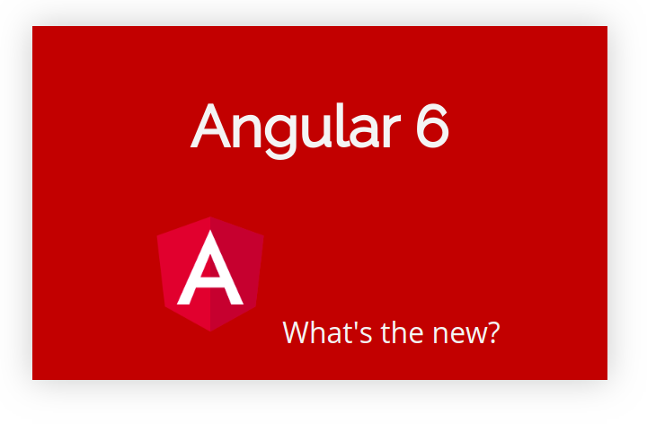

[Angular](https://angular.io) has come out with some amazing new features in [version 6.0.0](https://angular.io/), especially in Angular-cli. Now, with Angular 6, you can easily update your old packages, create native web elements using Angular Elements, and many other things. Let’s take a look!

### ng add

`**ng add**` is a new command in Angular-cli that helps you install and download new packages in your angular apps. It works the same as npm, but it doesn’t replace it.

### ng update

`**ng update**` is a new Angular-cli command too. It’s used to update and upgrade your packages. It’s really helpful, for example, when you want to upgrade from Angular 5 to Angular 6, or any other package in your Angular app.

### Declaring the providers inside the service itself

Before this update, you had to the declare the providers array in `**app.module.ts**`

Now with Angular 6, you can provide your service inside the supervisor itself by putting the `**providedIn:root**` property within the "`**@injectable"**` **decorator.**

### Use ng-template instead of template directive

You can use `**ng-template**` to render the HTML instead of the `**template**` tag in the new version of Angular. `**ng-template**` is an Angular element, and it works when it is used with a [structural directive](https://angular.io/guide/structural-directives) such as `***ngFor**` and `***ngIf**`

### Angular elements

Angular 6 introduced us to Angular elements. You’re able to render your Angular elements as native web elements, and they’re interpreted as trusted HTML elements.

You can add Angular elements by running the command below:

Import `**createCustomElement**` in your component.

Then create your customized element!

`**MyElemComponent.ts**`

The result:

**Note:** you have to implement the `**DomSanitizer**` method from `@angular/platform-browser` to make your custom element a trusted HTML tag .

You can learn more about Angular elements [here](https://angular.io/guide/elements)

### Upgrading to RxJS 6.0.0

Angular 6 uses the latest version of Rxjs library. Now you can enjoy the newest features of RxJS 6 in your Angular app :)

### Wrapping Up

Angular itself doesn’t have many groundbreaking changes in the Angular core, but Angular-cli is really exciting. The Angular team is focusing more on performance, building PWAs easily, providing a good environment to work in which to work with Angular in an easy way.

You can find me on [Twitter](https://twitter.com/SaidHYN).

<Embed src="https://upscri.be/7d6b36?as_embed=true" height={350} width={700} />