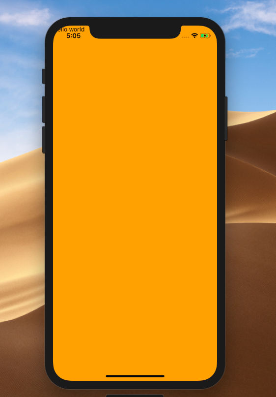
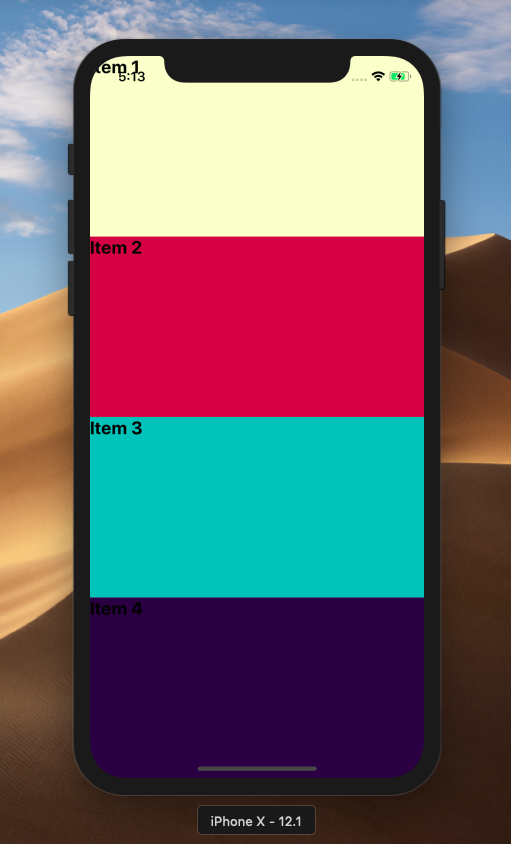
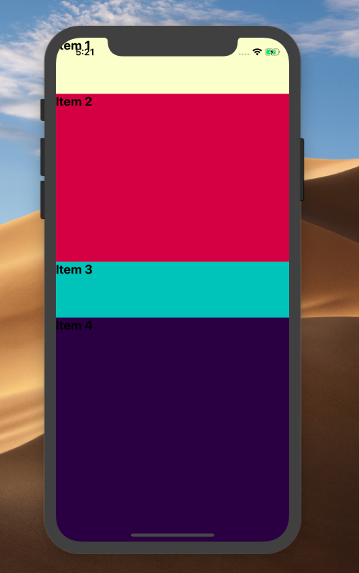
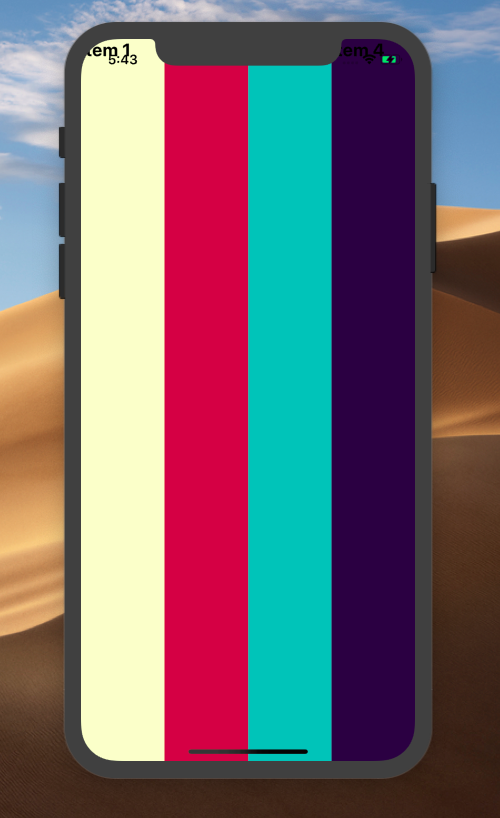
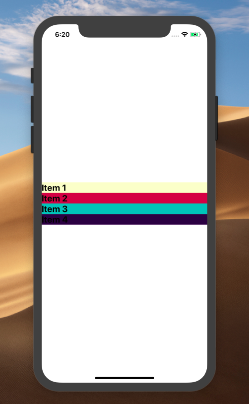
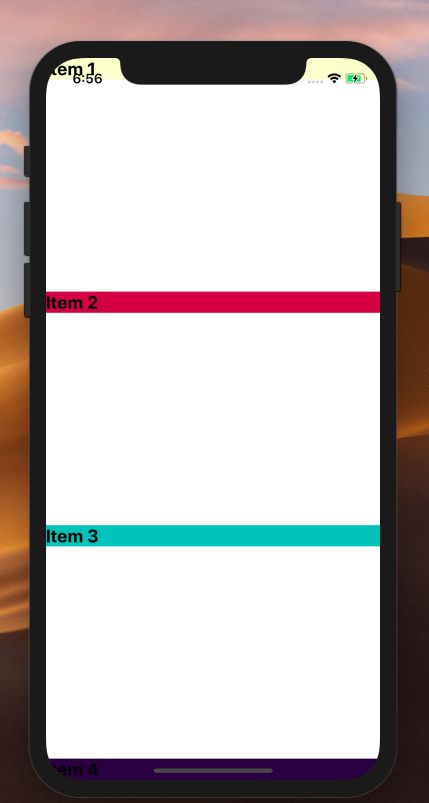

## Learn how to use Flexbox with React Native

 on [Unsplash](https://unsplash.com?utm_source=medium&utm_medium=referral)](./asset-1)

React native uses Flexbox to handle the layout. Flexbox makes it easy to distribute the UI elements in the container. The way that flexbox works in React Native is a bit different than the way it works on the web — that’s why we are going to demystify it here and give you a clear idea of how FlexBox in React Native deals with the Layout.

**Tip**: Use [**Bit**](https://github.com/teambit/bit) to easily share and reuse React components to build apps. It’s free and open source — so feel free to jump in and make your components reusable!

[!Bit’s Visual Collection[](./asset-2.gif)](https://bit.dev)

In React Native we have two options to define the layout, first, we can use the classic way using `width` and `height` properties, secondly React Native offer us Flexbox method which is great to distribute the elements within the container, and there is no `**CSS-Grid**` — only the two options I mentioned so we are going to cover most uses case of Flexbox. let’s start first with `flex` property.

### Using Flex property

We mostly assign `flex` to the parent, it specifies how much space the element should take from the available space, for example, if we put `flex:1` this makes the element take all the available space in the axis, as the example below explains:

Embed placeholder 0.7382943707579694



Let’s add some children and apply flex on them and see how it goes!

Embed placeholder 0.06314371748765435



What did we just do here? simply, we gave `flex:1` for each child, each child takes a portion of the available space from the parent, when we give each child a `flex 1` the space is distributed between the children equally, so each child has the same size, same width, and height!

Let’s do something different, let’s change the value of a specific element and see what’s happens! we change the values of `item2` and the `item4` :

Embed placeholder 0.3778351185091875



If you look at the example, the two element’s size has changed, and that’s because we changed the value of the `flex` , so you can use that if you want to give a specific size to an element, without having to use `width` and `height` — you can use flex instead.

### How to define the direction of the children in the axis?

What we mean by the direction here is how the position of an element is set **_vertically_** or **_horizontally!_** for that purpose we use `**flexDirection**`

`**FlexDirection**`  determines how the position of the children should be within the container `vertically` or `horizontally` in another way should be distributed by `column` or `row` . by default `flexDirection` is set to `column` in React Native!

Let add `flexDirection` property to the container and see how it change the Layout :

Embed placeholder 0.11614792928346396



You see how the children are distributed **horizontally** when we set `flexDirection` to `row` and as we mentioned above flexDirection is set the the `column` by default.

### How to control the position of the children within the container?

Well, we use `**justifyContent**`  to do that, it helps us to set the position of the elements this works especially when the children don’t have a `flex` property, By defining justifiContent we are setting the height and width of the element to be`auto` , in order to make `justifyContent` to work we have to remove `flex` from the children.

The first case of using `justifyContent`: make all the children come to the center, this happens when we assign `center` to `justifyContent` :

Embed placeholder 0.341361090341737

```
justifyContent:"flex-start"
``````
justifyContent:"flex-end"
``````
justifyContent:"space-around"
``````
justifyContent:"space-between"
```

The difference between `justifyContent` and `alignItems` :

> As the React Native official docs explain,`[justifyContent](https://facebook.github.io/react-native/docs/layout-props#justifycontent)` [aligns children in the main direction. For example, if children are flowing vertically,](https://facebook.github.io/react-native/docs/layout-props#justifycontent) `[justifyContent](https://facebook.github.io/react-native/docs/layout-props#justifycontent)` [controls how they align vertically](https://facebook.github.io/react-native/docs/layout-props#justifycontent), however`[alignItems](https://facebook.github.io/react-native/docs/layout-props#alignitems)` [aligns children in the cross direction. For example, if children are flowing vertically,](https://facebook.github.io/react-native/docs/layout-props#alignitems) `[alignItems](https://facebook.github.io/react-native/docs/layout-props#alignitems)` [controls how they align horizontally](https://facebook.github.io/react-native/docs/layout-props#alignitems)

### How to align a specific child?

You may want to align a specific child and make it goes to a different direction, we can always use `alignSelf` for this purpose :

```
child:{

alignSelf:"center" // you flex-end ,flex-start or auto

},
```

From all the examples above, it seems pretty obvious that it is much easier to build your Layout with Flexbox in React Native. It makes thing clearer by defining simple properties that can do a lot of work. For my next demonstration, I will build a simple Instagram profile with a gallery so you can see how easy it is to do it using Flexbox :


And here is the full source code:

Embed placeholder 0.8434215089882353

### Wrapping up

We’ve seen how flexbox allows us to define the layout in React Native. It’s really not that hard, there are a lost of libraries out there that can help you deal with layout, but If you know how to use Flexbox you won’t need to use any extra libraries. Sometimes, using a library just brings more problems when it comes to scaling and when you try to make your application compatible with different devices and screens.

Please feel free to comment if you have any questions or if you’d like to add anything to this post. I’m happy to talk on [Twitter](https://twitter.com/SaidHYN) as well.

### Learn More

[**11 React Native Component Libraries You Should Know in 2019**  
_Useful React Native UI toolkits to use in your next app!_blog.bitsrc.io](https://blog.bitsrc.io/11-react-native-component-libraries-you-should-know-in-2018-71d2a8e33312 "https://blog.bitsrc.io/11-react-native-component-libraries-you-should-know-in-2018-71d2a8e33312")[](https://blog.bitsrc.io/11-react-native-component-libraries-you-should-know-in-2018-71d2a8e33312)

[**How To Write Better Code in React**  
_9 Useful tips for writing better code in React: Learn about Linting, propTypes, PureComponent and more._blog.bitsrc.io](https://blog.bitsrc.io/how-to-write-better-code-in-react-best-practices-b8ca87d462b0 "https://blog.bitsrc.io/how-to-write-better-code-in-react-best-practices-b8ca87d462b0")[](https://blog.bitsrc.io/how-to-write-better-code-in-react-best-practices-b8ca87d462b0)

[**Building a Shared UI Component Library**  
_5 key factors for building a UI component library that people will use._blog.bitsrc.io](https://blog.bitsrc.io/building-a-shared-ui-component-library-350b297a53a8 "https://blog.bitsrc.io/building-a-shared-ui-component-library-350b297a53a8")[](https://blog.bitsrc.io/building-a-shared-ui-component-library-350b297a53a8)