JavaScript has great modules and methods to make HTTP requests that can be used to send or receive data from a server side resource. In this article, we are going to look at a few popular ways to make HTTP requests in JavaScript.

### Ajax

Ajax is the traditional way to make an asynchronous HTTP request. Data can be sent using the HTTP POST method and received using the HTTP GET method. Let’s take a look and make a `GET` request. I’ll be using JSONPlaceholder, a free online REST API for developers that returns random data in JSON format.

To make an HTTP call in Ajax, you need to initialize a new `XMLHttpRequest()` method, specify the URL endpoint and HTTP method (in this case GET). Finally, we use the `open()` method to tie the HTTP method and URL endpoint together and call the `send()` method to fire off the request.

We log the HTTP response to the console by using the `XMLHTTPRequest.onreadystatechange` property which contains the event handler to be called when the `readystatechanged` event is fired.

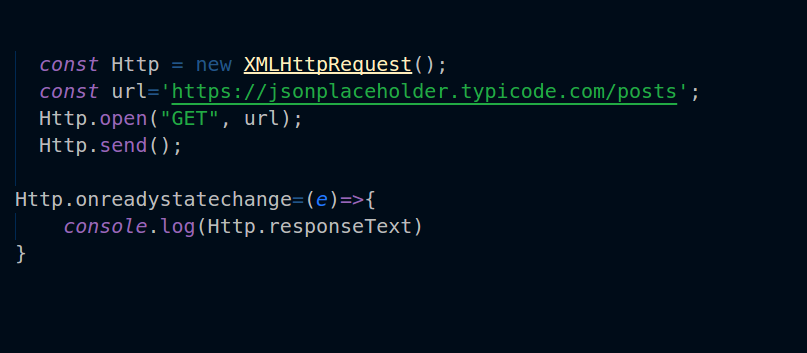```
const Http = new XMLHttpRequest();
const url='https://jsonplaceholder.typicode.com/posts';
Http.open("GET", url);
Http.send();
Http.onreadystatechange=(e)=>{
console.log(Http.responseText)
}
```

If you view your browser console, it will return an Array of data in JSON format. But how would we know if the request is done? In other words, how we can handle the responses with Ajax?

The `onreadystatechange` property has two methods, `readyState` and `status` which allow us to check the state of our request.

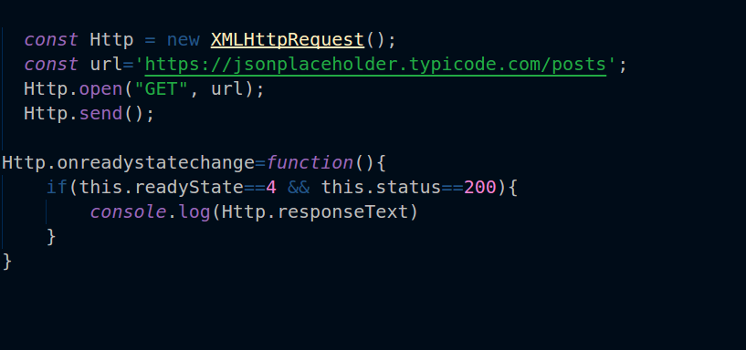

If `readyState` is equal to 4, it means the request is done. The `readyState` property has 5 responses. Learn more about it [here](https://developer.mozilla.org/en-US/docs/Web/API/XMLHttpRequest/readyState).

Apart from directly making an Ajax call with JavaScript, there are other more powerful methods of making an HTTP call such as `$.Ajax` which is a jQuery method. I’ll discuss those now.

### jQuery methods

jQuery has many methods to easily handle HTTP requests. In order to use these methods, you’ll need to include the jQuery library in your project.

```
<script src="https://ajax.googleapis.com/ajax/libs/jquery/3.3.1/jquery.min.js"></script>
```

#### $.ajax

jQuery Ajax is one of the simplest methods to make an HTTP call.

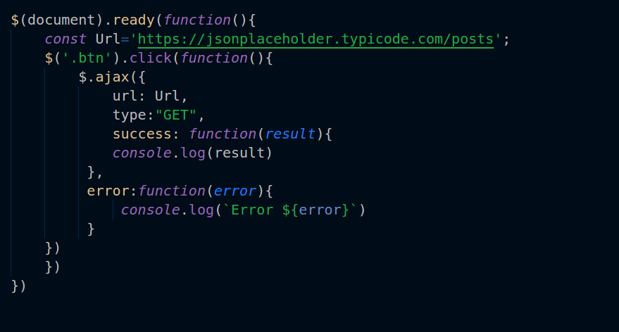

The $.ajax method takes many parameters, some of which are required and others optional. It contains two callback options `success` and `error` to handle the response received.

#### $.get method

The $.get method is used to execute GET requests. It takes two parameters: the endpoint and a callback function.

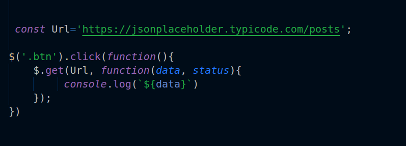

#### $.post

The `**$.post**` method is another way to post data to the server. It take three parameters: the `url`, the data you want to post, and a callback function.

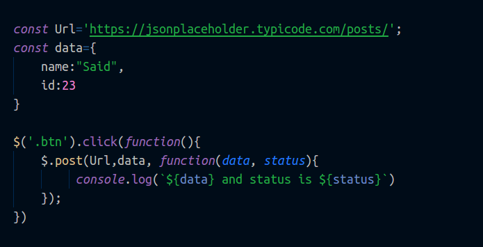

#### $.getJSON

The `$.getJSON` method only retrieves data that is in JSON format. It takes two parameters: the `url` and a callback function.

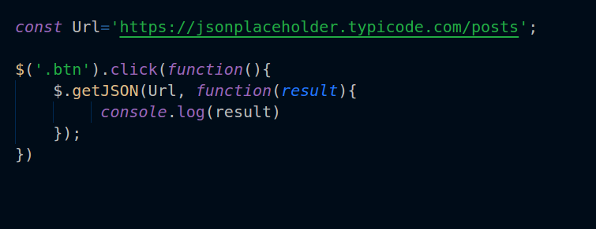

jQuery has all these methods to request for or post data to a remote server. But you can actually put all these methods into one: the `$.ajax` method, as seen in the example below:

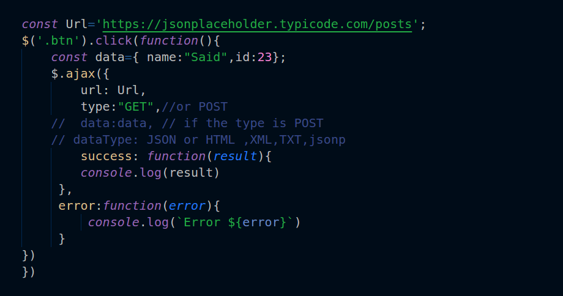

### fetch

`fetch` is a new powerful web API that lets you make asynchronous requests. In fact, `fetch` is one of the best and my favorite way to make an HTTP request. It returns a “Promise” which is one of the great features of ES6.  If you are not familiar with ES6, you can read about it in [this](https://medium.freecodecamp.org/write-less-do-more-with-javascript-es6-5fd4a8e50ee2) article. Promises allow us to handle the asynchronous request in a smarter way. Let’s take a look at how `fetch` technically works.

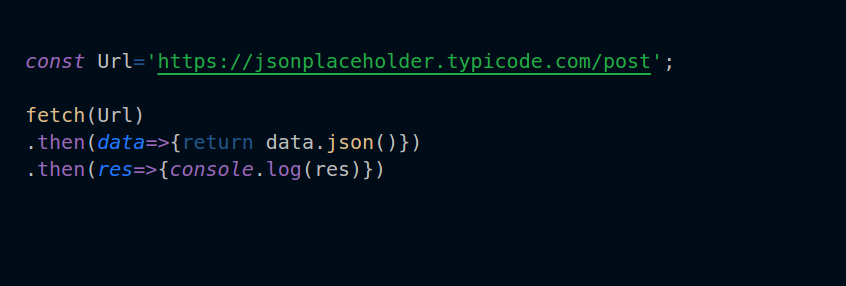

The `fetch` function takes one required parameter: the `endpoint` URL. It also has other optional parameters as in the example below:

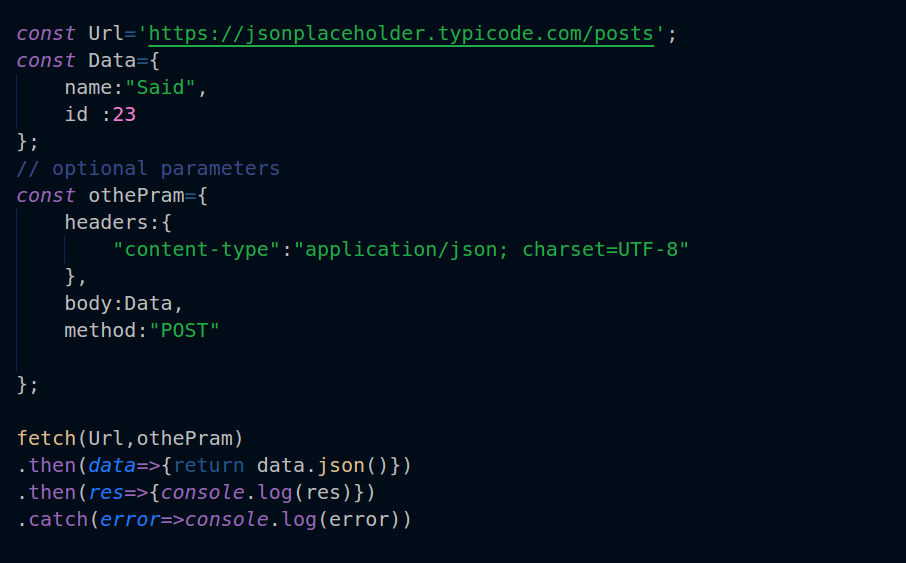

As you can see, `fetch` has many advantages for making HTTP requests. You can learn more about it [here](https://developer.mozilla.org/en-US/docs/Web/API/Fetch_API/Using_Fetch). Additionally, within fetch there are other modules and plugins that allow us to send and receive a request to and from the server side, such as [axios](https://github.com/axios/axios).

### Axios

Axios is an open source library for making HTTP requests and provides many great features. Let’s have a look at how it works.

#### Usage:

First, you’d need to include Axios. There are two ways to include Axios in your project.

First, you can use npm:

```
npm install axios --save
```

Then you’d need to import it

```
import axios from 'axios'
```

Second, you can include axios using a CDN.

```
<script src="https://unpkg.com/axios/dist/axios.min.js"></script>
```

#### Making a Request with axios:

With Axios you can use `GET` and `POST` to retrieve and post data from the server.

#### GET:

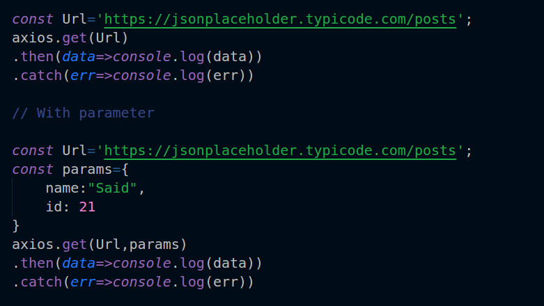

`axios` takes one required parameter, and can take a second optional parameter too. This takes some data as a simple query.

#### POST:

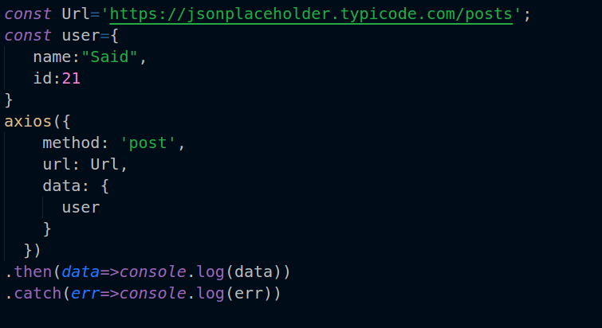

[Axios](https://github.com/axios/axios) returns a “Promise.” If you’re familiar with promises, you probably know that a promise can execute multiple requests. You can do the same thing with axios and run multiple requests at the same time.

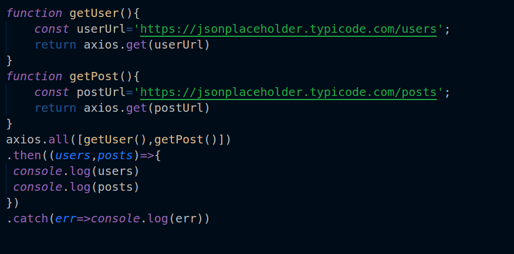

Axios supports many other methods and options. You can explore them [here](https://github.com/axios/axios).

### Angular HttpClient

Angular has its own HTTP module that works with Angular apps. It uses the [RxJS](http://reactivex.io/rxjs/) library to handle asynchronous requests and provides many options to perform the HTTP requests.

#### Making a call to the server using the Angular HttpClient

To make a request using the Angular HttpClient, we have to run our code inside an Angular app. So I created one. If you’re not familiar with Angular, check out my article, [learn how to create your first Angular app in 20 minutes](https://medium.freecodecamp.org/learn-how-to-create-your-first-angular-app-in-20-min-146201d9b5a7).

The first thing we need to do is to import `HttpClientModule` in `app.module.ts`

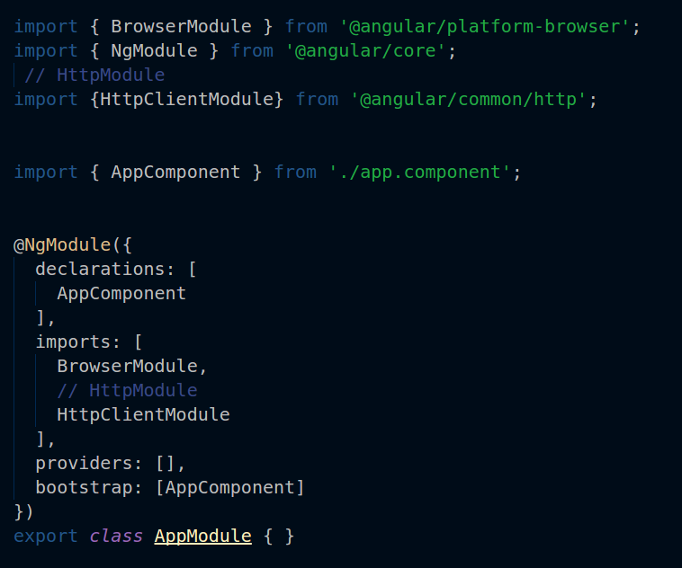

Then, we have to create a service to handle the requests. You can easily generate a service using [Angular CLI](https://cli.angular.io/).

```
ng g service  FetchdataService
```

Then, we need to import HttpClient in `fetchdataService.ts` service and inject it inside the constructor.

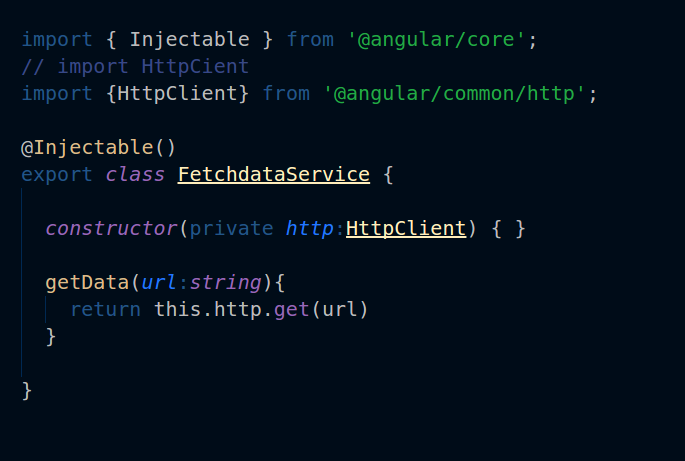

And in `app.component.ts` import `fetchdataService`

```
//import 
import { FetchdataService } from './fetchdata.service';
```

Finally, call the service and run it.

`app.component.ts:`

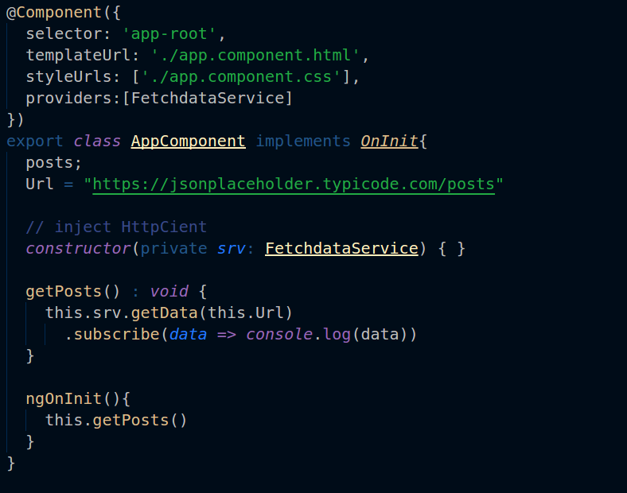

You can check out the demo example [on Stackblitz](https://stackblitz.com/edit/angular-httpclinent).

### Wrapping Up

We’ve just covered the most popular ways to make an HTTP call request in JavaScript.

Thank you for your time. If you like it, clap up to 50, click follow, and reach out to me on [Twitter](https://twitter.com/SaidHYN).

<Embed src="https://upscri.be/7d6b36?as_embed=true" height={350} width={700} />