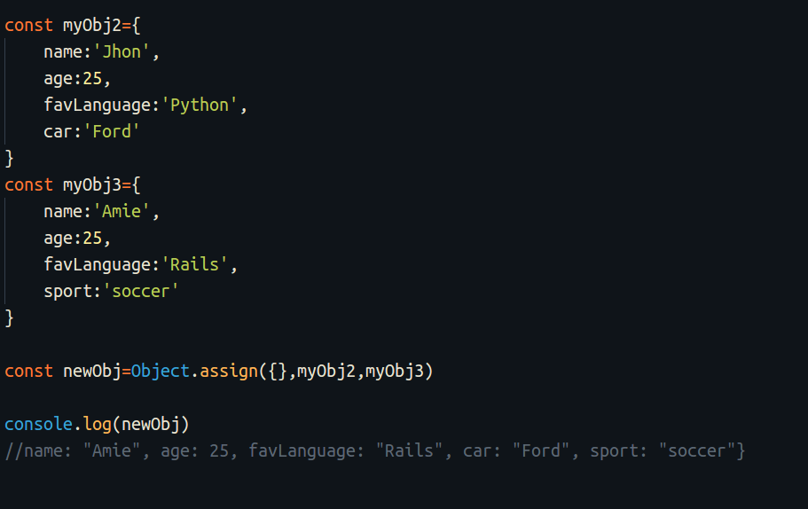
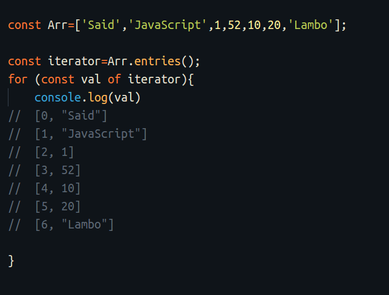
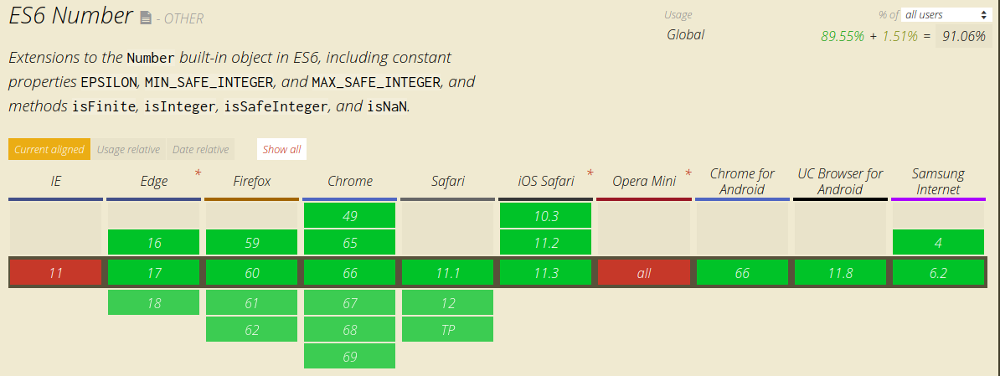

In the past few years, JavaScript has come out with many new releases. They have brought new features particularly in the syntax and its core. These updates have made JavaScript more readable and clever. I will introduce us to the new methods for Arrays, Objects, and Strings. These new methods can handle data in an elegant and efficient way by writing less code. This what we are going to explain in this article.

### The new objects methods

The Object is what makes JavaScript a powerful programming language. Objects allow you to group different datatypes. If you want to learn any new JavaScript framework like React, Vue, or Angular, you have to know how to use Objects and its methods. These frameworks use objects to get and handle user input. The new JavaScript releases bring new methods to Objects that make them more fun. Here are the new Object methods:

#### object.assign()

Object.assign() method has multiple jobs. It can copy an object, clone from another object, or concatenate two or more objects.

-   copy the values from another object:

-   Clone an object to a new object

-   Also, you can merge duplicate properties with Object.assign() by setting two empty brackets as the first argument:

#### Object.entries()

Object.entries() method returns the keys and values of the object as an Array.

#### Object.getOwnPropertyDescriptors()

Object.getOwnPropertyDescriptors allow us to get the properties descriptor for an object.

It’s really helpful to check the property of the object descriptor, for example, see if it is writable or enumerable.

### The new Array methods

The new JavaScript releases have provided new methods for Arrays. Here are the new array methods:

#### Array.includes()

Array.includes() allows us to check if a property exists in an array. You can see the difference between the old code and the new syntax (ES6). The new method is short and more readable.

#### Array.find()

Array.find() helps us to find an element in an Array. It takes a callback function as an argument. The callback function provides more options to find and extract complex data.

If the property we are looking for exists, it returns the found value. Otherwise, it returns undefined.

#### Array.findIndex()

Array.findIndex() returns the index of the found element instead of the value.

#### Array.values()

This new method returns an Array iterator of the values so we can run a for loop to extract each value of the Array.

#### Array.entries()

Array.entries() returns both the key and value and in an Array format.

#### Array.from()

Array.from() was introduced in the ES6 release. It can do multiple things by running a map() function on the data. It can convert a String to an Array or even create a new Array from the data.

#### Array.keys()

As the name implies, this method returns the keys of the Array.

### The new String methods

The new JavaScript releases provided new String methods. Here are the new String methods:

#### String.repeat()

String.repeat() method allows you to repeat a string.

#### String.includes()

String.includes() works like Array.includes(). It returns a Boolean if the value entered exists.

### The new Number methods

The new JavaScript releases provided new Number methods. Here are the new Number methods:

#### Number.isNaN()

This method was released in the ES6 update. It checks the Number value passed in and returns true if the value is NaN. Otherwise, it returns false. This method is inspired by the classic function isNAN() in JavaScript.

#### Number.isInteger()

Like the previous method, Number.isInteger() checks to see if the value passed is an integer or not. It will return true if the value is an integer and false if it is not.

#### Number.isSafeInteger()

You might always want to validate the users’ input to make sure it is a number. Number.isSafeInteger() checks if the number is a safe number.

[Learn more here](https://www.sitepoint.com/es6-number-methods/)

#### Number.isFinite()

Number.isFinite() checks if the value passed in is a finite number or not.

### **Browser support**

The new Number methods are almost supported by the major browser except for Opera Mini and IE-11. Support is shown in the image below:

### New Specific objects

JavaScript comes with new specific functions that allow us to write more performant code. Here are the new specific object methods:

### Proxy() object

Proxy is one of the great additions to JavaScript. It creates a custom behavior for our code. With Proxy you can handle:

-   validating user data
-   data correction
-   property lookup
-   assignment
-   enumeration
-   function invocation

Check other uses of Proxy and its methods [here](https://developer.mozilla.org/en-US/docs/Web/JavaScript/Reference/Global_Objects/Proxy).

For understanding proxy, we are going to write two examples.

**Example 1:**

In this example, we validate data while getting it from a user. We will try to define the behavior of an undefined error.

As you see in the example above userInfo.favCar returns `undefined`. What if we want to handle this error message? If we want to create a custom behavior for the error, for example, displaying another message instead of undefined, we can use Proxy in this case.

We defined a new proxy and gave it two arguments — the object and the handler. The handler runs some validation code and checks if the property exists in the object. It returns the property if it exists. Otherwise, it returns the message we defined and this is called **property lookup.**

**Example 2:**

In this example, we will create a validation for a specific value in the object using the **set** method.

In this example, we can validate the datatype and returns a new TypeError(). This makes debugging much easier. You can understand more with this [helpful Article](https://hackernoon.com/introducing-javascript-es6-proxies-1327419ab413).

### **Browser support**

Proxy works quite good for all major browser as you see below:

#### Set() object

The Set object is a new feature in JavaScript. It allows us to store unique values. It has a bunch of methods you can play. Object.add method lets you add a new property to the object. Object.delete removes a property from the object. Object.clear clears all properties from the object. The example below explains the object methods.

Learn more about Set() object [here](https://developer.mozilla.org/en-US/docs/Web/JavaScript/Reference/Global_Objects/Set).

### Wrapping up

We just covered the new built-in methods introduced by JavaScript. With these new great features, I don’t use the old syntax and methods anymore in my code. The new methods allow you to write proficient and performant JavaScript code in an elegant way.

You can check my articles about [New ES6 syntax](https://medium.freecodecamp.org/write-less-do-more-with-javascript-es6-5fd4a8e50ee2) as well to refresh your skills in JavaScript.

> You can find me on T[witter](https://twitter.com/SaidHYN?lang=en) and [Instagram](https://www.instagram.com/saidhappy6/)

**_Previous Articles:_**

-   [JavaScript ES6 — Write less, do more](https://medium.freecodecamp.org/write-less-do-more-with-javascript-es6-5fd4a8e50ee2)
-   [Learn Bootstrap 4 in 30 min by building a Landing a Website](https://medium.freecodecamp.org/learn-bootstrap-4-in-30-minute-by-building-a-landing-page-website-guide-for-beginners-f64e03833f33)
-   [Angular 6 and it’s new features, all explained in three minutes](https://medium.freecodecamp.org/angular-what-is-the-new-briefly-e6837348dd3a)
-   [How to use routing in Vue.js to create a better user experience](https://medium.freecodecamp.org/how-to-use-routing-in-vue-js-to-create-a-better-user-experience-98d225bbcdd9)
-   [Here are the most popular ways to make an HTTP request in JavaScript](https://medium.freecodecamp.org/here-is-the-most-popular-ways-to-make-an-http-request-in-javascript-954ce8c95aaa)
-   [Learn how to create your first Angular app in 20 minutes](https://medium.freecodecamp.org/learn-how-to-create-your-first-angular-app-in-20-min-146201d9b5a7)

<Embed src="https://upscri.be/7d6b36?as_embed=true" height={350} width={700} />