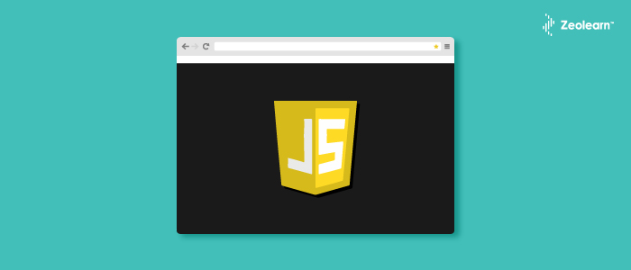
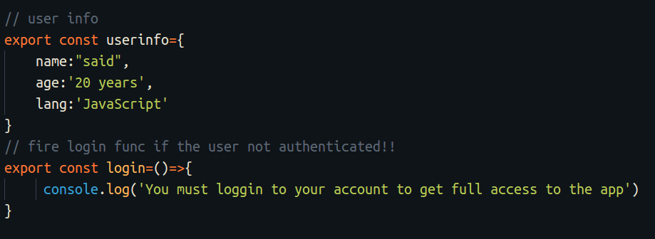
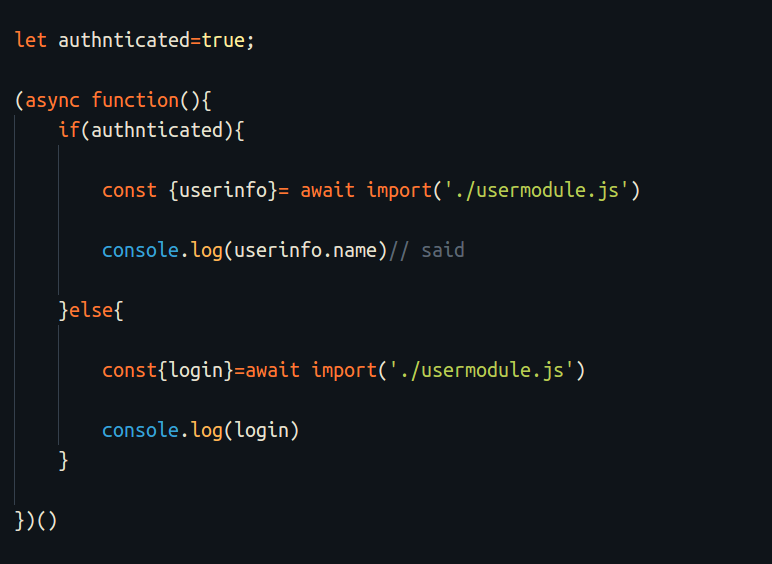
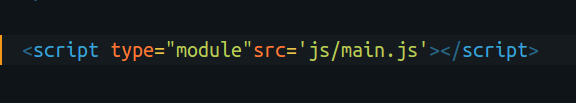
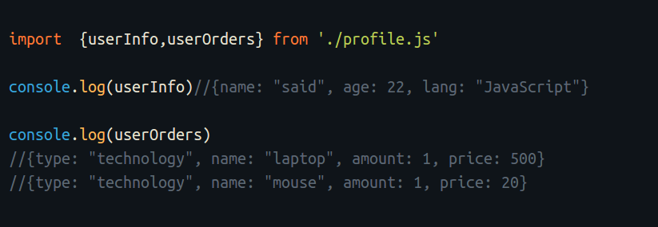
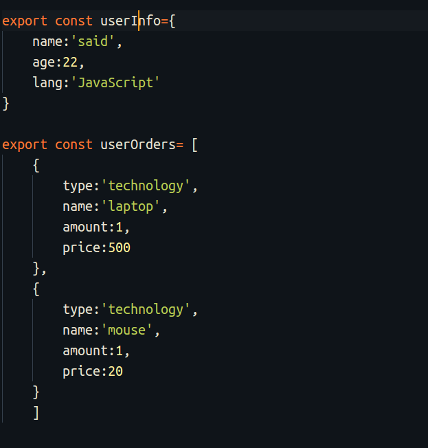
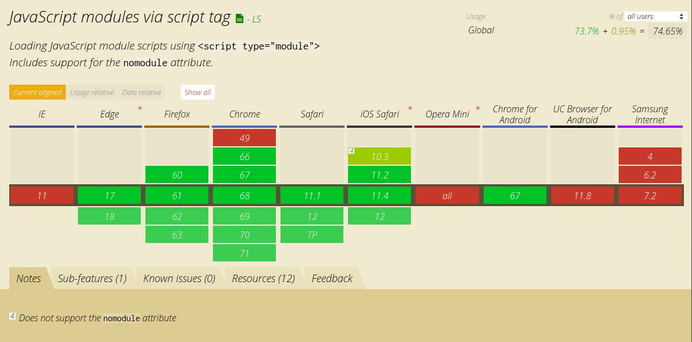

[JavaScript](https://www.zeolearn.com/javascript-training) modules are now supported by the browser. This means you can use this great addition in JavaScript, introduced by ECMAScript 2015, in the browser. Previously, you had to use a bundler such as a [webpack](https://www.zeolearn.com/magazine/beginning-with-webpack-4) in order to use modules. But no more. How cool is that!

So, in this article, we will walk through JavaScript modules and explore how we can use them in our web application.

### What are JavaScript modules and why you should use them instead of a classic script?

JavaScript modules basically allow us to import a file into another file using import and export methods. They also allow us to build modular components that can be reusable.

#### Why use JavaScript modules?

There are many advantages that come with using JavaScript modules in your app instead of a classic script:

-   **Separating your app into modules**: Building your app with modules makes it more efficient and increases the performance of your code. By using these modules, you can lazy load your code and you can use only the code that you need and avoid unused code.
-   **Using Strict mode by default:** Yeah, strict mode is enabled by default in JavaScript modules.
-   **The defer method is used by default**
-   This means that **your** [**HTML**](https://www.zeolearn.com/magazine/material-design-tooltip-with-css-html) **code is loaded in parallel with JavaScript**. So, you don’t need to add deferattribute to your script tag anymore when you use ECMAScript.
-   **It imports your modules dynamically**
-   With JavaScript Modules you can **customize the loading of your modules** by running a dynamic function that imports a module just in case you need it. This assumes that when a user visits your website, you have to load only the module that handles the profile just in case the user logged in. This is explained clearly in the example below:

`usermodule.js`

`profile.js`

### How to use modules

Now, in this part, we are going to explore the ways to use JavaScript modules. You can [easily use a JavaScript Module](https://www.zeolearn.com/magazine/learn-javascript-from-scratch-tutorials) by specifying the attribute type to the module in the script tag that implements your main JavaScript file. Now, you can use the import and export method to import your modules.

And inside your `main.js` you can import and export your modules:

Using the **export** method in `profile.js`:

As shown in the above example, it’s easy to use ECMAScript modules — there is no complex code in this case.

When you set the type in the module, the browser detects automatically that the file is a module and treats it as a JavaScript module.

In another way, you can set the `.mjs` extension to the file so the browser can identify the module. But this doesn’t make big changes if you set the type attribute as a module to the script tag.

### Browser support

It seems that only the modern browsers support JavaScript modules. But that’s alright if you use great browsers like Chrome, Edge, and Firefox.

#### I don’t need to use bundlers anymore?

[Addy Osmani](https://twitter.com/addyosmani) and [Mathias Bynens](https://twitter.com/mathias) explain in this [article](https://developers.google.com/web/fundamentals/primers/modules?utm_source=ESnextNews.com&utm_medium=Weekly+Newsletter&utm_campaign=2018-06-19) that you probably don’t need a web bundler such as webpack if you develop a web app with less than 100 modules. You can check out the article where they have exposed the best practices and good usage of ECMAScript modules [here](https://developers.google.com/web/fundamentals/primers/modules?utm_source=ESnextNews.com&utm_medium=Weekly+Newsletter&utm_campaign=2018-06-19).

Find the code in the GitHub repository [here](https://github.com/hayanisaid/JavaScript-modules-in-browser).

### Wrapping up

JavaScript modules are a great way to increase the performance of your app. They allow you to do many things that make your app more performant like a dynamic load of your modules, lazy loading, and more. Moreover, the great thing is that it supports the browser. So, don’t hesitate to take advantage of them if you don’t use a file bundler.

_Originally published on_ [_Zeolearn_](https://www.zeolearn.com/magazine/javascript-modules-are-now-supported-by-the-browsers)

[_Join My Class to learn Bootstrap on Skill Share_](https://skl.sh/2OZZhxs)

**_Previous Articles:_**

-   [JavaScript ES6 — Write less , do more](https://medium.freecodecamp.org/write-less-do-more-with-javascript-es6-5fd4a8e50ee2)
-   [Learn Bootstrap 4 in 30 min by building a Landing a Website](https://medium.freecodecamp.org/learn-bootstrap-4-in-30-minute-by-building-a-landing-page-website-guide-for-beginners-f64e03833f33)
-   [Angular 6 and it’s new features, all explained in three minutes](https://medium.freecodecamp.org/angular-what-is-the-new-briefly-e6837348dd3a)
-   [How to use routing in Vue.js to create a better user experience](https://medium.freecodecamp.org/how-to-use-routing-in-vue-js-to-create-a-better-user-experience-98d225bbcdd9)
-   [Here are the most popular ways to make an HTTP request in JavaScript](https://medium.freecodecamp.org/here-is-the-most-popular-ways-to-make-an-http-request-in-javascript-954ce8c95aaa)
-   [Learn how to create your first Angular app in 20 minutes](https://medium.freecodecamp.org/learn-how-to-create-your-first-angular-app-in-20-min-146201d9b5a7)

<Embed src="https://upscri.be/7d6b36?as_embed=true" height={350} width={700} />