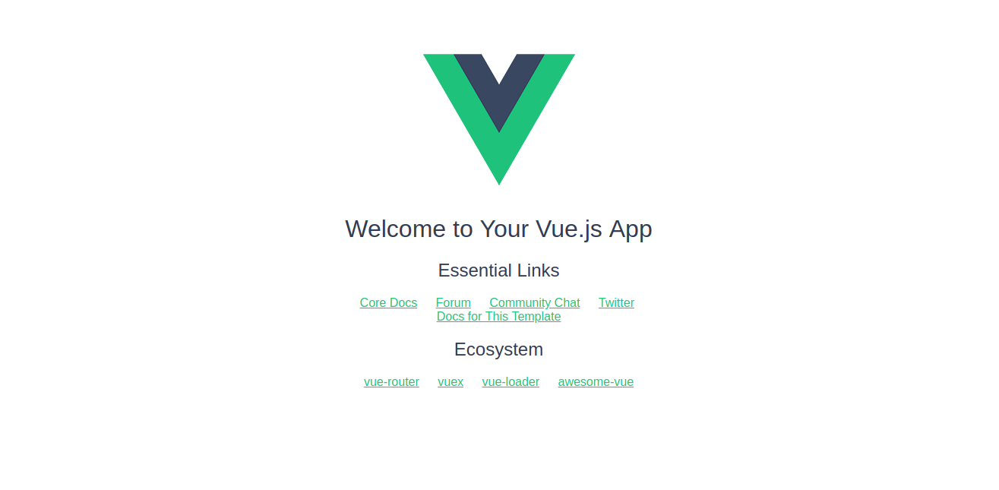
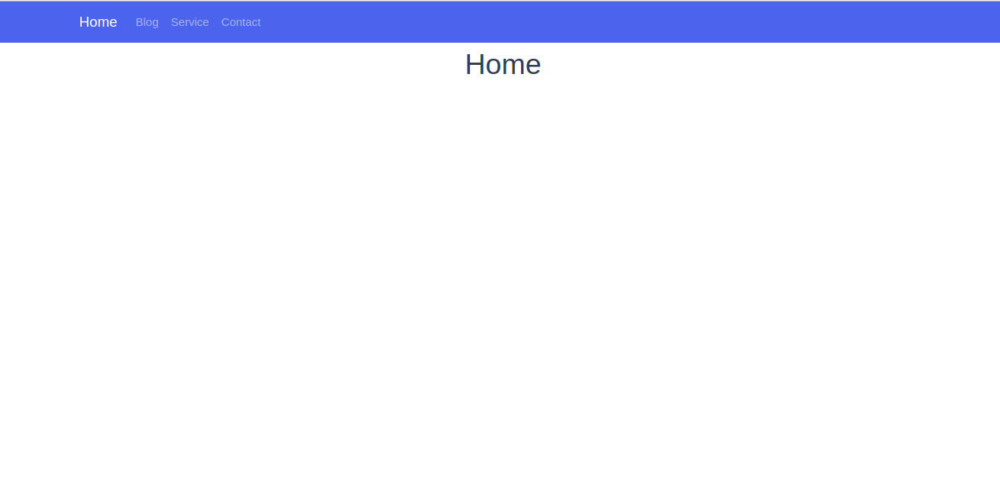
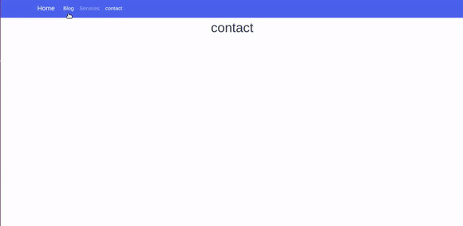
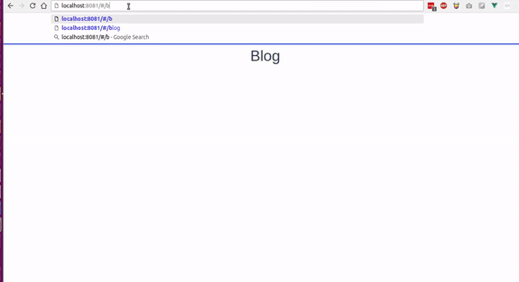
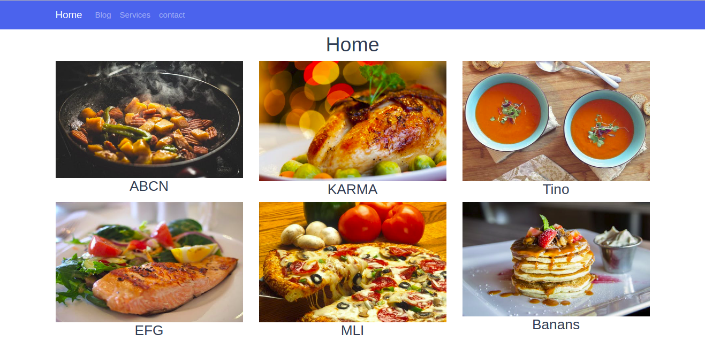
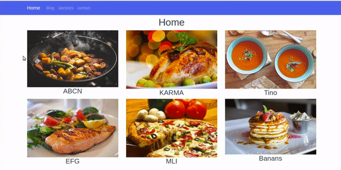
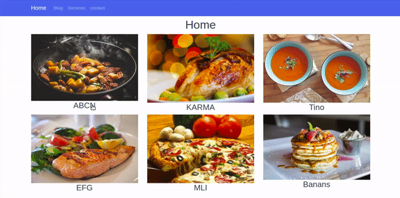
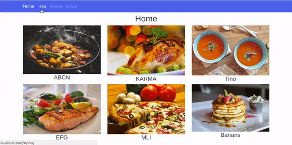

[!Zeolearn copyright[](./asset-1.jpeg)](https://www.zeolearn.com/magazine/understand-routing-in-vuejs-with-examples)

Vue.js is a great JavaScript Framework created by [Evan You](https://twitter.com/youyuxi). It’s used to build single web page apps and flexible components, and it’s one of the most required skills in Front End Web development. You can learn more about Vue.js [here](https://vuejs.org/) .

[Vue.js](https://vuejs.org/) provides a bunch of features that allow you to build reusable web components. Routing is one of those methods. It allows the user to switch between pages without refreshing the page. This is what makes navigation easy and really nice in your web applications.

So in this article, I’ll explain how Vue.js routers work by building a Vue template as an example.

### Getting started

So, let’s get started with our Vue.js Route**r** project by installing and creating a new [Vue.js](https://www.zeolearn.com/magazine/why-must-you-choose-vuejs-over-reactjs) project. We need to have Node.js installed. We will be using [vue-cli](https://github.com/vuejs/vue-cli) to generate a new Vue.js project. Follow the steps given below:

Type the following code in your terminal and run:

```
vue init webpack vue-router

//
cd vue-router
//
npm run dev
```

Browse to [http://localhost:8080](http://localhost:8080)



Open the app in your text editor. Inside the components folder, open the `HellowWorld.vue` file and follow these steps:

-   Rename `HellowWorld.vue` to `home.vue`. Remove all the code and replace it with this:

```
<template>
  <div class="home">
    <h1>Home</h1>
  </div>
</template>

<script>
export default {
  name: 'home',
  data () {
    return {
      msg: 'Welcome to Your Vue.js App'
    }
  }
}
</script>

<!-- Add "scoped" attribute to limit CSS to this component only -->
<style scoped>

</style>
```

-   Go to `index.js` inside the **router** folder and replace `HelloWorld` with `home`:

```
import Vue from 'vue'
import Router from 'vue-router'
import home from '@/components/home'

Vue.use(Router)

export default new Router({
  routes: [
    {
      path: '/',
      name: 'home',
      component: home
    }
  ]
})
```

The `App.vue` file should look like this:

```
<template>
  <div id="app">
    
    <router-view/>
  </div>
</template>

<script>
export default {
  name: 'App'
}
</script>

<style>
#app {
  
}
</style>
```

And now let’s write our code!

We are now going to add a [Bootswatch](https://bootswatch.com/) template. You can choose any template you like. I’ll choose [Cosmo](https://bootswatch.com/cosmo/). Click Ctrl + U to view the code source and just copy the `Navbar` (we just need the navbar). Paste this code into App.vue  component.

Here we are 😃



Next, we’re gonna create three other components: `Blog`,`Services` and `Contact`.

Inside the components folder, create new file, name it `blog.vue`, and push this code into it:

```
<template>
 <div class="blog">
  <h1>{{blog}}</h1>
 </div>
</template>
<script>
 export default{
  name:'blog',
  data (){
   return{
    title:'Blog'
   }
  }
 }
</script>

<style scoped>
 
</style>
```

If you want to do the same thing for the service and contact component, you must have these files in your component folder:

-   home.vue
-   blog.vue
-   services.vue
-   contact.vue

### Routers config

Now after creating these four components, we need to configure the routers so that we can navigate between the components.

So how we can navigate to each components using the routers?

We need to learn the rules of routing. Now, we have to do some modifications inside the router folder, so open `index.js`



Follow these steps:

-   First import your components into index.js. Import all the components using the `import` method.

```
import home from '@/components/home'
import blog from '@/components/blog'
import services from '@/components/services'
import contact from '@/components/contact'
```

-   Second import Vue and router module from [vue-router](https://router.vuejs.org) module:

```
import Vue from 'vue'
import Router from 'vue-router'

// use router
Vue.use(Router)
```

If you have installed Vue with vue-cli, you will have the [vue-router](https://router.vuejs.org/) module imported by default.

-   Finally, inside the router folder, we have to configure the routers to make them work. The router method takes an Array of objects which in turn takes each component’s properties:

```
export default new Router({
  routes: [
    {
      path: '/',
      name: 'home',
      component: home
    },
    {
      path: '/blog',
      name: 'blog',
      component: blog
    },
    {
      path: '/services',
      name: 'services',
      component: services
    },
    {
      path: '/contact',
      name: 'contact',
      component: contact
    }
  ]
})
```

-   `path` : the path of the component
-   `name`: the name of the component
-   `component` : the view of the component

To make any component the default component, set slash(‘/’) to the path property:

```
path:'/'
```

In our example, we set the home page as the default page. Now, when you open the the project in the browser, the first page that will appear is the home page.

```
{
path:'/',
name:'home',
component:home
}
```

The vue-router has more advanced parameters and methods, but we are not jumping into this section at this point.

This is the list of properties and methods that you can use with vue-router:

-   [Nested routers](https://router.vuejs.org/en/essentials/nested-routes.html)
-   [Named view](https://router.vuejs.org/en/essentials/named-views.html)
-   [Redirect and Alias](https://router.vuejs.org/en/essentials/redirect-and-alias.html)
-   [Navigation Guard](https://router.vuejs.org/en/advanced/navigation-guards.html)
-   [Router instance](https://router.vuejs.org/en/api/router-instance.html)

Now you can browse to any components by typing the name of the component!



### router-link

Now we are going to set up the navigation through the Navbar that we created using  the router-link element.

To do that, we should replace the `</a>` element by `<router-link></router/link>` like this:

```
<li class="nav-item">
  <router-link class="nav-link" to="/blog">Blog</router-link>
</li>
<li class="nav-item">
  <router-link class="nav-link" to="/services">Services</router-link>
 </li>
<li class="nav-item">
   <router-link class="nav-link" to="/contact">contact</router-link>
 </li>
```

The router-link takes the `to='path'` attribute that takes the path of the component as a value.

### Router-view

You will find the `<router-view>` tag in the `App.vue` file. It’s basically the view where the components are rendered. It’s like the main div that contains all the components, and it returns the component that match the current route. We will discuss `route-view` in the next part when we use the animation transition .

### Using the parameters inside the routers

At this point, we will use parameters to navigate to specific components. The parameters make the routing dynamic.

To work with parameters, we are gonna create a list of products and an array of data. When you click on the link of any product, it will take us to the page details through a parameter.

In this situation, we are not going to use a database or API to retrieve the products’ data. So what we have to do is create an Array of products that will act as a database.

Inside the `home.vue` component, put the Array within the data() method just like this:

```
export default {
  name: 'home',
  data () {
    return {
      title: 'Home',
      products:[
      {
        productTitle:"ABCN",
        image       : require('../assets/images/product1.png'),
        productId:1
      },
      {
        productTitle:"KARMA",
        image       : require('../assets/images/product2.png'),
        productId:2
      },
      {
        productTitle:"Tino",
        image       : require('../assets/images/product3.png'),
        productId:3
      },
      {
        productTitle:"EFG",
        image       : require('../assets/images/product4.png'),
        productId:4
      },
      {
        productTitle:"MLI",
        image       : require('../assets/images/product5.png'),
        productId:5
      },
      {
        productTitle:"Banans",
        image       : require('../assets/images/product6.png'),
        productId:6
      }
      ]
    }
  }
}
```

Then fetch and loop into the Products Array using the `v-for` directive .

```
<div class="row">
      <div class="col-md-4 col-lg4" v-for="(data,index) in products" :key="index">
        
         <h3>{{data.productTitle}}</h3>
      </div>
    </div>
```

The result:



To navigate to the details component, we first have to add a click event:

```
<h3 @click="goTodetail()" >{{data.productTitle}}</h3>
```

Then add methods:

```
methods:{
  goTodetail() {
    this.$router.push({name:'details'})
  }
```

If you click the title, it will return undefined because we haven’t created the details component yet. So let’s create one:

**details.vue**

```
<template>
 <div class="details">
  <div class="container">
   <h1 class="text-primary text-center">{{title}}</h1>
  </div>
 </div>
</template>
<script>
 export default{
  name:'details',
  data(){
   return{
    title:"details"
   }
  }
 }
</script>
```

Now we can navigate without getting an error 😃



Now how can we browse to the details page and get the matched data if we don’t have a database?

We are going to use the same products array in the details component. So we can mach the id that comes from the URL:

```
products:[
      {
        productTitle:"ABCN",
        image       : require('../assets/images/product1.png'),
        productId:1
      },
      {
        productTitle:"KARMA",
        image       : require('../assets/images/product2.png'),
        productId:2
      },
      {
        productTitle:"Tino",
        image       : require('../assets/images/product3.png'),
        productId:3
      },
      {
        productTitle:"EFG",
        image       : require('../assets/images/product4.png'),
        productId:4
      },
      {
        productTitle:"MLI",
        image       : require('../assets/images/product5.png'),
        productId:5
      },
      {
        productTitle:"Banans",
        image       : require('../assets/images/product6.png'),
        productId:6
      }
      ]
```

First we have to set the id to the goTodetail() method as a parameter:

```
<h3 @click="goTodetail(data.productId)" >{{data.productTitle}}</h3>
```

Then add a second parameter to the router method.

The `$router` method takes two parameters: first, the `name` of the component we want to navigate to, and second, the `id` parameter (or any other parameter).

```
this.$router.push({name:'details',params:{Pid:proId}})
```

Add Pid as the parameter in **index.js** inside the `router` folder:

```
{
      path: '/details/:Pid',
      name: 'details',
      component: details
    }
```

**home.vue**

```
methods:{
  goTodetail(prodId) {
    this.$router.push({name:'details',params:{Pid:proId}})
  }
  }
```

To get the matched parameter, use this line of code:

```
this.$route.params.Pid

```

**details.vue**

```
<h2>the product id is :{{this.$route.params.Pid}}</h2>

```

Then loop through the products array in  `detalils.vue` and check the object that matchs the parameter Pid and return its data:

```
<div class="col-md-12" v-for="(product,index) in products" :key="index">
     <div v-if="proId == product.productId">
      <h1>{{product.productTitle}}</h1>
      
     </div>
    </div>

///
export default{
  name:'details',
  data(){
   return{
    proId:this.$route.params.Pid,
    title:"details"
     }
}
```

You see now that when we click any product’s link it get us to that product!



**detail.vue** component:

```
<template>
 <div class="details">
  <div class="container">
   <div class="row">
    <div class="col-md-12" v-for="(product,index) in products" :key="index">
     <div v-if="proId == product.productId">
      <h1>{{product.productTitle}}</h1>
      
     </div>
    </div>
   </div>
  </div>
 </div>
</template>
<script>
 export default{
  name:'details',
  data(){
   return{
    proId:this.$route.params.Pid,
    title:"details",
    products:[
    {
    productTitle:"ABCN",
    image       : require('../assets/images/product1.png'),
    productId:1
    },
    {
    productTitle:"KARMA",
    image       : require('../assets/images/product2.png'),
    productId:2
    },
    {
    productTitle:"Tino",
    image       : require('../assets/images/product3.png'),
    productId:3
    },
    {
    productTitle:"EFG",
    image       : require('../assets/images/product4.png'),
    productId:4
    },
    {
    productTitle:"MLI",
    image       : require('../assets/images/product5.png'),
    productId:5
    },
    {
    productTitle:"Banans",
    image       : require('../assets/images/product6.png'),
    productId:6
    }
    ]
     
   }
  }
 }
</script>
```

### The transition


In this part, we are going to add an animation transition to the animated component. We will animate the transition of the components. It makes the navigation awesome, and it creates a better UX and UI.

To make an animation transition, put the “<router-view>” inside the “<transition/>” tag and give it a name of class.

**App.vue**

```
<transition name="moveInUp">
         <router-view/>
  </transition>
  
```

To animate the transition of the component when it enters the view, add `enter-active`  to the name given to the transition tag. Then add  `leave-active`  and then give it the CSS transition properties just like this:

```
.moveInUp-enter-active{
  opacity: 0;
  transition: opacity 1s ease-in;
}

```

#### **Using CSS3 animation**

Now we are gonna animate using @keyframes in CSS3.

When the component enters the view, add a fade effect to the view.

```
.moveInUp-enter-active{
  animation: fadeIn 1s ease-in;
}
@keyframes fadeIn{
  0%{
    opacity: 0;
  }
  50%{
    opacity: 0.5;
  }
  100%{
    opacity: 1;
  }
}
```

Add another fade effect when the component leaves the view.

Now we’re going to make the component move in and up when it leaves the view.

```
.moveInUp-leave-active{
  animation: moveInUp .3s ease-in;
}
@keyframes moveInUp{
 0%{
  transform: translateY(0);
 }
  100%{
  transform: translateY(-400px);
 }
}
```

Now you can create you own animations and transitions for your components.

That’s it — we are done ! 😆

You can Download the Source code [**here**](https://github.com/hayanisaid/Vue-router)** .**

### Wrapping up

Routing in Vue.js makes your app pretty awesome when it come to navigation. It give it that energy of the single page web application, and it creates a better user experience.

By the way…

If you want to learn Bootstrap 4, check out my class on Skillshare with this [**referral link**](https://skl.sh/2ssg1nj) and get 2 free months access to 20,000 classes.

[_Originally published on zeolearn.com_](https://www.zeolearn.com/magazine/understand-routing-in-vuejs-with-examples)

> Subscribe to this [mailList](http://eepurl.com/dk9OJL) to learn more about Front End topics, and Follow me on [Twitter](https://twitter.com/hayanisaid1995).
