JavaScript ES6 brings new syntax and new awesome features to make your code more modern and more readable. It allows you to write less code and do more. ES6 introduces us to many great features like arrow functions, template strings, class destruction, Modules… and more. Let’s take a look.

### const and let

`const` is a new keyword in ES6 for declaring variables. `const` is more powerful than `var`. Once used, the variable can’t be reassigned. In other words, it’s an **immutable variable** except when it used with objects.

This is really useful for targeting the selectors. For example, when we have a single button that fires an event, or when you want to select an HTML element in JavaScript, use `const` instead of `var`. This is because `var` is ‘hoisted’. It’s always preferable to use `const` when don’t want to reassign the variable .

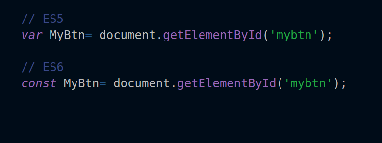

In the code above, `const` will not change and cannot be reassigned. If you try to give it a new value, it will return you an error.

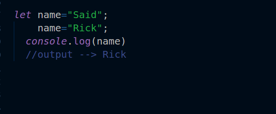

`let` can be reassigned and take new value. It creates a **mutable variable**.

`let` is the same as `const` in that both are blocked-scope. It means that the variable is only available within its scope.

### Arrow functions

The arrow function is really awesome, and makes your code more readable, more structured, and look like modern code. Instead of using this:

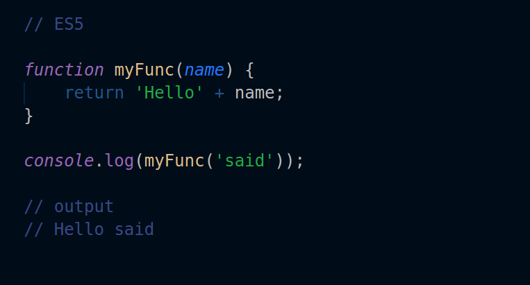

Use this:


As you see, the arrow function seems more readable and clean! You won’t need to use the old syntax anymore.

Also, you can use Arrow function with `map`, `filter`, and `reduce`  built-in functions.

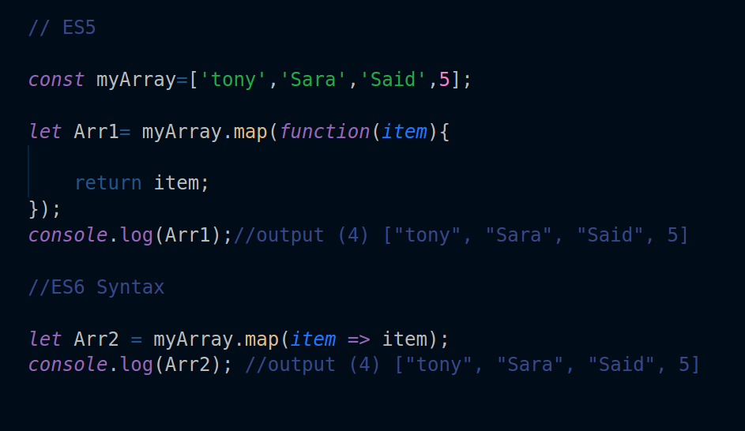

The map function with arrows looks more clear and readable than `map` in ES5. With ES6 you can write shorter and smarter code. You can use the same with `filter` and `reduce`.

### Template Literals

Template literals or template strings are pretty cool. We don’t have to use the plus (+) operator to concatenate strings, or when we want to use a variable inside a string.

The old syntax:

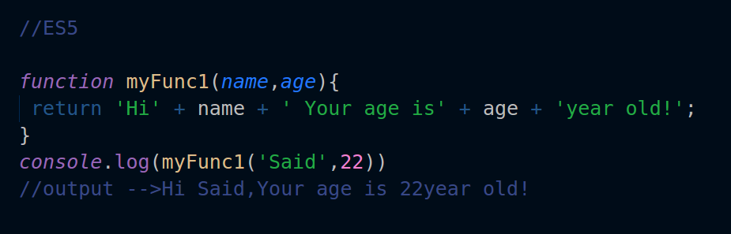

With new ES6 syntax:

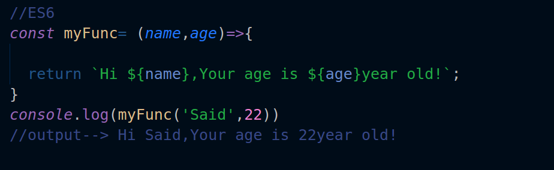

So simple! It’s a really huge difference between the old syntax and ES6. When playing with strings, the literal string in ES6 looks more organized and well structured than ES5.

### **Default parameters**

When I work in PHP, I usually use default parameters. These allow you to define a parameter in advance.

So, when you forget to write the parameter, it won’t return an undefined error because the parameter is already defined in the default. So when you run your function with a missed parameter, it will take the value of the default parameter `t`, and it will not return an error!

Look at this example:

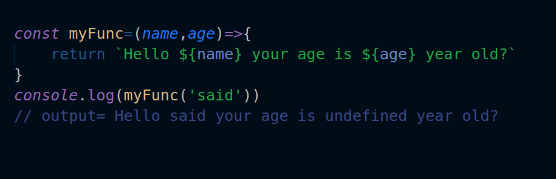

The function above returns undefined, because we forgot to give it the second parameter `age`.

But if we used the default parameter, it won’t return undefined, and it will use its value when we forget to assign a parameter!

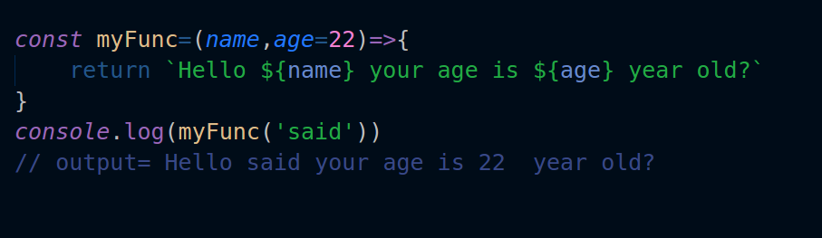

As you see, the function returns a value even though we missed the second parameter. Now with the default parameter we can handle the error in advance.

### Array and object destructing

Destruction makes the assignment of the values of an array or object to the new variable easier.

The old syntax:

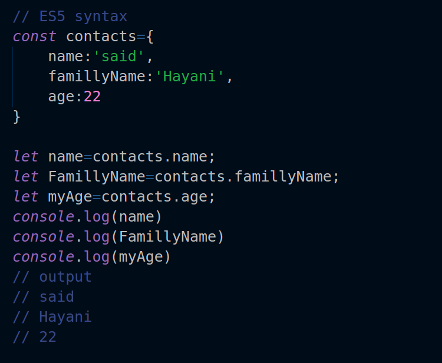

With ES6 syntax:

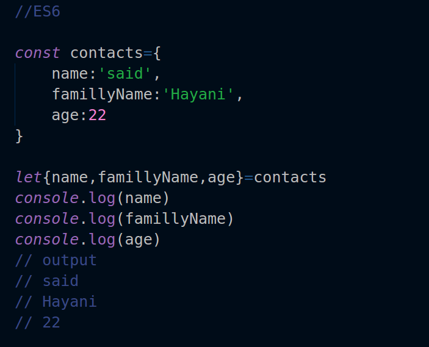

With ES5, we have to assign each value to each variable. With ES6, we just put our values within curly brackets to get any property of the object.

Note:  if you assign a variable that is not identical to the name of property, it will return undefined. For example, if the name of the property is `name` and we assign it to a `username`  variable,  it will return undefined.

We always have to name the variable the same as the name of the property. But in case we want to rename the variable, we can use the colon `:` instead.

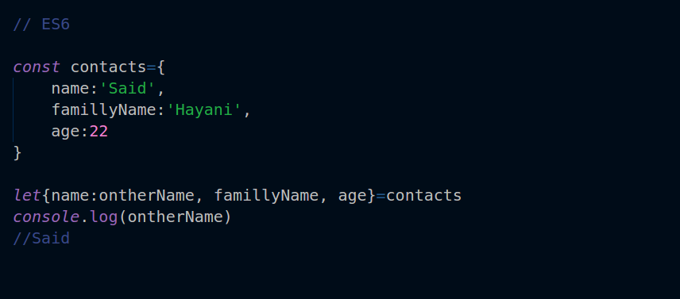

For the array, we use the same syntax as the object. We have just to replace the curly brackets with square brackets.

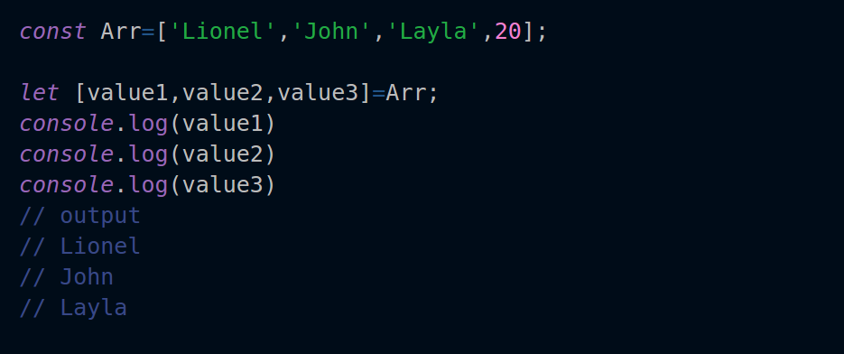

### Import and export

Using `import` and `export` in your JavaScript application makes it more powerful. They allow you to create separate and reusable components.

If you are familiar with any JavaScript MVC framework, you will see that they use `import` and `export` to handle the components most of the time. So how do they really work?

It is simple! `export` allows you to export a module to be used in another JavaScript component. We use `import` to import that module to use it in our component.

For example, we have two files. The first is named `detailComponent.js`  and the second is named  `homeComponent.js`.

In `detailComponent.js`  we are going to export the `detail` function.

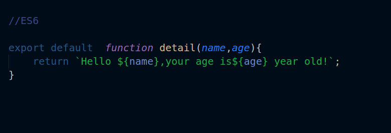

And if we want to use this function in `homeComponent.js`,  we will just use `import`.


If we want to import more than one module, we just put them within curly brackets.

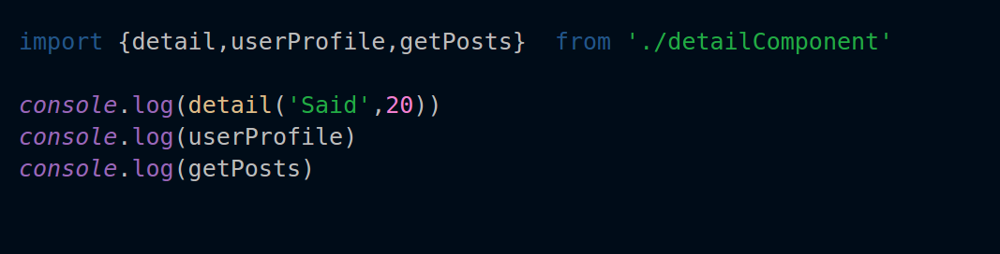

So cool, isn’t it?!

### **Promises**

Promises are a new feature of ES6. It’s a method to write asynchronous code. It can be used when, for example, we want to fetch data from an API, or when we have a function that takes time to be executed. Promises make it easier to solve the problem, so let’s create our first Promise!

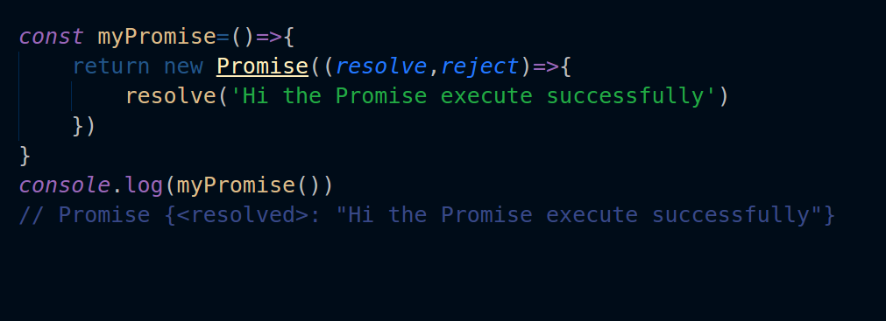

If you log your console, it will return a Promise. So, if we want to execute a function after data is fetched, we will use a Promise. The Promise takes two parameters: `resolve` and `reject` to handle an expected error.

Note: the fetch function returns a Promise itself!

```
const url='https://jsonplaceholder.typicode.com/posts';

const getData=(url)=>{
return fetch(url);
}

getData(url).
then(data=> data.json()).
then(result=> console.log(result));
```

Now if you log your console it will return an array of data.

### Rest parameter and Spread operator

[The rest parameter](https://developer.mozilla.org/ar/docs/Web/JavaScript/Reference/Functions/rest_parameters)s are used to get the argument of an array, and return a new array.

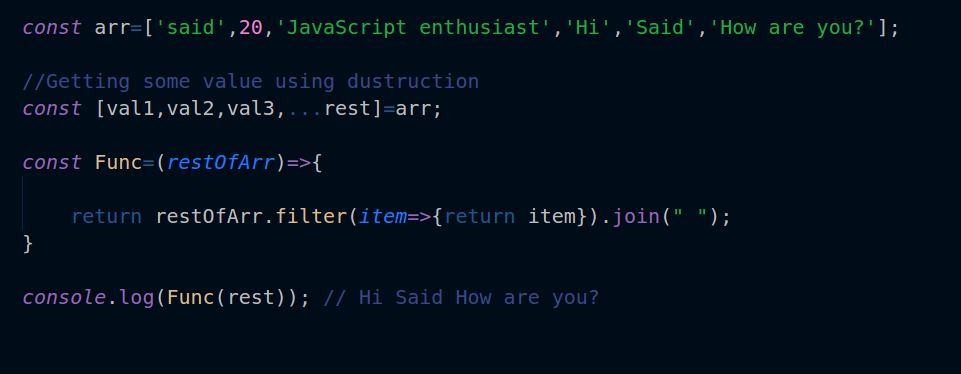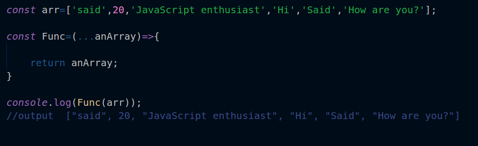

The spread operator has the same syntax as the rest parameter, but the spread operator takes the Array itself and not just the arguments. We can use the Spread parameter to get the values of an Array, instead of using a for loop or any other method.

```
const arr=['said',20,'JavaScript enthusiast','Hi','Said','How are you?'];

const Func=(...anArray)=>{
return anArray;
}
console.log(Func(arr));
//output  ["said", 20, "JavaScript enthusiast", "Hi", "Said", "How are you?"
```

### Classes

Classes are the core of object oriented programming (OOP). They make your code more secure and encapsulated. Using classes gives your code a nice structure and keeps it oriented.

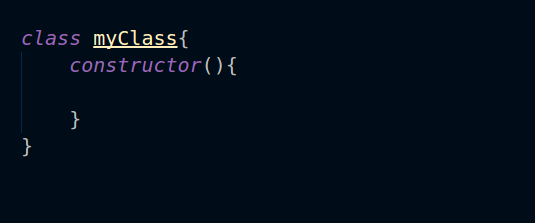

To create a class, use the `class` keyword followed by the name of the class with two curly brackets.

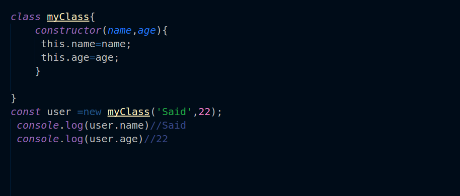

Now we can access the `class` methods and properties using the `new` keyword.

```
class myClass{
    constructor(name,age){
    this.name=name;
    this.age=age;
}
}
const Home= new myClass("said",20);

console.log(Home.name)//  said


```

To inherit from another class, use the `extends` keyword followed by the name of the class you want to inherit from.

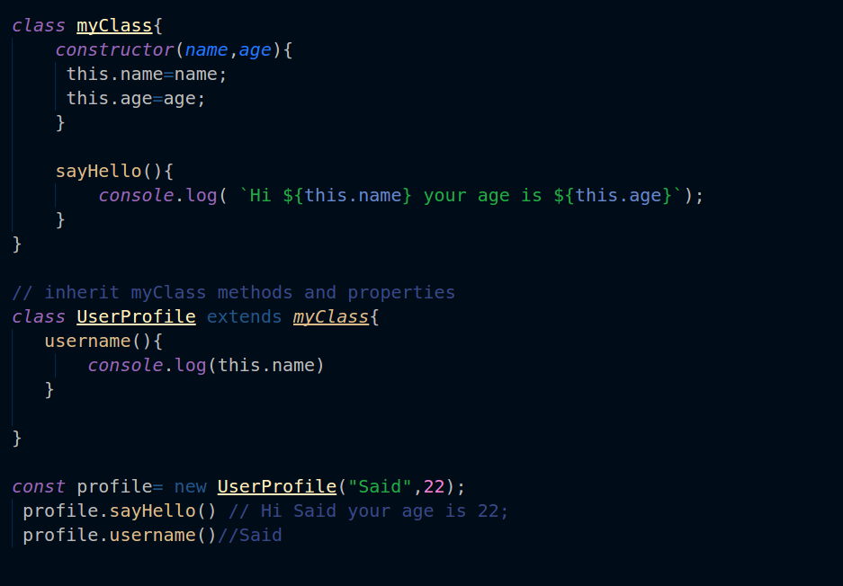

You can learn more about Classes  [here](https://developer.mozilla.org/ar/docs/Web/JavaScript/Reference/Classes).

ES6 has other amazing features — you can explore them [here](http://es6-features.org).

### Conclusion

I hope you guys found this article useful, and I hope I was able to introduce you some of the ES6 features. If so, subscribe to this [mail-list](http://eepurl.com/dk9OJL) to learn more about Front-end topics. Thanks for your time.