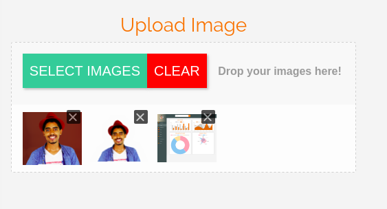

---

### Layla Template -V 1.0.0

> Layla is a dashboard template based on Angular 2 and bootstrap 4 and other angular plugin for progressive Web Application ,E-commerce and Content Management see the [**Demo**](https://medium.com/r/?url=https%3A%2F%2Flayla-angular-bootstrap4.firebaseapp.com%2F)

### Tools and Packages used in this template:

-   [Angular 2](https://medium.com/r/?url=https%3A%2F%2Fangular.io%2F)
-   [Angular CLI](https://medium.com/r/?url=https%3A%2F%2Fcli.angular.io%2F)
-   [Bootstrap 4](https://medium.com/r/?url=http%3A%2F%2Fgetbootstrap.com%2F)
-   [Material icon](https://medium.com/r/?url=https%3A%2F%2Fmaterial.io%2Ficons%2F)
-   [Sass Processor](https://medium.com/r/?url=http%3A%2F%2Fsass-lang.com%2Fguide)
-   [Google fonts API](https://medium.com/r/?url=https%3A%2F%2Ffonts.google.com%2F)
-   Angular animatoins
-   Angular Routing
-   [ng-Chart Module](https://medium.com/r/?url=https%3A%2F%2Fvalor-software.com%2Fng2-charts%2F)
-   [ImageUploadModule](http://localhost:4200/)

### 1- Using Animations:

If you would use animation first you have to import animations function into your component.

```
import   {moveIn,fadeIn,moveInLeft,moveInDown,moveInUp}          from "../../app-animation";
```

Then add animations array to @component decorator

```
animations:[moveIn(),fadeIn(),moveInLeft(),moveInDown(),moveInUp()],
```

So now You can use animation to your HTML element

```
// To move The element from Down
<div>Hello World [@moveInDown]></div>

//To move Elemnt From Up
<div>Hello World [@moveInUp]></div>

//To move Element In
<div>Hello World [@moveIn]></div>

// To move Element from Right
<div>Hello World [@moveInRight]></div>

//To move Element From Left
<div>Hello World [@moveInLeft]></div>
```

### \-2 Charts;


include this HTML to your component to use one of those chart

```
<!-- bar chart  -->
    <div class="col-md-12 col-lg-5 col-sm-6 col-xs-12 chart" >
      <h3 class="text-center">Bar chart</h3>
       <canvas baseChart
            [datasets]="barChartData"
            [labels]="barChartLabels"
            [options]="barChartOptions"
            [legend]="barChartLegend"
            [colors]="barChartColors"
            [chartType]="barChartType"
            (chartHover)="chartHovered($event)"
            (chartClick)="chartClicked($event)"></canvas>

</div>
    <!-- bar chart -->

<!-- Doughnut Chart t -->
   <div class="col-md-12 col-lg-5 col-sm-12 chart">
    <h3 class="text-center">Line Chart</h3>
     <canvas baseChart
               [datasets]="lineChartData"
                [labels]="lineChartLabels"
                [options]="lineChartOptions"
                [colors]="lineChartColors"
                [legend]="lineChartLegend"
                [chartType]="lineChartType"
                (chartHover)="chartHovered($event)"
                (chartClick)="chartClicked($event)"></canvas>
   </div>
   <!-- Doughnut Chart  -->
     <!-- line chart -->
    <div class="col-md-12 col-lg-5 col-xs-12 chart">
    <h3 class="text-center"> Doughnut Cahrt</h3>
       <canvas baseChart height="300" 
              [data]="doughnutChartData"
              [labels]="doughnutChartLabels"
              [chartType]="doughnutChartType"
              (chartHover)="chartHovered($event)"
              (chartClick)="chartClicked($event)"></canvas>
    </div>
    <!-- line chart -->

<!-- Radar chart -->
    <div class="col-md-12 col-lg-5 col-xs-12 chart">
    <h3 class="text-center">Radar Chart</h3>
       <canvas baseChart
          [datasets]="radarChartData"
          [labels]="radarChartLabels"
          [chartType]="radarChartType"
          
          (chartHover)="RadarchartHovered($event)"
          (chartClick)="RadarchartClicked($event)"></canvas>
    </div>
    <!-- radar chart -->
```

To customize Chart and change chart properties inside your components.ts

include

```
/*bar charts*/
 public barChartOptions:any = {
    scaleShowVerticalLines: false,
    responsive: true
  };
  public barChartLabels:string[] = ['2006', '2007', '2008', '2009', '2010', '2011', '2012'];
  public barChartType:string = 'bar';
  public barChartLegend:boolean = true;
 
  public barChartData:any[] = [
    {data: [65, 59, 80, 81, 56, 55, 40], label: 'Series A'},
    {data: [28, 48, 40, 19, 86, 27, 90], label: 'Series B'}
  ];
 
   public barChartColors:Array<any> = [
    { // grey
      backgroundColor: '#cecece',
      borderColor: 'rgba(148,159,177,1)',
      pointBackgroundColor: 'rgba(148,159,177,1)',
      pointBorderColor: '#fff',
      pointHoverBackgroundColor: '#f8f8f8',
      pointHoverBorderColor: 'rgba(148,159,177,0.8)'
    },
    { // dark grey
      backgroundColor: '#F97300',
      borderColor: '#F97300',
      pointBackgroundColor: 'rgba(77,83,96,1)',
      pointBorderColor: '#fff',
      pointHoverBackgroundColor: '#fff',
      pointHoverBorderColor: 'rgba(77,83,96,1)'
    },
    { // grey
      backgroundColor: 'rgba(148,159,177,0.2)',
      borderColor: 'rgba(148,159,177,1)',
      pointBackgroundColor: 'rgba(148,159,177,1)',
      pointBorderColor: '#fff',
      pointHoverBackgroundColor: '#fff',
      pointHoverBorderColor: 'rgba(148,159,177,0.8)'
    }
  ];
  // events
  public chartClicked(e:any):void {
    console.log(e);
  }
 
  public chartHovered(e:any):void {
    console.log(e);
  }

/*Start  Doughnut*/

public doughnutChartLabels:string[] = ['Download Sales', 'In-Store Sales', 'Mail-Order Sales'];
  public doughnutChartData:number[] = [350, 450, 100];
  public doughnutChartType:string = 'doughnut';
 public doughnutColors:Array<any>=[
 { // dark grey
      backgroundColor: '#F97300',
      borderColor: '#F97300',
      pointBackgroundColor: 'rgba(77,83,96,1)',
      pointBorderColor: '#fff',
      pointHoverBackgroundColor: '#fff',
      pointHoverBorderColor: 'rgba(77,83,96,1)'
    }];

// events
  public DoughnutCliked(e:any):void {
    console.log(e);
  }
 
  public DoughnutHovered(e:any):void {
    console.log(e);
  }
   /*End Doughnut Chart*/

// Radar chart

public radarChartLabels:string[] = ['Eating', 'Drinking', 'Sleeping', 'Designing', 'Coding', 'Cycling', 'Running'];
 
  public radarChartData:any = [
    {data: [65, 59, 90, 81, 56, 55, 40], label: 'Series A'},
    {data: [28, 48, 40, 19, 96, 27, 100], label: 'Series B'}
  ];
  public radarChartType:string = 'radar';
   
   public rardarColor :Array<any> =[
  { // dark grey
      backgroundColor: 'rgba(249, 115, 0, 0.7)',
      borderColor: '#F97300',
      pointBackgroundColor: 'rgba(77,83,96,1)',
      pointBorderColor: '#fff',
      pointHoverBackgroundColor: '#fff',
      pointHoverBorderColor: 'rgba(77,83,96,1)'
    }

];
  // events
  public RadarchartClicked(e:any):void {
    console.log(e);
  }
 
  public RadarchartHovered(e:any):void {
    console.log(e);
  }

/*line chart*/
  public lineChartData:Array<any> = [
    {data: [65, 59, 80, 81, 56, 55, 40], label: 'Series A'},
    {data: [28, 48, 40, 19, 86, 27, 90], label: 'Series B'},
    {data: [18, 48, 77, 9, 100, 27, 40], label: 'Series C'}
  ];
  public lineChartLabels:Array<any> = ['January', 'February', 'March', 'April', 'May', 'June', 'July'];
  public lineChartType:string = 'line';

public lineChartColors:Array<any> = [
     { // grey
      
      borderColor: '#F97300',
      pointBackgroundColor: '#ac0c0c',
      pointBorderColor: '#fff',
      pointHoverBackgroundColor: '#fff',
      pointHoverBorderColor: 'rgba(148,159,177,0.8)'
    },
    { // dark grey
      backgroundColor:"#F97300",
      borderColor: '#fff',
      pointBackgroundColor: '#ac0c0c',
      pointBorderColor: '#fff',
      pointHoverBackgroundColor: '#fff',
      pointHoverBorderColor: 'rgba(77,83,96,1)'
    },
    { // grey
      
      borderColor: '#10828C',
      pointBackgroundColor: '#ac0c0c',
      pointBorderColor: '#fff',
      pointHoverBackgroundColor: '#fff',
      pointHoverBorderColor: 'rgba(148,159,177,0.8)'
    }
   ];
```

### 3- Notifications


To use notifications in your component


In **component.ts**

The notification work with animations Function,So you have to include Them in your component

```
import {moveInRight,notifyTop,notifyLeft,notifyBottom} from '../../app-animation';
```

\-**component.ts**

Include notifications Functions inside class

```
export class NotificationComponent implements OnInit {

right:boolean=false;
  left:boolean=false;
  top:boolean=false;
  bottom:boolean=false;
  constructor() { }

ngOnInit() {
  }

// push notofication function
  notifRight(){
   this.right=(this.right===false)?true:false;
   setTimeout(()=>this.right=false,1000);
  }
   notifLeft(){
   this.left=(this.left===false)?true:false;
   setTimeout(()=>this.left=false,1000);
  }
   notifTop(){
   this.top=(this.top===false)?true:false;
 setTimeout(()=>this.top=false,1000);
  }
   notifBottom(){
   this.bottom=(this.bottom===false)?true:false;
   setTimeout(()=>this.bottom=false,1000);
  }

}
```

in your **_components.html_**

```
<h3>Notification</h3>
      <button class="btn btn-lg btn-default"  (click)="notifRight()">Notification from right</button>
      <button class="btn btn-lg btn-default" (click)="notifLeft()">Notification from Left</button>
      <button class="btn btn-lg btn-default" (click)="notifTop()">Notification from Top</button>
      <button class="btn btn-lg btn-default" (click)="notifBottom()">Notification from Bottom</button>
      <div class="notification-inner">
       <div class="item right" *ngIf="right" [@moveInRight]="right"><p>Notification from right</p></div>
       <div class="item left" *ngIf="left" [@notifyLeft]="left"><p>Notification from Left</p></div>
       <div class="item top" *ngIf="top" [@notifyTop]="top"><p>Notification from Top</p></div>
       <div class="item bottom" *ngIf="bottom" [@notifyBottom]="bottom"><p>Notification from Bottom</p></div>
      </div>
```

Notification Style **NotificationComponent.scss**

```
// notification style
.notification{
 padding: 2em;
 min-height: 60em;
 h3{
  font-family: $Raleway;
  color:$orange;
 }
 button{
  margin-bottom:1em;
  background: $orange;
  font-family: $Raleway;
  color:#f4f4f4;
  @media(min-width:768px) {
  background: $orange;
  font-family: $Raleway;
  color:#f4f4f4; 
  }
  
 }
 .notification-inner{
  position: relative;
  .item{
   background: #3e5151;
    padding: 7px 130px;
    border-radius: 6px;
    position: fixed;
    max-width: 30em;
     @media(min-width:768px) {
      background: #3e5151;
    padding: 7px 130px;
    border-radius: 6px;
    position: fixed;
    max-width: 30em;
     }
    
   p{
    font-family: $openSans;
    color:#f4f4f4;
   }
   
  }
  .right{
    right: 5%;
    top: 50%;
   }
  .left{
    left: 5%;
    top: 50%;
   }
  .top{
    top: 95px;
    left: 39%
  }
  .bottom{
   bottom: 10%;
            right: 27%;
  }

}
}
```

### 4- Forms

**a- uploadImage form**

use **ImageUploadModule** module in your component to have a nice upload file form with awesome Features (Drop and drag ,live preview).



### Usage:

First include ImageUploadModule in your component.ts

```
import { ImageUploadModule } from "angular2-image-upload";
```

in your **component.html**

```
<div class="form-group">
     
                  <image-upload 
                 
                  [extensions]="['jpg','png','gif']"
                  
                  >
                  </image-upload>

<!-- options

[max]="100"
            [url]="'example.com/images/upload'" the url that will handel post requset

[headers]="{Authorization: 'MyToken'}"// in case  header request need token
            [buttonCaption]="'Select Images!'"

[dropBoxMessage]="'Drop your images here!'"

[extensions]="['jpg','png','gif']"     // extention allowed

[uploadedFiles]="['http://example.com/path/to/my/file']"

[class]="'customClass'"   // class for Css Style

(removed)="onRemoved($event)" // function to fire when remove file

(uploadFinished)="onUploadFinished($event)" //function handel after upload

(uploadStateChanged)="onUploadStateChanged($event)"

//css class to costumize

customStyle = {
              selectButton: {
              "color": "white",
              "background-color": "purple",
              },
              clearButton: {
              "color": "white",
              "background-color": "yellow",
              },
              layout: {
              "background-color": "black",
              "color": "red",
              "font-size": "15px",
              },
              previewPanel: {
              "background-color": "red",
              }
              };

-->

</div>
```

**b- Form Validation:**


To use From validation features:

-   include animations functions in your **component.ts**

```
// import animation
import {moveInUp,moveInLeft,moveInRight,moveInDown,notifyLeft}   from '../../app-animation';
```

-   in your **component.html**

```
<h3 class="text-center">Form Validation</h3>
         <form #userForm='ngForm' novalidate>
            <div class="form-group">
            <!-- name field -->
               <div class="input-group">
                     <input type="text" required #nameV='ngModel' minlength="4" maxlength="15" class="form-control"  placeholder="Enter your name" name="name" ngModel autocomplete="off">
                        <div class="input-group-prepend">
                          <span class="input-group-text"><i class="material-icons">person</i></span>
                        </div>
                       
               </div>
               <!-- alert validation -->
               <div [@moveInRight] *ngIf="nameV.errors && (nameV.dirty || nameV.touched)" class="alert_validation">
                 <span [hidden]=!nameV.errors.required>The Name is Required !</span>
                 <span [hidden]=!nameV.errors.minlength>Please Enter at least 5 characteres min</span>
                 <span [hidden]=!nameV.errors.maxlength>Maximun Characters 15</span>   
              </div> 
             </div>
             
               <!-- last name field -->
            <div class="form-group">   
               <div class="input-group">
                     <input type="text" class="form-control" required minlength="4" maxlength="20" #Lname='ngModel' placeholder="LastName" name="Lname" autocomplete="off"  ngModel>
                        <div class="input-group-prepend">
                          <span class="input-group-text"><i class="material-icons">assignment_ind</i></span>
                        </div>
               </div>
                <!-- alert validation -->
               <div [@moveInRight] *ngIf="Lname.errors && (Lname.dirty || Lname.touched)" class="alert_validation">
                 <span [hidden]=!Lname.errors.required>The Last Name is Required !</span>
                 <span [hidden]=!Lname.errors.minlength>Please Enter at least 5 characteres min</span>
                 <span [hidden]=!Lname.errors.maxlength>Maximun Characters 20</span>   
              </div> 
            </div>
               <!-- phone field -->
            <div class="form-group">   
               <div class="input-group">
                     <input type="text"
                      class="form-control"
                       autocomplete="off"
                       #phone="ngModel"
                       pattern="^(?:(?:\+?1\s*(?:[.-]\s*)?)?(?:\(\s*([2-9]1[02-9]|[2-9][02-8]1|[2-9][02-8][02-9])\s*\)|([2-9]1[02-9]|[2-9][02-8]1|[2-9][02-8][02-9]))\s*(?:[.-]\s*)?)?([2-9]1[02-9]|[2-9][02-9]1|[2-9][02-9]{2})\s*(?:[.-]\s*)?([0-9]{4})(?:\s*(?:#|x\.?|ext\.?|extension)\s*(\d+))?$"
                        placeholder="Your phone Number" name="phone" ngModel>
                        <div class="input-group-prepend">
                          <span class="input-group-text"><i class="material-icons">phone</i></span>
                        </div>
               
               </div>
                 <!-- alert validation -->
               <div [@moveInRight]  *ngIf="phone.errors && (phone.dirty || phone.touched)" class="alert_validation">
                 <span [hidden]=!phone.errors.pattern>Please Enter a Valid phone Number</span>
                   
              </div> 
            </div>

<!-- Email field -->
             <div class="form-group">  
               <div class="input-group">
                     <input type="text"
                      autocomplete="off" 
                     #email='ngModel'
                     pattern='^(("[\w-\s]+")|([\w-]+(?:\.[\w-]+)*)|("[\w-\s]+")([\w-]+(?:\.[\w-]+)*))(@((?:[\w-]+\.)*\w[\w-]{0,66})\.([a-z]{2,6}(?:\.[a-z]{2})?)$)|(@\[?((25[0-5]\.|2[0-4][0-9]\.|1[0-9]{2}\.|[0-9]{1,2}\.))((25[0-5]|2[0-4][0-9]|1[0-9]{2}|[0-9]{1,2})\.){2}(25[0-5]|2[0-4][0-9]|1[0-9]{2}|[0-9]{1,2})\]?$)'
                      class="form-control" placeholder="Enter your Email" name="email" ngModel>
                        <div class="input-group-prepend">
                          <span class="input-group-text"><i class="material-icons">email</i></span>
                        </div>
                                
              
               </div>
               <!-- alert validation -->
               <div [@moveInRight] *ngIf="email.errors && (email.dirty || email.touched)" class="alert_validation">
                 <span [hidden]=!email.errors.pattern>Please Enter a Valid Email</span>
                   
              </div>
            </div>

<!-- url field -->
             <div class="form-group">  
               <div class="input-group">
                     <input type="text"
                      autocomplete="off" 
                     #url='ngModel'
                     pattern='(http:\/\/www\.|https:\/\/www\.|http:\/\/|https:\/\/)?[a-z0-9]+([\-\.]{1}[a-z0-9]+)*\.[a-z]{2,5}(:[0-9]{1,5})?(\/.*)?$'
                      class="form-control" placeholder="Ex:http://www.google.com" name="email" ngModel >
                        <div class="input-group-prepend">
                          <span class="input-group-text"><i class="material-icons">https</i></span>
                        </div>
                                
              
               </div>
               <!-- alert validation -->
               <div [@moveInRight] *ngIf="url.errors && (url.dirty || url.touched)" class="alert_validation">
                 <span [hidden]=!url.errors.pattern>The Url is Invalid</span>
                   
              </div>
            </div>

<!-- adress Fields -->

<div class="adress">

<!-- Street field -->
             <div class="form-group">      
               <div class="input-group">
                     <input type="text"
                     #street="ngModel"
                     pattern="^[0-9-a-z][0-9A-Z]"
                      class="form-control"
                       placeholder="Street Adress"
                        name="street"
                        ngModel>
                        <div class="input-group-prepend">
                          <span class="input-group-text"><i class="material-icons">streetview</i></span>
                        </div>
                    
                   
              </div>
                  <!-- alert validation -->
               <div [@moveInRight] *ngIf="street.errors && (street.dirty || street.touched)" class="alert_validation">
                 <span [hidden]=!street.errors.pattern>Please Enter a Valid Adress</span>
               </div>
            </div>

<!-- Zip field -->
             <div class="form-group">     
               <div class="input-group">
                     <input type="text"
                     #zip='ngModel'
                     pattern="^[1-9][1-9]{4}$" 
                      class="form-control"
                       placeholder="Code Zip"
                        name="zip"
                        ngModel>
                        <div class="input-group-prepend">
                          <span class="input-group-text">Zip</span>
                        </div>
               </div>
                        <!-- alert validation -->
               <div [@moveInRight] *ngIf="zip.errors && (zip.dirty || zip.touched)" class="alert_validation">
                 <span [hidden]=!zip.errors.pattern>Code Postal is Invalid !</span>
                   
              </div>
            </div>
                 
                </div>
              <input type="submit" [disabled]=!userForm.valid class="btn btn-secondary btn-block" value="Submit">
            
         </form>
    </div>
```

-   Form and errors Style

**component.scss**

```
form{
  margin-bottom: 2em;
  // form class validation
    .ng-valid{
   border: 2px solid #2C9E4B;

}
        
     
     .form-control{
          font-family: $openSans;
       font-size: 13px;
      &:focus{
       box-shadow: none !important;
       border:1px solid #ccc;

}
     } 
     .alert_validation{
      padding: 1em;
      span{
       color:#AC0C0C;
       font-family: $openSans;
       font-size: 13px;
      }
     }

.input-group-text{
   background:#3e5151 !important;
   color:#f4f4f4;

}

}
```

**C- DatePicker:**

To use datepicker Just include datepicker HTMl tag in your component

```
<material-datepicker [(date)]="yourModelDate"></material-datepicker>
```

### \-Bootstrap Elements

-   **1 Layout:**


**HTML code**

```
<h3>Bootstrap4 Layout</h3>
    <div class="row">
    <div class="col-md-8 item"><strong>.col-md-8</strong></div>
    <div class="col-md-4 item"><strong>.col-md-4</strong></div>

<div class="col-md-4 item"><strong>.col-md-4</strong></div>
    <div class="col-md-4 item"><strong>.col-md-4</strong></div>
    <div class="col-md-4 item"><strong>.col-md-4</strong></div>

<div class="col-md-2 item"><strong>.col-md-2</strong></div>
    <div class="col-md-2 item"><strong>.col-md-2</strong></div>
    <div class="col-md-3 item"><strong>.col-md-3</strong></div>
    <div class="col-md-5 item"><strong>.col-md-5</strong></div>

<div class="col-md-1 item"><strong>.col-md-1</strong></div>
    <div class="col-md-1 item"><strong>.col-md-1</strong></div>
    <div class="col-md-1 item"><strong>.col-md-1</strong></div>
    <div class="col-md-1 item"><strong>.col-md-1</strong></div>
    <div class="col-md-1 item"><strong>.col-md-1</strong></div>
    <div class="col-md-1 item"><strong>.col-md-1</strong></div>
    <div class="col-md-1 item"><strong>.col-md-1</strong></div>
    <div class="col-md-1 item"><strong>.col-md-1</strong></div>
    <div class="col-md-4 item"><strong>.col-md-4</strong></div>

<div class="col-md-10 item"><strong>.col-md-10</strong></div>
    <div class="col-md-2 item"><strong>.col-md-2</strong></div>

</div>
   </div>
```

2- Modal


In your HTML Template

```
<div class="container">

//button 
<button class="btn btn-primary btn-lg" data-toggle="modal" data-target="#exampleModal1"> Modal</button>

// modal

<!-- modal1 -->
    <div class="modal fade modal-image bd-example-modal-lg" id="exampleModal1" tabindex="-1" role="dialog">
    <div class="modal-dialog modal-lg" role="document">
    <div class="modal-content">
    <button type="button" class="close" data-dismiss="modal" aria-label="Close">
    <span aria-hidden="true">&times;</span>
    </button>
    
    <div class="modal-body ">
    
    </div>
    
    </div>
    </div>
    </div>
    <!-- modal1 -->

</div>
```

### \-Icons


Layla template use material icon so if you would use them check [icons docs](https://medium.com/r/?url=https%3A%2F%2Fmaterial.io%2Ficons%2F)

it contain over than 900 icon.

### **About Author**

Web Developer specializing in Front End UI and Back End ,Experience manager in all stages of the development cycle for dynamic web projects, #JavaScript enthusiast and #AngularJs Lover :) .  
available for #Freelance Job ContactMe : hayanisaid1995@gmail.com

for support :

You can always reach me at **_info.said.dev@gmail.com_**