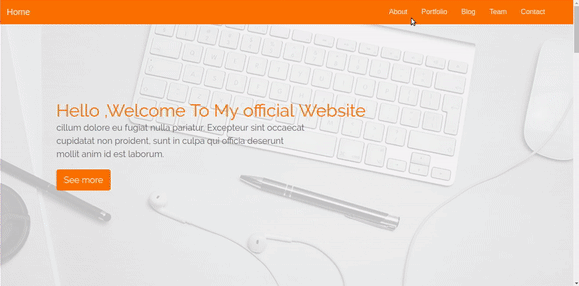
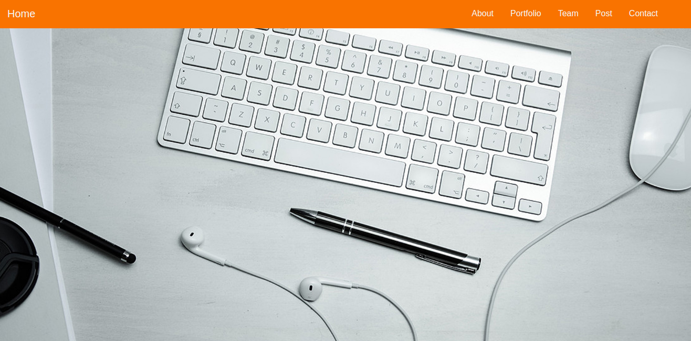
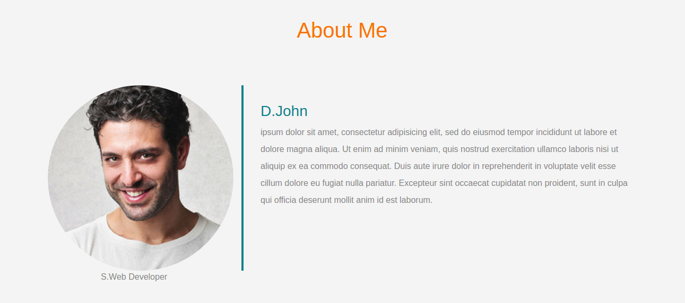
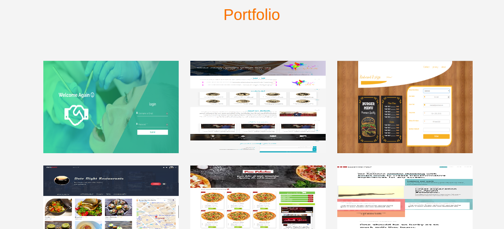
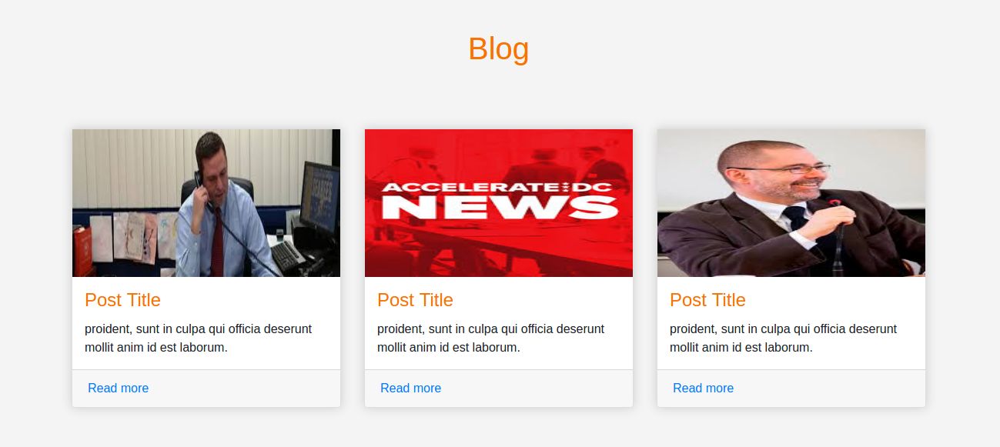
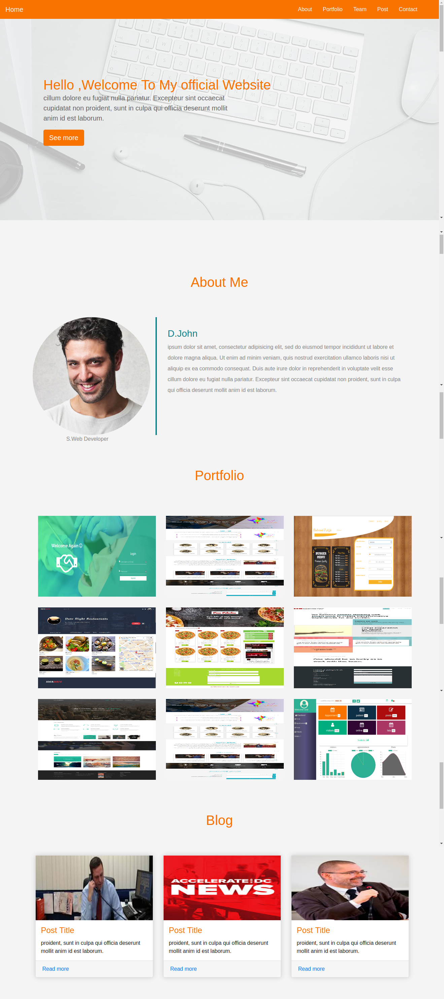
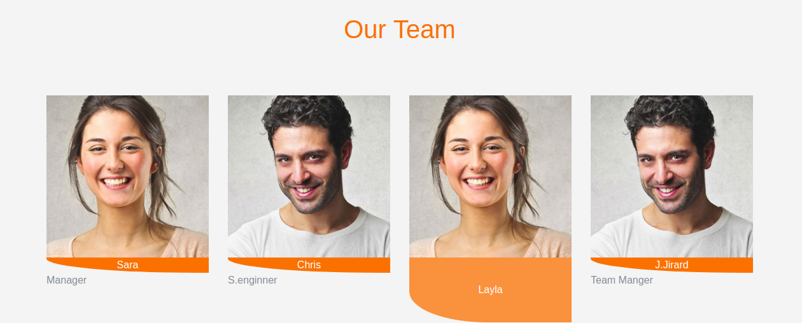
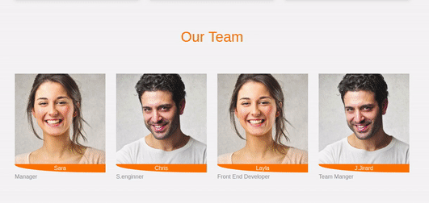
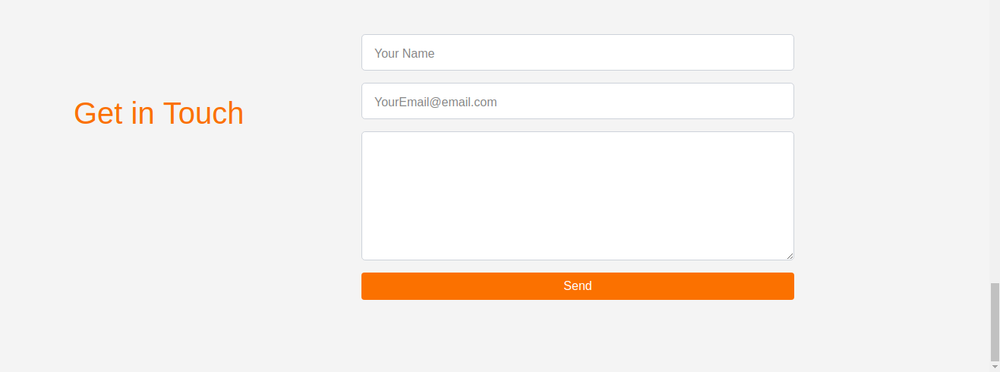

](./asset-1.jpeg)

### A guide for beginners

> “Bootstrap is a free, open-source front-end library for designing websites and web applications. It contains HTML- and CSS-based design templates for everything from typography, forms, buttons, navigation and other interface components as well as JavaScript extensions. Unlike many other web frameworks, Bootstrap concerns itself with front-end development only.” — [Wikipedia](https://en.wikipedia.org/wiki/Bootstrap_%28front-end_framework)

> [Hi, before we start check out my full class to learn Bootstrap 4 ,where you will learn new features of bootstrap and how to use them to build better user experiences](https://skl.sh/2NbSAYj) .

There are many versions of Bootstrap with version 4 being the latest. In this article, we are going to build a website using Bootstrap 4.

### Prerequisites

Before starting, there are some skills you’ll have to know in order to learn and use the Bootstrap framework:

-   HTML fundamentals
-   basic knowledge of CSS
-   and some basic JQuery

### Table of Contents

We will cover the topics below while building the website:

-   [Downloading and installing Bootstrap 4](https://medium.com/p/f64e03833f33/#57f4)
-   [The new features of Bootstrap 4](https://medium.com/p/f64e03833f33/#8a73)
-   [Bootstrap Grid system](https://medium.com/p/f64e03833f33/#06ac)
-   [Navbar](https://medium.com/p/f64e03833f33/#e7c2)
-   [Header](https://medium.com/p/f64e03833f33/#a500)
-   [Buttons](https://medium.com/p/f64e03833f33/#74b8)
-   [About Section](https://medium.com/p/f64e03833f33/#89ac)
-   [Portfolio Section](https://medium.com/p/f64e03833f33/#7504)
-   [Blog Section](https://medium.com/p/f64e03833f33/#9bb6)
-   [Cards](https://medium.com/p/f64e03833f33/#6767)
-   [Team Section](https://medium.com/p/f64e03833f33/#6db4)
-   [Contact Form](https://medium.com/p/f64e03833f33/#971e)
-   [Fonts](https://medium.com/p/f64e03833f33/#f161)
-   [Scroll Effect](https://medium.com/p/f64e03833f33/#6c7e)
-   [Wrap-up and Conclusion](https://medium.com/p/f64e03833f33/#a0a8)

### Downloading and installing Bootstrap 4

There are three ways to install and include Bootstrap 4 for your project:

1.  Use npm

You can install Bootstrap 4 by running this command `npm install bootstrap`

2\. Use a Content Delivery Network (CDN)

By including this link in your project between head tags:

```
<link rel="stylesheet" href="https://maxcdn.bootstrapcdn.com/bootstrap/4.0.0/css/bootstrap.min.css" integrity="sha384-Gn5384xqQ1aoWXA+058RXPxPg6fy4IWvTNh0E263XmFcJlSAwiGgFAW/dAiS6JXm" crossorigin="anonymous">
```

3\. Download the [Bootstrap 4](http://getbootstrap.com/) library and use it locally.

The structure of our project should look like this:


### The new features of Bootstrap 4

What’s new in Bootstrap 4? And what’s different between Bootstrap 3 and 4?

Bootstrap 4 now comes with some awesome features that didn’t exist in the last version:

-   Bootstrap 4 is written using Flexbox Grid, whereas Bootstrap 3 was written using the float method.   
    If you’re new to Flexbox then check out [this tutorial](https://scrimba.com/p/pL65cJ/canLGCw).
-   Bootstrap 4 uses `rem` CSS units whereas Bootstrap 3 uses `px`.  
    [See how these two units differ.](https://zellwk.com/blog/media-query-units/)
-   Panels, thumbnails, and wells have been dropped entirely.   
    You can read in detail more about the global changes and removed features of Bootstrap 4 [here](http://getbootstrap.com/docs/4.0/migration/#global-changes).

Without jumping too deep into detail here, let’s move on to some other important things.

### The Bootstrap Grid system

The Bootstrap Grid system helps you to create your layout and easily build a responsive website. There have not been any changes in the class names, except the `.xs` class, which no longer exists in Bootstrap 4.

The grid is divided into 12 columns, so your layout will be based on this.

To use the grid system you’ll have to add a `.row` class to the main _div_.

```
col-lg-2 // class used for large devices like laptops
col-md-2 // class used for medium devices like tablets
col-sm-2// class used for small devices like mobile phones
```

### Navbar


The navbar wrapper is pretty cool in Bootstrap 4. It’s so helpful when it comes to building a responsive navbar.

To get it, we are going to add the `navbar` class to our `**index.html**` file:

```
<!-- navbar -->  
 <nav class="navbar navbar-expand-lg fixed-top ">  
 <a class="navbar-brand" href="#">Home</a>
<button class="navbar-toggler" type="button" data-toggle="collapse" data-target="#navbarSupportedContent" aria-controls="navbarSupportedContent" aria-expanded="false" aria-label="Toggle navigation">  
 <span class="navbar-toggler-icon"></span>
</button>
<div class="collapse navbar-collapse " id="navbarSupportedContent">     <ul class="navbar-nav mr-4">
 <li class="nav-item">
     <a class="nav-link" data-value="about" href="#">About</a>        </li>  
<li class="nav-item">
    <a class="nav-link " data-value="portfolio"href="#">Portfolio</a>    
 </li>
 <li class="nav-item"> 
    <a class="nav-link " data-value="blog" href="#">Blog</a>         </li>   
<li class="nav-item">  
   <a class="nav-link " data-value="team" href="#">         Team</a>       </li>  
<li class="nav-item"> 
 <a class="nav-link " data-value="contact" href="#">Contact</a>       </li> 
</ul> 
</div></nav>
```

<Embed src="https://codesandbox.io/embed/38nnqwl8n6" height={350} width={700} />

Create and include a `**main.css**` file so that you can customize the CSS style.

Put this within the `head` tag in your `**index.html**` file:

```
<link rel="stylesheet" type="text/css" href="css/main.css">
```

Let’s add some colors to our navbar:

```
.navbar{ background:#F97300;}

.nav-link , .navbar-brand{ color: #f4f4f4; cursor: pointer;}

.nav-link{ margin-right: 1em !important;}

.nav-link:hover{ background: #f4f4f4; color: #f97300; }

.navbar-collapse{ justify-content: flex-end;}

.navbar-toggler{  background:#fff !important;}
```

The new Bootstrap Grid is built with the Flexbox system, so for alignment, you have to use a Flexbox property. For example, to place the navbar menu on the right we need to add a `justify-content` property and set it to `flex-end`.

```
.navbar-collapse{
 justify-content: flex-end;
}
```

Add the `.fixed-top` class to the navbar to give it a fixed position.

To make the navbar background color light, add `.bg-light`. For a dark background, add `.bg-dark`, and for a light blue background, add   
`.bg-primary`.

Here’s how that should look:

```
.bg-dark{
background-color:#343a40!important
}
.bg-primary{
background-color:#007bff!important
}
```

### Header

```
<header class="header">
  
</header>
```

Let’s try and create a layout for the header.

Here, we want to make sure the header takes up the window’s height so we are going to use a little `JQuery` code.

First, create a file named `**main.js**` and include it in the `**index.html**`  file  before the closing `body` tag:

```
<script type="text/javascript" src='js/main.js'></script>
```

In the `main.js`  file insert this a little code of JQuery_:_

```
$(document).ready(function(){
 $('.header').height($(window).height());

})
```

It’d be pretty cool if we set a nice background image to the header:

```
/*header style*/
.header{
 background-image: url('../images/headerback.jpg');
 background-attachment: fixed;
 background-size: cover;
 background-position: center;
}
```

Let’s add an overlay to make the header look a bit more professional:

Add this to your `**index.html**` file:

```
<header class="header">
  <div class="overlay"></div>
</header>
```

Then, add this to your `**main.css**` file:

```
.overlay{
 position: absolute;
 min-height: 100%;
 min-width: 100%;
 left: 0;
 top: 0;
 background: rgba(244, 244, 244, 0.79);
}
```

Now we have to add a description inside the header.

To wrap our description we’re first going to create a `div` and give it a class `.container`.

`.container` is a Bootstrap class that will help you to wrap your content and make your layout more responsive:

```
<header class="header">
  <div class="overlay"></div>
   <div class="container">
    
   </div>
  
</header>
```

Then, add another `div` which will contain the description.

```
<div class="description ">
   <h1>    Hello ,Welcome To My official Website
    <p>    cillum dolore eu fugiat nulla pariatur. Excepteur sint occaecat cupidatat non    proident, sunt in culpa qui officia deserunt mollit anim id est laborum.
</p>   
 <button class="btn btn-outline-secondary btn-lg">See more</button>   </h1>  
</div>
```

We’ll give it a class of `.description` and add the `.text-center` class to make sure the content is placed in the center of the page.

#### Buttons

Add the class `.btn btn-outline-secondary` to the `button` element. there are many other Bootstrap classes for buttons.

Check some examples:

[**CodePen Embed — buttons in Bootstrap 4**  
_Buttons Button primary Button default Button danger Button info Button warning Button dark Button success Buttons…_codepen.io](https://codepen.io/Saidalmaghribi/embed/oEWgbw "https://codepen.io/Saidalmaghribi/embed/oEWgbw")[](https://codepen.io/Saidalmaghribi/embed/oEWgbw)

Here’s how the styling for the `.description` looks in the `**main.css**` file:

```
.description{
    position: absolute;
    top: 30%;
    margin: auto;
    padding: 2em;

}
.description h1{
 color:#F97300 ;
}
.description p{
 color:#666;
 font-size: 20px;
 width: 50%;
 line-height: 1.5;
}
.description button{
 border:1px  solid #F97300;
 background:#F97300;
 color:#fff;
}
```

After all of that, our header will look like this:


Cool isn’t :).

### About Section



In this section, we will use some Bootstrap Grid to divide the section into two parts.

To start our grid, we have to assign the`.row`  class to the parent `div`.

```
<div class="row"></div>
```

The first section will be on the left and will contain a picture, the second section will be on the right and contain a description.

Each `div` will take up 6 columns — that means half of the section. Remember that a grid is divided into 12 columns.

In the first `div` on the left side:

```
<div class="row"> 
 // left side
<div class="col-lg-4 col-md-4 col-sm-12">
    
    <span class="text-justify">S.Web Developer</span>
 </div>

</div>
```

After adding the the HTML elements on the right-side, the structure of the code will look like this:

```
<div class="row">
   <div class="col-lg-4 col-md-4 col-sm-12">
    
    <span class="text-justify">S.Web Developer</span>
   </div>
   <div class="col-lg-8 col-md-8 col-sm-12 desc">
     
    <h3>D.John</h3>
    <p>
       ipsum dolor sit amet, consectetur adipisicing elit, sed do eiusmod
     tempor incididunt ut labore et dolore magna aliqua. Ut enim ad minim veniam,
     quis nostrud exercitation ullamco laboris nisi ut aliquip ex ea commodo
     consequat. Duis aute irure dolor in reprehenderit in voluptate velit esse
     cillum dolore eu fugiat nulla pariatur. Excepteur sint occaecat cupidatat non
     proident, sunt in culpa qui officia deserunt mollit anim id est laborum.
    </p>
   </div>
  </div>
```

Here’s how I’ve made it look:

```
.about{
 margin: 4em 0;
 padding: 1em;
 position: relative;
}
.about h1{
 color:#F97300;
 margin: 2em;
}
.about img{
 height: 100%;
    width: 100%;
    border-radius: 50%
}
.about span{
 display: block;
 color: #888;
 position: absolute;
 left: 115px;
}
.about .desc{
 padding: 2em;
 border-left:4px solid #10828C;
}
.about .desc h3{
 color: #10828C;
}
.about .desc p{
 line-height:2;
 color:#888;
}
```

### Portfolio Section

Now, let’s move onto the next bit and make a portfolio section that will contain a gallery.



The structure of our HTML code for the Portfolio section looks like this:

```
<!-- portfolio -->
<div class="portfolio">
     <h1 class="text-center">Portfolio</h1>
 <div class="container">
  <div class="row">
   <div class="col-lg-4 col-md-4 col-sm-12">
    
   </div>
   <div class="col-lg-4 col-md-4 col-sm-12">
    
   </div>
   <div class="col-lg-4 col-md-4 col-sm-12">
    
   </div>

<div class="col-lg-4 col-md-4 col-sm-12">
    
   </div>
   <div class="col-lg-4 col-md-4 col-sm-12">
    
   </div>
   <div class="col-lg-4 col-md-4 col-sm-12">
    
   </div>

<div class="col-lg-4 col-md-4 col-sm-12">
    
   </div>
   <div class="col-lg-4 col-md-4 col-sm-12">
    
   </div>
   <div class="col-lg-4 col-md-4 col-sm-12">
    
   </div>
  </div>
 </div>
</div>
```

Adding `.img-fluid` to each image to makes it responsive.

Each item in our gallery will take up 4 columns (remember, `col-md-4` for medium devices, `col-lg-4` for large devices). That’s equal to 33.33333%  on large devices such desktops and large tablets, and 12 columns on a small device (like iPhone, mobile devices) will take up 100% of the container.

Let’s add some styling to our Gallery:

```
/*Portfolio*/
.portfolio{
 margin: 4em 0;
    position: relative; 
}
.portfolio h1{
 color:#F97300;
 margin: 2em; 
}
.portfolio img{
  height: 15rem;
  width: 100%;
  margin: 1em;

}
```

### **Blog Section**



#### Cards

Cards in Bootstrap 4 make blog design so much easier. The cards are appropriate for articles and posts.

To create a card, we use the class `.card`  and assign it to a _div_ element,

The card class contains many features:

-   `.card-header`: define the card header
-   `.card-body`:  for the card body
-   `.card-title`: the title of the card
-   `card-footer`:  define the footer of the card.
-   `.card-image`: for the card’s image

So, our website’s HTML should now look something like this:

```
<!-- Posts section -->
<div class="blog">
 <div class="container">
 <h1 class="text-center">Blog</h1>
  <div class="row">
   <div class="col-md-4 col-lg-4 col-sm-12">
    <div class="card">
     <div class="card-img">
      
     </div>
     
     <div class="card-body">
     <h4 class="card-title">Post Title</h4>
      <p class="card-text">
       
       proident, sunt in culpa qui officia deserunt mollit anim id est laborum.
      </p>
     </div>
     <div class="card-footer">
      <a href="" class="card-link">Read more</a>
     </div>
    </div>
   </div>
   <div class="col-md-4 col-lg-4 col-sm-12">
    <div class="card">
     <div class="card-img">
      
     </div>
     
     <div class="card-body">
        <h4 class="card-title">Post Title</h4>
      <p class="card-text">
       
       proident, sunt in culpa qui officia deserunt mollit anim id est laborum.
      </p>
     </div>
     <div class="card-footer">
      <a href="" class="card-link">Read more</a>
     </div>
    </div>
   </div>
   <div class="col-md-4 col-lg-4 col-sm-12">
    <div class="card">
     <div class="card-img">
      
     </div>
     
     <div class="card-body">
     <h4 class="card-title">Post Title</h4>
      <p class="card-text">
       
       proident, sunt in culpa qui officia deserunt mollit anim id est laborum.
      </p>
     </div>
     <div class="card-footer">
      <a href="" class="card-link">Read more</a>
     </div>
    </div>
   </div>
  </div>
 </div>
</div>
```

We need to add some CSS style to the cards:

```
.blog{
 margin: 4em 0;
 position: relative; 
}
.blog h1{
 color:#F97300;
 margin: 2em; 
}
.blog .card{
 box-shadow: 0 0 20px #ccc;
}
.blog .card img{
 width: 100%;
 height: 12em;
}
.blog .card-title{
 color:#F97300;
  
}
.blog .card-body{
 padding: 1em;
}
```

After adding the Blog section to our website, the design should now look something like this:



Cool isn’t it? 😄

### **Team Section**



In this section we will use the grid system to distribute even space between images. Each image takes up 3 columns (`**.col-md-3**`) of the container — that equals 25% of the total space.

Our HTML structure:

```
<!-- Team section -->
<div class="team">
 <div class="container">
    <h1 class="text-center">Our Team</h1>
  <div class="row">
   <div class="col-lg-3 col-md-3 col-sm-12 item">
    
    <div class="des">
      Sara
     </div>
    <span class="text-muted">Manager</span>
   </div>
   <div class="col-lg-3 col-md-3 col-sm-12 item">
    
    <div class="des">
       Chris
     </div>
    <span class="text-muted">S.enginner</span>
   </div>
   <div class="col-lg-3 col-md-3 col-sm-12 item">
    
    <div class="des">
      Layla 
     </div>
    <span class="text-muted">Front End Developer</span>
   </div>
   <div class="col-lg-3 col-md-3 col-sm-12 item">
    
     <div class="des">
      J.Jirard
     </div>
    <span class="text-muted">Team Manger</span>
   </div>
  </div>
 </div>
</div>
```

And let’s add some style:

```
.team{
 margin: 4em 0;
 position: relative;  
}
.team h1{
 color:#F97300;
 margin: 2em; 
}
.team .item{
 position: relative;
}
.team .des{
 background: #F97300;
 color: #fff;
 text-align: center;
 border-bottom-left-radius: 93%;
 transition:.3s ease-in-out;

}


```

Adding an overlay to the image on-hover using animation would be nice 😄.



To make this effect , add the styles below to `**main.css**` file:

```
.team .item:hover .des{
 height: 100%;
 background:#f973007d;
 position: absolute;
 width: 89%;
 padding: 5em;
 top: 0;
 border-bottom-left-radius: 0;
}
```

Super cool! 😙

### Contact Form



The Contact Form is the last section to add, then we are done 😃.

The Contact Form section will contain a form through which visitors can send an email or give feedback. We will use some Bootstrap classes to make the design beautiful and responsive.

Like Bootstrap 3, Bootstrap 4 also uses the `.form-control` class for input fields, but there are some new features added — like switching from `.input-group-addon`  (deprecated) to `**.input-group-prepend**`  (to use icons as labels ).

See [Bootstrap 4 document](https://getbootstrap.com/docs/4.0/migration/#input-groups) for more information. In our Contact form we will wrap each input between a `div` that has the class`.form-group`.

The `**index.html**` file now looks something like this:

```
<!-- Contact form -->
<div class="contact-form">
 <div class="container">
  <form>
   <div class="row">
    <div class="col-lg-4 col-md-4 col-sm-12">
      <h1>Get in Touch</h1> 
    </div>
    <div class="col-lg-8 col-md-8 col-sm-12 right">
       <div class="form-group">
         <input type="text" class="form-control form-control-lg" placeholder="Your Name" name="">
       </div>
       <div class="form-group">
         <input type="email" class="form-control form-control-lg" placeholder="YourEmail@email.com" name="email">
       </div>
       <div class="form-group">
         <textarea class="form-control form-control-lg">
          
         </textarea>
       </div>
       <input type="submit" class="btn btn-secondary btn-block" value="Send" name="">
    </div>
   </div>
  </form>
 </div>
</div>
```

Contact section’styles :

**main.css**

```
.contact-form{
 margin: 6em 0;
 position: relative;  
}

.contact-form h1{
 padding:2em 1px;
 color: #F97300; 
}
.contact-form .right{
 max-width: 600px;
}
.contact-form .right .btn-secondary{
 background:  #F97300;
 color: #fff;
 border:0;
}
.contact-form .right .form-control::placeholder{
 color: #888;
 font-size: 16px;
}
```

#### Fonts

I think default fonts are ugly so we are going to use the Google Font API, and we’ll choose **Raleway** which is a nice font and appropriate to our template.

Add this link into your `**main.css**` file:

```
@import url('https://fonts.googleapis.com/css?family=Raleway');
```

and set the global style to HTML and heading tags:

```
html,h1,h2,h3,h4,h5,h6,a{
 font-family: "Raleway";
}
```

#### **Scroll Effect**


The last thing missing is scroll effect. Here, we’ll have to use some JQuery. Don’t worry️ if you are not familiar with it, just add this code into your  `**main.js**`  file:

```
$(".navbar a").click(function(){
  $("body,html").animate({
   scrollTop:$("#" + $(this).data('value')).offset().top
  },1000)
  
 })
```

and add a `data-value` attribute to each navbar link:

```
<li class="nav-item">
         <a class="nav-link" data-value="about" href="#">About</a>
       </li>
       <li class="nav-item">
         <a class="nav-link " data-value="portfolio" href="#">Portfolio</a>
       </li>
       <li class="nav-item">
         <a class="nav-link " data-value="blog" href="#">Blog</a>
       </li>
       <li class="nav-item">
         <a class="nav-link " data-value="team" href="#">
         Team</a>
       </li>
       <li class="nav-item">
         <a class="nav-link " data-value="contact" href="#">Contact</a>
       </li>
```

Set an `id` attribute to each section.

**Note**: The `id` must be identical to the `data-value` attribute in the navbar link for the scroll to work:

```
<div class="about" id="about"></div>
```

### Wrap-up and Conclusion

Bootstrap 4 is a great option for building your web application. It delivers high quality of UI elements and it’s easy to customize, integrate and use. It will also help you to include responsiveness in your website, therefore delivering a premium user experience to your users.

You will find the project’s files on [GitHub](https://github.com/hayanisaid/bootstrap4-website).

> If you need some Bootstrap themes and templates you can check out [BootstrapBay](https://bootstrapbay.sjv.io/DV1q2),they have some awesome products

Check out my Bootstrap Class to learn Bootstrap 4:

[**Bootstrap 4 crash course: basic to advance | Said Hayani | Skillshare**  
_In this class the you are going to learn bootstrap version 4, the CSS framework to build flexible templates and…_skl.sh](https://skl.sh/2LaD1ym "https://skl.sh/2LaD1ym")[](https://skl.sh/2LaD1ym)