 on [Unsplash](https://unsplash.com?utm_source=medium&utm_medium=referral)](./asset-1.)

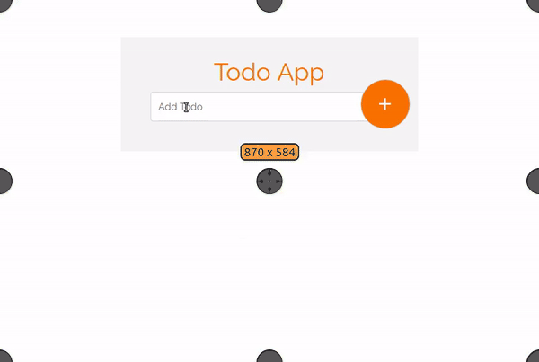

Angular is a JavaScript framework, created my Misko Hevery and maintained by Google. It’s an MVC (Model View Vontroller). You can [visit the official page](https://angular.io/) to learn more about it.

Right now, the latest version of Angular is **5.2.10.** There is [first generation 1.](https://angularjs.org/)x and [second generation 2.x](https://angular.io/), and the two generations are totally different in their structures and methods. Don’t worry if you feel confused about the version, because in this article we will be using the second generation 2.x

#### **Table of contents**

-   Adding an item (learn how to submit a form in Angular )
-   Removing an item (learn how to add an event in Angular)
-   Angular animation (learn how animate the components )

### Prerequisites:

-   **Node.js**

Check if node.js is installed in your computer. [Learn more about installation](https://nodejs.org/en/download/package-manager/).

-   **npm**

**npm** (node package manager) is installed with Node.js

Check the **node.js** version:

```
node -v
```

**npm:**

```
npm -v
```

**Angular-CLI**

You should have the latest version of Angular-CLI. Learn more about Angular CLI [**here**](https://angular.io/guide/quickstart)**,** and find the instructions for installation.

Install Angular-cli:

```
npm install -g @angular/cli
```

And finally, you should have:

-   Basic knowledge of JavaScript
-   HTML and CSS fundamentals

You don’t need to have any knowledge of Angular.

Now that we have the environment to run our Angular app, let’s get started!

### Creating our first app

We will use angular-cli to create and generate our components. It will generate services, router, components, and directives.

To create a new Angular project with Angular-cli, just run:

```
ng new my-app
```

The project will be generated automatically. Let’s create our to-do app!

```
ng new todo-app
```

Then, open the files in your text editor. I use Sublime text, but you can choose any editor.

Here’s what the app structure looks like:

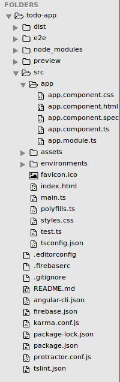

Don’t worry if you are confused about the files. All of our work will be in the **app** folder. It contains five files:

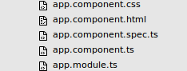

> Note: Angular 2 uses [**TypeScript**](https://www.typescriptlang.org/), in which files end with “**.ts”**extension.

To make a nice interface for our app, we will use the [Bootstrap 4](http://getbootstrap.com/) Framework.

Include bootstrap **cdn** in **index.html**:

```
<link rel="stylesheet" href="https://maxcdn.bootstrapcdn.com/bootstrap/4.0.0/css/bootstrap.min.css" integrity="sha384-Gn5384xqQ1aoWXA+058RXPxPg6fy4IWvTNh0E263XmFcJlSAwiGgFAW/dAiS6JXm" crossorigin="anonymous">
```

Run the app in your terminal:

```
ng serve
```

The app will run in [http://localhost:4200/](http://localhost:4200/)

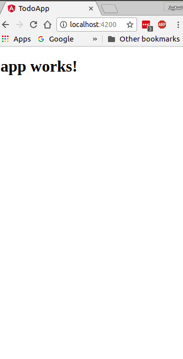

All is well 😄!

Now let’s do some HTML structuring. We will use Bootstrap classes to create a simple form.

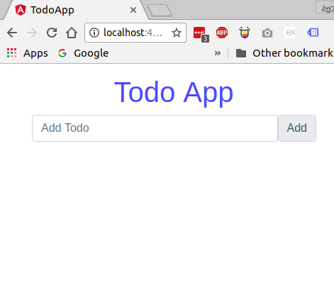

**app.component.html**:

```
<div class="container">
 <form>
  <div class="form-group">
  <h1 class="text-center text-primary">Todo App</h1>
   <div class="input-group-prepend">
       <input type="text" class="form-control" placeholder="Add Todo" name="todo">
    <span class="input-group-text">Add</span>
   </div>
  </div>
 </form>
</div>
```

In **app.component.css**:

```
body{
 padding: 0;
 margin: 0;

}
form{
 max-width: 25em;
 margin: 1em auto;
}
```

To capture the input value in Angular 2, we can use the **ngModel** directive. You can insert a variable as an attribute inside the input element.

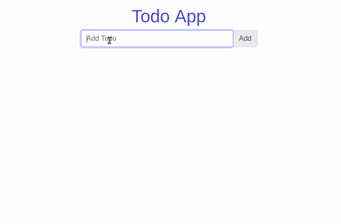```
<input type="text" #todo class="form-control" placeholder="Add Todo" name="todo" ngModel>
```

To create a variable as an attribute, use **#** followed by the variable’s name.

```
<input #myVariable type="text" name="text" ngModel>

// get the value of the Variable
<p>{{myVariable.value}}</p>
```

Now get the “todo” variable value:

```
<p>{{todo.value}}</p>
```

All is well 😅!

Now we have to store the value captured from the input. We can create an empty array in **app.component.ts** inside the AppComponent class:

```
export class AppComponent {
  todoArray=[]
 
}
```

Then we have to add a click event to our button that pushes the value captured into “**todoArray**”.

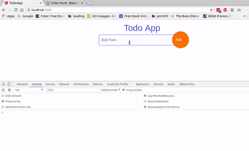

**app.component.html**:

```
<span class="input-group-text" (click)="addTodo(todo.value)">Add</span>
```

In **app.component.ts**:

```
export class AppComponent {
 todoArray=[]

addTodo(value){
    this.todoArray.push(value)
    console.log(this.todoArray)
  }
 
}
```

> Use console.log(this.todoArray) to see Array value

#### Fetch data from “todoArray”

Now we have to fetch data stored in “todosArray.” We will use the \*[**ngFor directive**](https://angular.io/guide/structural-directives) to loop through the array and extract the data.

app.component.html:

```
<div class="data">
  <ul class="list-instyled">
   <li *ngFor="let todo of todoArray">{{todo}}</li>
  </ul>
  </div>
```

After fetching data:

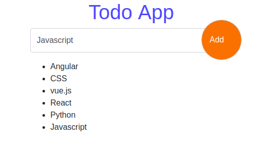

The data will now be fetched automatically when we click the add button.

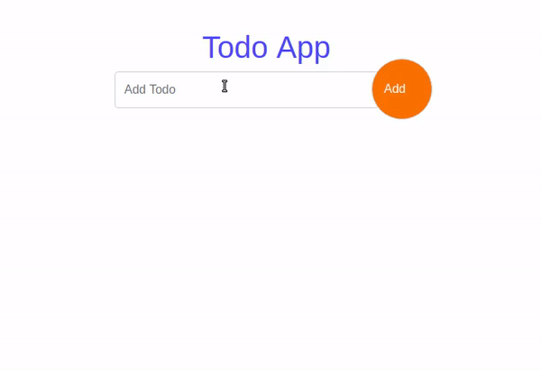

#### Styling the app

I like to use [Google-fonts](https://fonts.google.com) and [Material-icons](https://material.io/icons/), which are free to use.

Include Google fonts inside **app.component.css**:

```
/*Google fonts*/
@import url('https://fonts.googleapis.com/css?family=Raleway');
```

And Material-icons inside **index.html**:

```
<link href="https://fonts.googleapis.com/icon?family=Material+Icons" rel="stylesheet">
```

After adding some styling to our app, it will look like this:

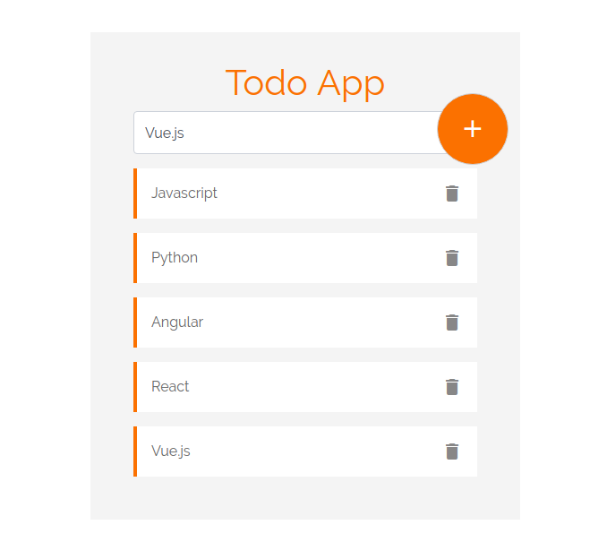

To use Material icons:

```
<i class="material-icons>iconName</i>
```

Add “delete” and “add” icons in **app.component.html**:

```
// put add icon inside "input-group-text" div

<span class="input-group-text" (click)="addTodo(todo.value)">
<i class="material-icons">add</i>
</span>

// and delete icon inside list item
 
<li *ngFor="let todo of todoArray">{{todo}}
<i class="material-icons">delete</i>
</li>
```

For styles in **app.component.css**:

```
/*Google fonts*/
@import url('https://fonts.googleapis.com/css?family=Raleway');

body{
 padding: 0;
 margin: 0;

}
form{
 max-width: 30em;
 margin: 4em auto;
 position: relative;
 background: #f4f4f4;
 padding: 2em 3em;
}
form h1{
    font-family: "Raleway";
    color:#F97300; 
}
form input[type=text]::placeholder{
   font-family: "Raleway";
   color:#666; 
}
form .data{
    margin-top: 1em;
}
form .data li{
 background: #fff;
 border-left: 4px solid #F97300;
 padding: 1em;
 margin: 1em auto;
 color: #666;
 font-family: "Raleway";
}
form .data li i{
    float: right;
    color: #888;
    cursor: pointer;
}
form .input-group-text{
    background: #F97300;
    border-radius: 50%;
    width: 5em;
    height: 5em;
    padding: 1em 23px;
    color: #fff;
    position: absolute;
    right: 13px;
    top: 68px;
    cursor: pointer;
}
form .input-group-text i{
    font-size: 2em;
}
form .form-control{
 height: 3em;
    font-family: "Raleway";
}
form .form-control:focus{
 box-shadow: 0;
}
```

Our app is almost done, but we need to add some features. A delete functionality should let users click a delete icon and delete an item. It would also be great to have the option to enter a new item with the return key, instead of clicking the add button.

**Deleting items**

To add the delete functionality, we will use the “splice” array method and a for loop. We will loop through “todoarray” and extract the item we want to delete.

Add a (click) event to delete icon and give it “todo” as parameter :

```
<li *ngFor="let todo of todoArray">{{todo}} <i (click)="deleteItem(todo)" class="material-icons">delete</i></li>
```

In **app.component.ts**:

```
/*delete item*/
  deleteItem(){
   console.log("delete item")
  }
```

When you click delete, this should show up in the console:

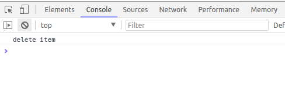

Now we have to loop through “todoArray” and splice the item we clicked.

In **app.component.ts**:

```
/*delete item*/
  deleteItem(todo){
   for(let i=0 ;i<= this.todoArray.length ;i++){
    if(todo== this.todoArray[i]){
     this.todoArray.splice(i,1)
    }
   }
  }
```

The result:

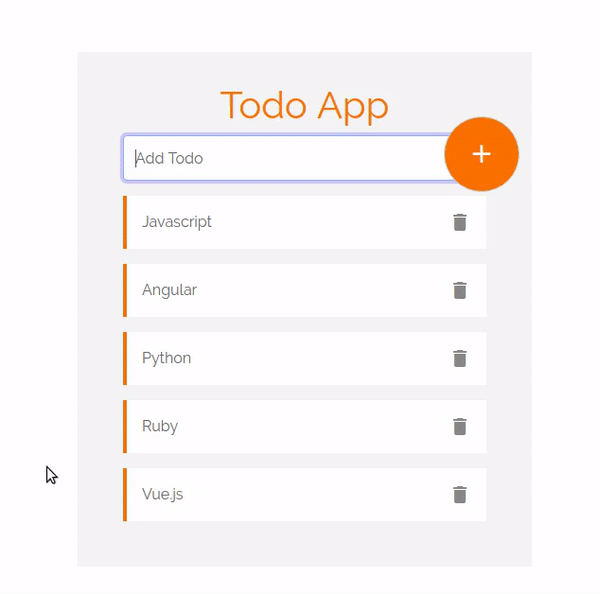

Awesome 👋!!

#### **Entering to add items**

We can add a submit event to the form:

```
(ngSubmit)="TodoSubmit()"
```

We need to add the variable “#todoForm” to the form and give it “ngForm” as a value. In this case, we just have one field so we will just get a single value. If we have multiple fields, the submit event will return the values of all the fields in the form.

**app.component.html**

```
<form #todoForm= "ngForm" (ngSubmit)="todoSubmit(todoForm.value)"></form>
```

in **app.component.ts**

```
// submit Form
  todoSubmit(value:any){
 console.log(value)
  }
```

Check the console. It will return an object of values:

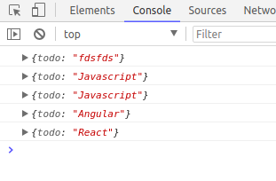

So now we have to push the returned value to “todoArray”:

```
// submit Form
  todoSubmit(value:any){
     if(value!==""){
    this.todoArray.push(value.todo)
     //this.todoForm.reset()
    }else{
      alert('Field required **')
    }
    
  }
```

Here we are 😃. The value is inserted without needing to click the add button, just by clicking “enter”:

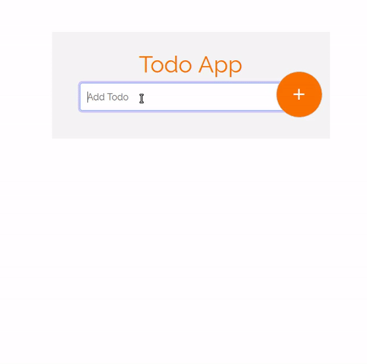

One more thing. To reset the the form after submitting, add the “resetForm()” build-in method to submit the event.

```
<form #todoForm= "ngForm" (ngSubmit)="todoSubmit(todoForm.value); todoForm.resetForm()" ></form>
```

The form will reset after each submit now:

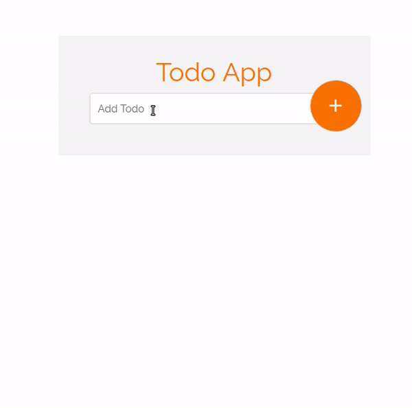

#### Adding animations

I like to add a little touch of animations. To add animation, import the animations components in your **app.component.ts**:

```
import { Component,trigger,animate,style,transition,keyframes } from '@angular/core';
```

Then add the animations property to “@component” decorator:

```
@Component({
  selector: 'app-root',
  templateUrl: './app.component.html',
  styleUrls: ['./app.component.css'],
  animations:[
   trigger("moveInLeft",[
      transition("void=> *",[style({transform:"translateX(300px)"}),
        animate(200,keyframes([
         style({transform:"translateX(300px)"}),
         style({transform:"translateX(0)"})
 
          ]))]),

transition("*=>void",[style({transform:"translateX(0px)"}),
        animate(100,keyframes([
         style({transform:"translateX(0px)"}),
         style({transform:"translateX(300px)"})
 
          ]))])    
     
    ])

]
})
```

Now the items have a nice effect when they’re entered and deleted.

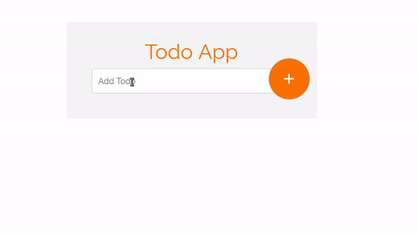

### All the code

**app.component.ts**

```
import { Component,trigger,animate,style,transition,keyframes } from '@angular/core';

@Component({
  selector: 'app-root',
  templateUrl: './app.component.html',
  styleUrls: ['./app.component.css'],
  animations:[
   trigger("moveInLeft",[
      transition("void=> *",[style({transform:"translateX(300px)"}),
        animate(200,keyframes([
         style({transform:"translateX(300px)"}),
         style({transform:"translateX(0)"})
 
          ]))]),

transition("*=>void",[style({transform:"translateX(0px)"}),
        animate(100,keyframes([
         style({transform:"translateX(0px)"}),
         style({transform:"translateX(300px)"})
 
          ]))])    
     
    ])

]
})
export class AppComponent {
  todoArray=[];
  todo;
  //todoForm: new FormGroup()

addTodo(value){
    if(value!==""){
     this.todoArray.push(value)
    //console.log(this.todos) 
  }else{
    alert('Field required **')
  }
    
  }

/*delete item*/
  deleteItem(todo){
   for(let i=0 ;i<= this.todoArray.length ;i++){
    if(todo== this.todoArray[i]){
     this.todoArray.splice(i,1)
    }
   }
  }

// submit Form
  todoSubmit(value:any){
     if(value!==""){
    this.todoArray.push(value.todo)
     //this.todoForm.reset()
    }else{
      alert('Field required **')
    }
    
  }
 
}
```

**app.component.html**

```
<div class="container">
 <form #todoForm= "ngForm"(submit)="todoSubmit(todoForm.value); todoForm.resetForm()" >
  <div class="form-group">
  <h1 class="text-center ">Todo App</h1>
   <div class="input-group-prepend">
       <input type="text" #todo  class="form-control" placeholder="Add Todo" name="todo" ngModel>
    <span class="input-group-text" (click)="addTodo(todo.value)">
    <i class="material-icons">add</i></span>
   </div>
  </div>
  <div class="data">
  <ul class="list-unstyled">
   <li [@moveInLeft]  *ngFor="let todo of todoArray">{{todo}} <i (click)="deleteItem(todo)" class="material-icons">delete</i></li>
  </ul>
 </div>
 </form>
</div>
```

**app.component.css**

```
/*Google fonts*/
@import url('https://fonts.googleapis.com/css?family=Raleway');

body{
 padding: 0;
 margin: 0;

}
form{
 max-width: 30em;
 margin: 4em auto;
 position: relative;
    background: #f4f4f4;
    padding: 2em 3em;
    overflow: hidden;
}
form h1{
    font-family: "Raleway";
    color:#F97300; 
}
form input[type=text]::placeholder{
   font-family: "Raleway";
   color:#666; 
}
form .data{
    margin-top: 1em;
}
form .data li{
 background: #fff;
 border-left: 4px solid #F97300;
 padding: 1em;
 margin: 1em auto;
 color: #666;
 font-family: "Raleway";
}
form .data li i{
    float: right;
    color: #888;
    cursor: pointer;
}
form .input-group-text{
    background: #F97300;
    border-radius: 50%;
    width: 5em;
    height: 5em;
    padding: 1em 23px;
    color: #fff;
    position: absolute;
    right: 13px;
    top: 68px;
    cursor: pointer;
}
form .input-group-text i{
    font-size: 2em;
}
form .form-control{
 height: 3em;
    font-family: "Raleway";
}
form .form-control:focus{
 box-shadow: 0;
}
```

We are done 🙌. You can find the files and code on [Github](https://github.com/hayanisaid/Todo-app-in-Angular).

#### [See the Demo](https://stackblitz.com/edit/todo-app-in-angular?file=index.html)

### Conclusion

Angular is easier than you think. Angular is one of the best JavaScript libraries, and it has great support and a nice community. It also has tools that make working with Angular fast and easy, like Angular-cli.

Subscribe to this [mail-list](http://eepurl.com/dk9OJL) to learn more about Angular.

[**SaidHayani@ (@hayanisaid1995) | Twitter**  
_The latest Tweets from SaidHayani@ (@hayanisaid1995). #Web\_Developer /#Frontend / #Back\_end(#PHP &…_twitter.com](https://twitter.com/hayanisaid1995 "https://twitter.com/hayanisaid1995")[](https://twitter.com/hayanisaid1995)

Here are some of the best online courses to learn Angular for free:

**Angular 1.x**

-   S[haping with Angular](https://www.codeschool.com/courses/shaping-up-with-angularjs)
-   [Learn Angular](http://www.learn-angular.org/)

**Angular 2.x** _(recommended)_

-   [learn Angular2 (coursetro](https://coursetro.com/courses/8/Learn-Angular-2-Development-with-our-Free-Course))
-   [YouTube playlist](https://www.youtube.com/playlist?list=PLC3y8-rFHvwg5gEu2KF4sbGvpUqMRSBSW)