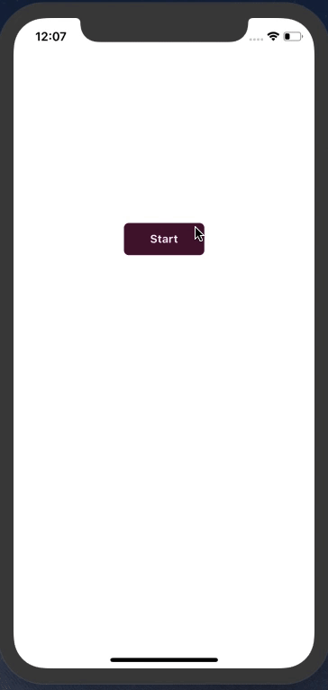
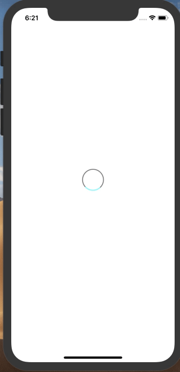
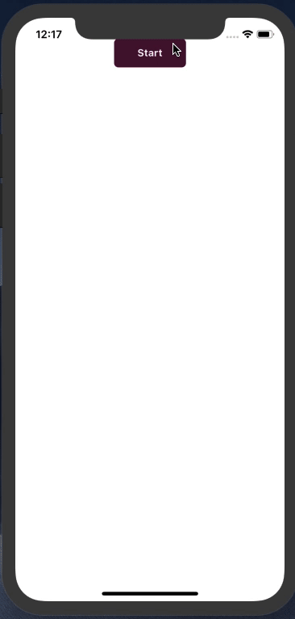
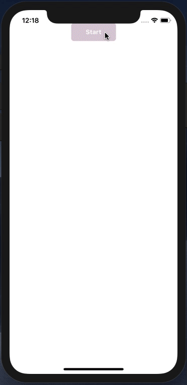

> The animations are an important part of the UX of an app, and interacting with the user using the animations create a better experience for the user, the most successful user experience are made with animations, that’s why we are goin to play around animations in React Native, technically React Native provide a [great animations API](https://facebook.github.io/react-native/docs/animations) that give us the ability to do different transitions and the animations .

---

> New to React Native? check my article introduction to React Native [check this out!](https://medium.freecodecamp.org/what-you-need-to-know-to-start-building-mobile-apps-in-react-native-dded951277b7)

> You may want how to style a React Native app and the options you can use to do the Job check [Styling in React Native](https://blog.bitsrc.io/styling-in-react-native-c48caddfbe47).

---

Now, what are we gonna is create animations like `Fade`,`slideUp`, `slideDown`, `rotate` ..etc. using the [animations API](https://facebook.github.io/react-native/docs/animations).

_A good to mention we will be comparing the examples we are going to create with_ [_rnal_](https://github.com/hayanisaid/rnal) _(react native animations library) the library I’ve created a library that does that all the kind of the animations you may want use. learn more_ [_here_](https://github.com/hayanisaid/rnal)_!_

First, of all to start using animations, we are using `Animated` module that react-native provides to do the magic things for us 💫

When building components, I’d advise using [Bit](https://github.com/teambit/bit) to share and manage them across projects as a team- so you can build faster and stay in sync. Try it:

[**Share reusable code components as a team · Bit**  
_Easily share reusable components between projects and applications to build faster as a team. Collaborate to develop…_bit.dev](https://bit.dev "https://bit.dev")[](https://bit.dev)


### LayoutAnimation !!!

```
import {Animated} from "react-native";
```

Let’s start first with `Fade` :

### Fade animation



The `Animated` method takes parameters as values and turns those values into animated values then we can use those values to animate our Components, okay! show me the code! 🤨 :

Embed placeholder 0.28792752679002787

**Let’s break it down!**

First, we need to initialize a value so we can give this value to the `Animated` method :

```
state = {

fadeValue: Animated.Value(0)

};
```

Then let’s create a function called `_start` that will start our animations:

```
_start = () => {

return Animated.timing(this.state.fadeValue, {

toValue: 1, // output 

duration: 3000, // duration of the animation 

}).start();

};
```

What we just did here? we used `timing` method from `Animated` , it takes some values:

-   The first argument is the value we want to animate
-   The second is an object of options to define how our animation should work.
-   And finally, the `start()` callback that starts the animations!

Now we have an animated value, the next step is to use it to animate the component. we use `Animated.View` as a wrapper to our component in order to make the animations happen !

```
<Animated.View

style={{

opacity: this.state.fadeValue,

height: 250,

width: 200,

margin: 5,

borderRadius: 12,

backgroundColor: "#347a2a",

justifyContent: "center"

}}

>

<Text style={styles.text}>Fade </Text>

</Animated.View>
```

You see we passed the `fadeValue` to the opacity property so we can handle the opacity of the element so when the component start appears it happens smoothly and in an animated behavior! and that gives us the `fade` animation !

Now let's call the `_start()` function when an action is taken , in our case we call the function when `button` is clicked. you can trigger the function whenever you like for example within `componentDidMount()` .

```
<TouchableOpacity style={styles.btn} onPress={() => this._start()}>
```

#### Doing the Fade animation with [rnal](https://github.com/hayanisaid/rnal):

[rnal](https://github.com/hayanisaid/rnal) made things for us more easy to create the fade animation:

First, let’s install the package :

With `Yarn` hit `yarn add rnal `, or `npm` run `npm i rnal`

Then Import The `Fade` element :

Embed placeholder 0.5941283672541311

And:


Fade has `startWhen` props, it’s a type of `boolean` and it determines when the animation should start by default it starts when the component mount, you can discover more options to customize your animations, check out the [docs](https://github.com/hayanisaid/rnal).

Let’s try with something more awesome like making the component goes from the bottom or `SlideDown` animation. we will use the same code above but we need to change some values! and we will use `[interpolate](https://facebook.github.io/react-native/docs/animations#interpolation)` method to interpolate the AnimatedValue cool let’s do it 🎩

### SlideDown animation

Embed placeholder 0.9289966632006756

Replace gif with the slideDown animation


The `interpolate` method takes an Object of properties.

-   `inputRange` : The start point of the `animatedValue`: for example, we want the `translateX` to start from 1 level :

```
inputRange:[0,1]
```

-   `outputRange` : gives us an outputRange based on the `inputRange`

```
transform:[

{translateY:animatedValue.interpolate({

inputRange:[0,1],

outputRange:[-600,0]})}
]
```

Doing the same with [react-native-animations-library](https://github.com/hayanisaid/rnal)! is more much simple, there is the`SlideDown` element so you can wrap the component you want to animate!

Embed placeholder 0.3835687078230885

There are cases when need to make the animations to run indefinitely, Animated gives us `Animated.loop()` method to make this happen let’s see how it works! the best example to demonstrate that is to create a spinner!

Embed placeholder 0.5385960251641928

Here we go!



What we just did is give the `Animated.loop` our animations as an argument to run it in a loop cycle.

With [react-native animation library(rnal)](https://github.com/hayanisaid/rnal), you can just add`inifinite` props to make this happen!

```
import { Rotate } from "rnal";

<Rotate infinite>

<View

style={{

height: 50,

width: 50,

margin: 5,

borderWidth: 2,

borderColor: "#888",

borderBottomColor: "#8bffff",

borderRadius: 50,

justifyContent: "center"

}}

/>

<Text style={styles.text}>Fade </Text>

<View />

</Rotate>
```

If you take a look at the examples above, we don’t actually change much, the same function we just determine where we use then `animatedValue` yeah it’s all about a value transformed to an animated value and allow us to do the animation we want using `translate,scale, rotate` and all other supported animations 😛 .

That was the way we run a single animation what about making a group of animations? `sequence` and `parallel` methods got you covred!

### Run a group of animations

We can use`sequence` or `parallel` methods to run a group of animations, the two methods do almost the same job, the only difference is that parallel run the group of animations at once whereas the `sequence` method blocks the next animation until the previous animation is finished and done, and if one of the animations stops or break the next animation won’t be able to run. you can explore more about the two methods in [the official docs](https://facebook.github.io/react-native/docs/animations#composing-animations).

Embed placeholder 0.0016331422364534998

-   Using `parallel` method:



With `sequence` :



I think we are gonna stop at this point we don’t want to make this post longer. generally, there is much to talk about React Native animations and it’s a huge subject we won’t be able to cover it in one post we will have a chance to talk about other parts in upcoming articles but anyway we just covered the most parts of it and you will be able to create your own animations after reading this article. you can always use the [react-native animations library](https://github.com/hayanisaid/rnal) I’ve created it’s so simple and easy to use. Thanks for reading, and please comment below!

---

### Learn more

[**11 React Native Component Libraries You Should Know in 2019**  
_Useful React Native UI toolkits to use in your next app!_blog.bitsrc.io](https://blog.bitsrc.io/11-react-native-component-libraries-you-should-know-in-2018-71d2a8e33312 "https://blog.bitsrc.io/11-react-native-component-libraries-you-should-know-in-2018-71d2a8e33312")[](https://blog.bitsrc.io/11-react-native-component-libraries-you-should-know-in-2018-71d2a8e33312)

[**5 Tools for Faster Development in React**  
_5 tools to speed the development of your React application, focusing on components._blog.bitsrc.io](https://blog.bitsrc.io/5-tools-for-faster-development-in-react-676f134050f2 "https://blog.bitsrc.io/5-tools-for-faster-development-in-react-676f134050f2")[](https://blog.bitsrc.io/5-tools-for-faster-development-in-react-676f134050f2)

[**How to Share React UI Components between Projects and Apps**  
_A simple guide to help you organize, share and sync React components between your team’s apps._blog.bitsrc.io](https://blog.bitsrc.io/how-to-easily-share-react-components-between-projects-3dd42149c09 "https://blog.bitsrc.io/how-to-easily-share-react-components-between-projects-3dd42149c09")[](https://blog.bitsrc.io/how-to-easily-share-react-components-between-projects-3dd42149c09)