## With some basic React and JavaScript knowledge, you’ll be on your way

](./asset-1.png)

**Next.js** is a JavaScript framework created by [Zeit](https://zeit.co/). It lets you build server-side rendering and static web applications using React. It’s a great tool to build your next website. It has many great features and advantages, which can make Nextjs your first option for building your next web application.

You don’t need any configuration of webpack or similar to start using Next.js. It comes with its configuration. All you need is to run `npm run dev` and start building your application 😃.

In this article, we are going to explore the great features and tricks of Next.js, and how to start building your next website with it.

**This post assumes that you have some basic knowledge of React and JavaScript.**

Here are some great websites built with Next.js:

-   [Syntaxt.fm](https://syntax.fm/)
-   [npmjs](https://www.npmjs.com/)
-   [material-ui.io](https://material-ui.com/)
-   [expo.io](https://expo.io/)
-   [codemenitor.io](https://www.codementor.io/)

I even used Nextjs to build my personal website [saidhayani.me](https://www.saidhayani.me/) — you can get the source code on GitHub [here](https://github.com/hayanisaid/said-hayani-nextjs).

### Getting starting with Next.js

To start with Next.js you need to have node.js installed in your machine and that’s all. Next.js is like any other node.js application — you need npm or Yarn to install dependencies.

Let’s get started and create a Next.js project.

First, we need to create a folder and give it a name of our choice. I’m gonna name it `nextjs-app`.

You can easily do that with this command line:

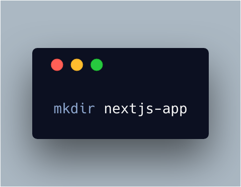```
mkdir nextjs-app
```

After creating the nextjs-app folder, open it on the terminal. Run `npm init` to create the `package.json` file.

Next, we have to install our dependencies.

Installing Next.js

-   using Yarn, type

```
yarn add next
```

-   using npm, type:

```
npm i next --save
```

Then we have to install React because Next.js uses React. The first line below uses Yarn for the installation.

```
yarn add react react-dom

// with npm

npm i react react-dom --save
```

After that you have to create two necessary folders: `pages` and `static` . Next.js won’t work without them!!

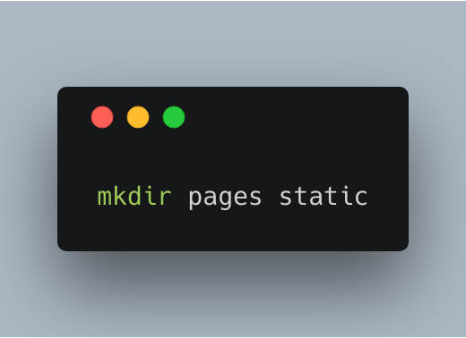```
mkdir pages static
```

You **must** have this structure after running these commands :

```
nextjs-app
  -pages
  -static
  -package.json
```

And then simply you can run `npm next dev` and then open `[http://localhost:3000/](http://localhost:3000/)` in your browser.

The `NotFound` page will show up because we don't have any page yet!

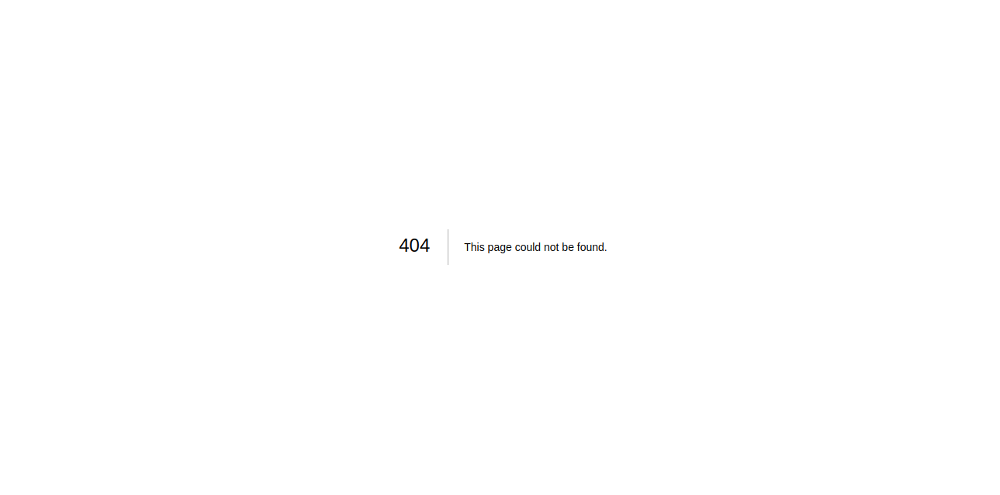

So let’s create a `home` page and an entry point `index.js`.

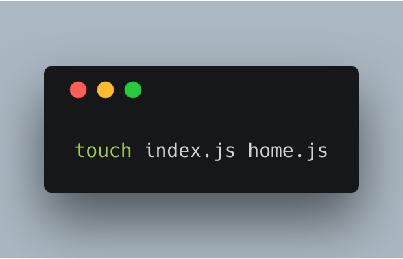```
touch index.js home.js
```

And then you can write a normal React component. As I said above, Next.js is for building React applications.

Here is what our `home.js` looks like:

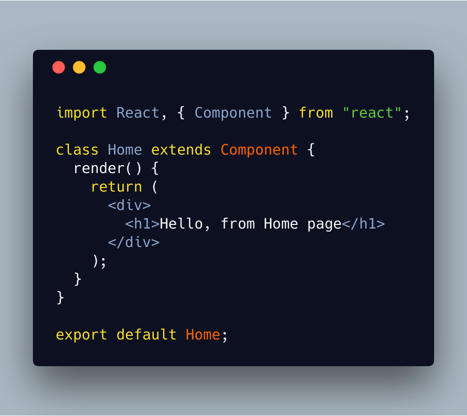

And here is our `index.js` file:

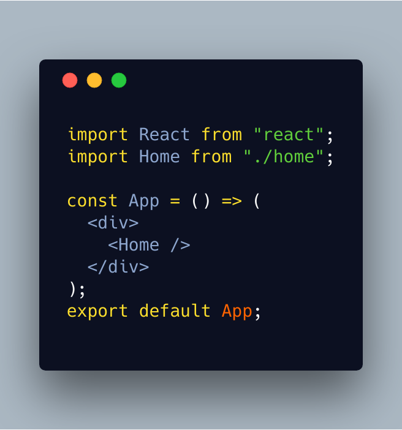

Next.js has a live reload feature. All you need to do is just change and save, and Next.js will compile and reload the app automatically for you.

**Note**: Next.js is like any other server-side rendering tool we need to define the default page of our application, in our case is `index.js`.

You will see this change in the browser after running `npm next dev`:


Congratulations! We just created a Next.js app with a few simple steps. These instructions to create a Next.js app are described in the [official docs of Next.js ](https://nextjs.org/learn/basics/getting-started/first-page).

#### My alternative

I usually don’t use this way. I use the [create-next-app](http://import%20React%20from%20%22react%22;%20import%20Home%20from%20%22./home%22;%20%20const%20App%20=%20%28%29%20=%3E%20%28%20%20%20%3Cdiv%3E%20%20%20%20%20%3CHome%20/%3E%20%20%20%3C/div%3E%20%29;%20export%20default%20App;) CLI instead that will do all this stuff for me in one single line.

```
npx create-next-app my-app
```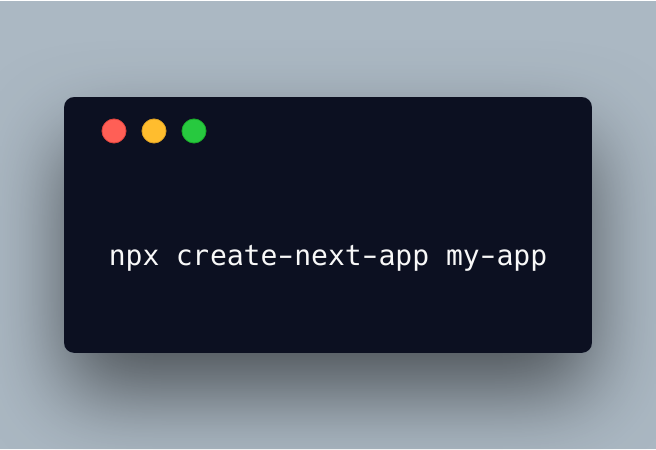

You can check out the documentation [here](https://github.com/segmentio/create-next-app) to explore more features.

### Create custom configs for Next.js

Sometimes you might want to add some additional dependencies or packages to your Next.js app.

Next.js gives you the option to customize your configuration using a `next-config.js` file.

For example, you might want to add sass support to your app. In this case you have to use the [next-sass](https://github.com/zeit/next-plugins/tree/master/packages/next-sass) package **and** you have to add it to the `next-config.js` file as in the example below:

First, install `next-sass`:

```
yarn add @zeit/next-sass
```

Then include it inside the `next-config.js` file:

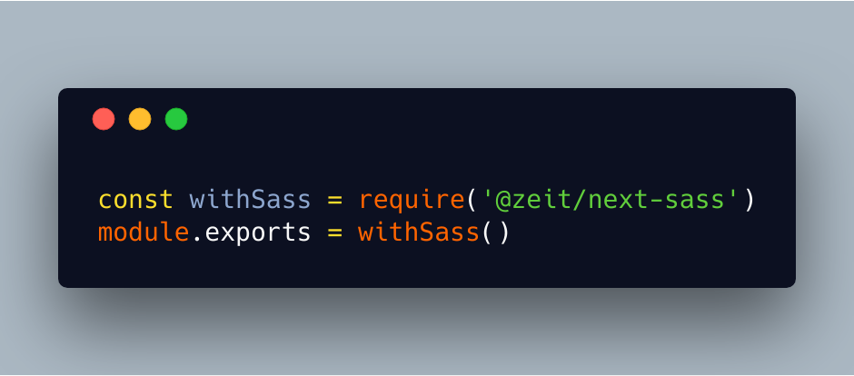

And then you can create write your sass code and import it in your component:

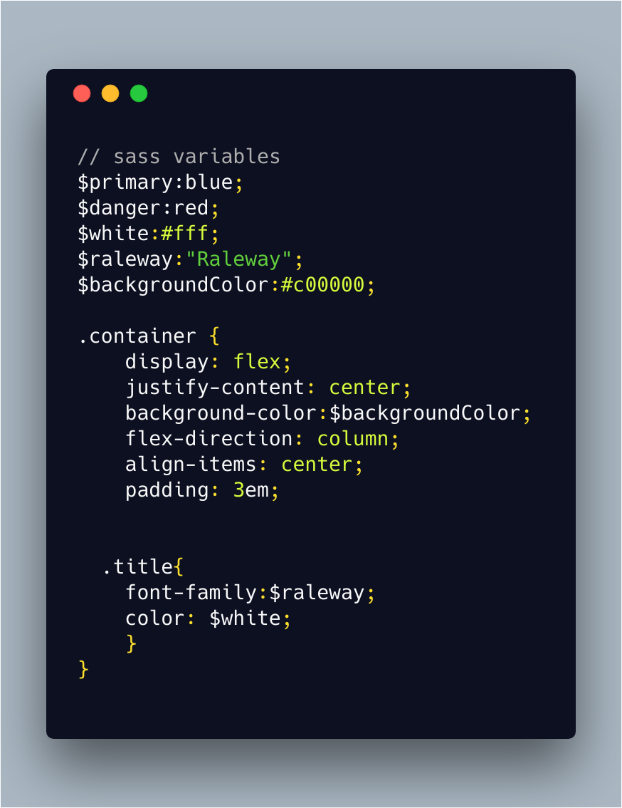

Importing the sass file in our component:

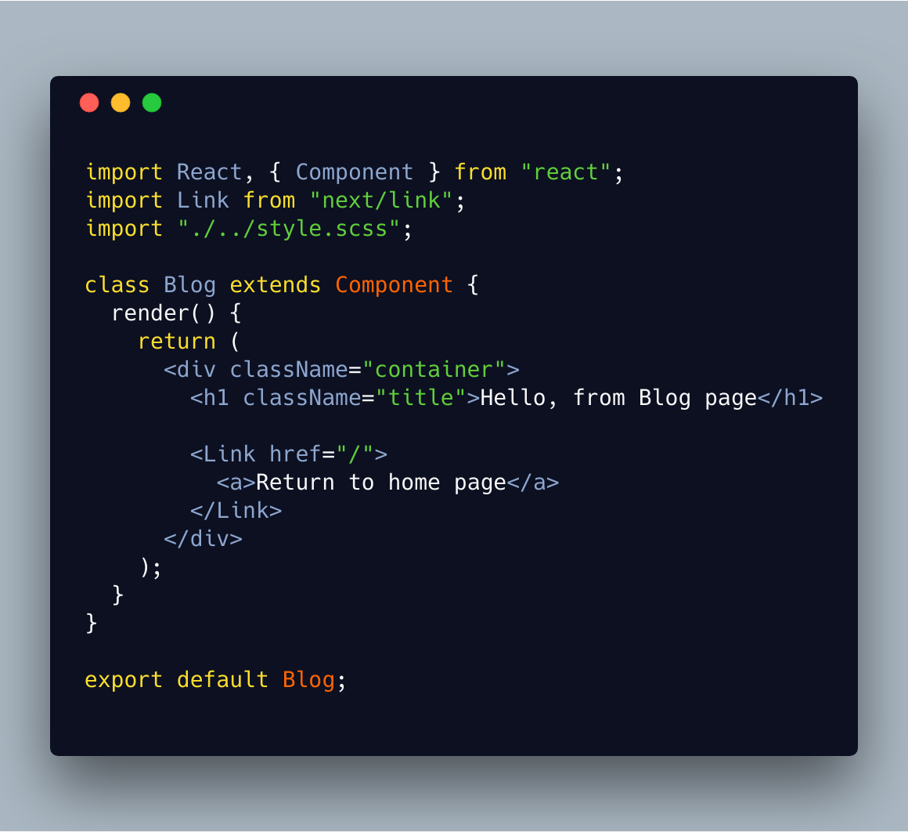

And here is the result:


Wow, wasn’t that **super easy** to add sass support to out Next.js app?

At this point, we just covered the installation and configuration part. Now let’s talk about the features of Next.js!

### The features

Next.js comes with a bunch of great features like server-side rendering, routers, and lazy loading.

#### Server-side rendering

Next.js performs server-side rendering by default. This makes your application optimized for search engines. Also, you can integrate any middleware such as [express.js](https://expressjs.com/) or [Hapi.js](https://hapijs.com/), and you can run any database such as MongoDB or MySQL.

Speaking of search engine optimization, Next.js comes with a `Head` component that allows you to add and make dynamic meta tags. It’s my favorite feature — you can make custom and dynamic meta tags. These make your website able to be indexed by search engines like Google. Here is an example of a `Head` component :

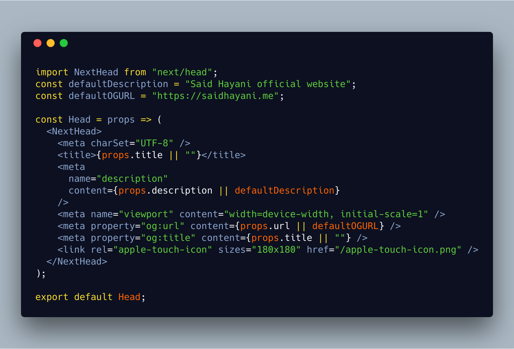

And you can import and use the`Head` component in any other page:

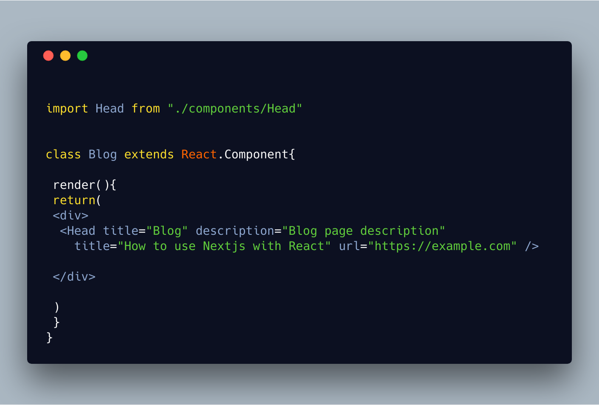

Awesome!

**Note**: With Next.js you **don’t** need to import React because Next.js does this for you.

#### Generating a static website with Next.js

As well as server-side rendering, you still can compile and export your application as an HTML static website and deploy it on a static website hosting like a GitHub page or [netlify](https://www.netlify.com/). You can learn more how to make a static website with Next.js [here in the official docs](https://nextjs.org/learn/excel/static-html-export/setup).

#### Routers

This is another one of the great features of Next.js. When you use the [create-react-app](https://github.com/facebook/create-react-app), you usually need to install [react-router](https://github.com/ReactTraining/react-router) and create its custom configuration.

Next.js comes with its own routers with zero configs. You don’t need any extra configuration of your routers. Just create your page inside the `pages` folder and Next.js will take care of all routing configuration.

Let’s go ahead and create a custom navigation to make everything clear!

To navigate between pages, Next.js has the `Link` method to manage the navigation.

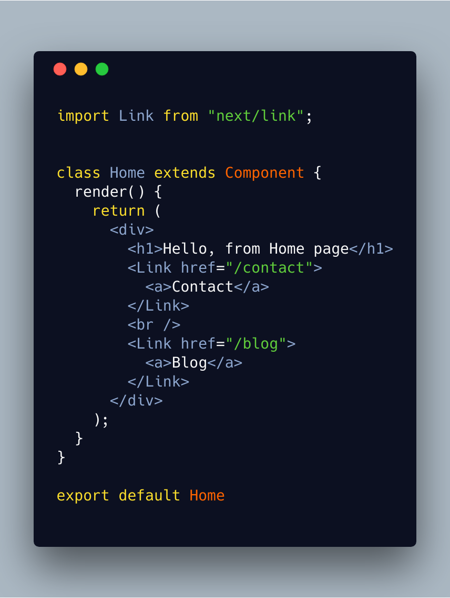

Let’s create `blog.js` and `contact.js` pages:

`blog.js`

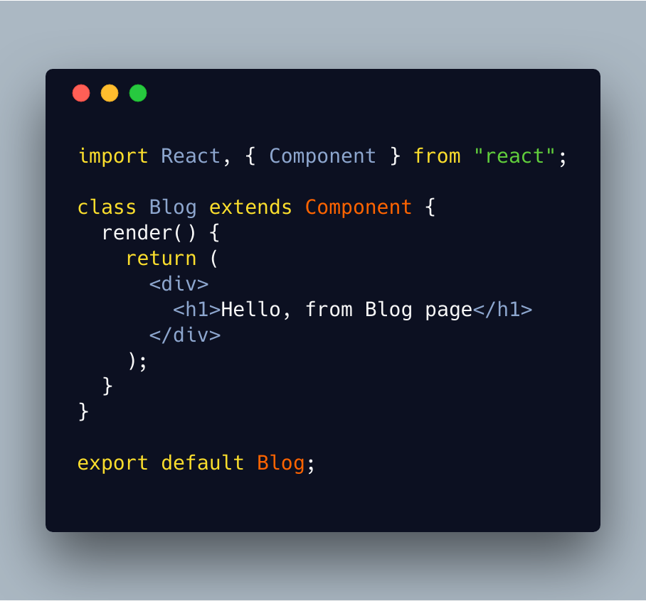

And here is the `contact.js` page:

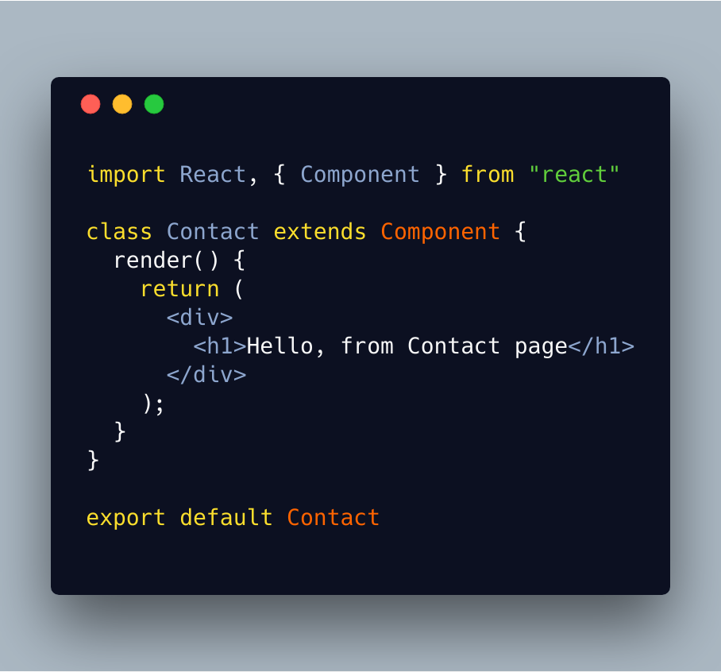

And now we must be able to navigate between those pages 😃

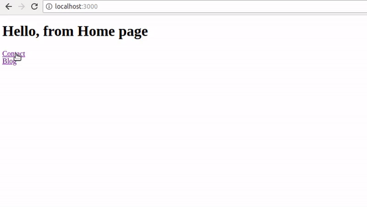

Wow that so easy and super awesome.

#### Lazy loading

<Embed src="https://giphy.com/embed/WAmzFl5P9XyGQ/twitter/iframe" height={245} width={435} />

Lazy loading makes your application deliver a better user experience. Sometimes the page might take time to load. The user may abandon your app if the loading takes more than 30 seconds.

The way to avoid this is to use some trick to indicate to the user that the page is loading, for example by displaying a spinner. Lazy loading or code splitting is one of the features that allow you to deal with, and control, slow loading so you only load the necessary code in your page.

Next.js comes with its own code splitting method. It provides us a method, called `dynamic`, to load our component, as in the example below:

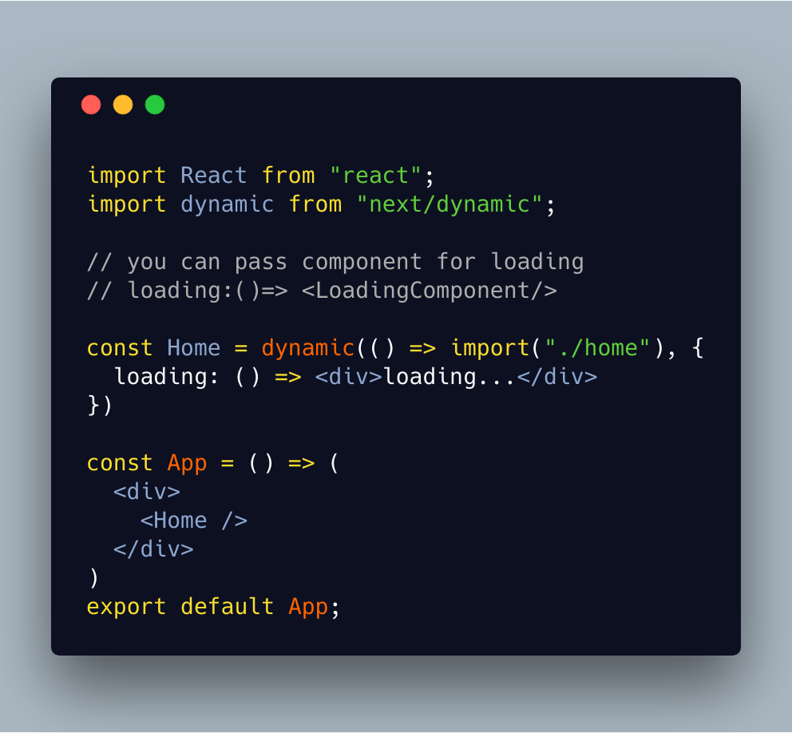

You can find the source code of these examples on [GitHub](https://github.com/hayanisaid/nextjs-intro-example)

That’s all. I hope that’s enough and I hope this article gives you a clear idea about Next.js and its features. You can learn more about other features in the [official docs](https://nextjs.org/docs/).

If you have any other additions to this post you can leave a comment below and if you like this post please hit clap 👏 and share.

You can always find me on [Twitter 🐦](https://twitter.com/SaidHYN).

<Embed src="https://upscri.be/ddda72?as_embed=true" height={350} width={700} />