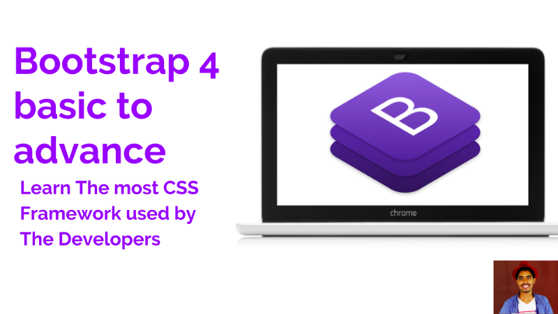
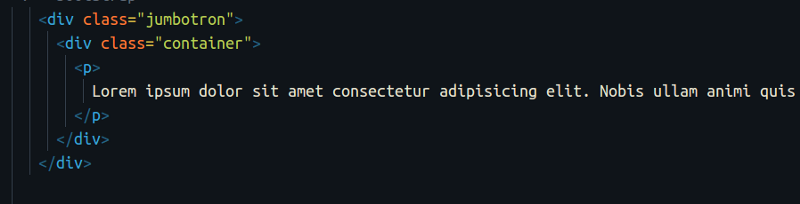
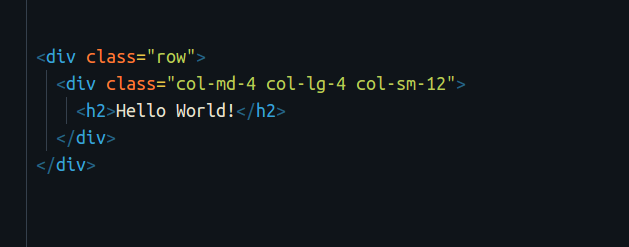

> Most people how start working with bootstrap might have same issues with responsive design even they use Grid system and responsive features of bootstrap ,here is some tips for you to make you template responsive in all devices .

### Use container to wrap the content



always use` .container` class to wrap your content . when you use the container it dynamically make the content fit in the different devices. and bootstrap recommend use container with grid system to get better results

### Use col-md-x , `col-lg-x` and col-sm-x at the same time



Some developers when they use bootstrap Grid ,they only use `**col-md-x **`**.** no that's note good enough  to make your layout responsive in all devices ,in my experience when I just use only `**col-md**` class I almost find a responsive issue with **IPad** and **IPad** **Pro**,so I use the `**col-md **`,`**col-lg **`,`**col-sm**` at the same time ,to make the Grid specific for each devices.

### Responsive breakpoints

Some times when you create a complex layout ,it’s probably wont be full responsive in all devices ,so you can specify the breakpoints to customize the responsive style in some specific devices,here is the breakpoints that bootstrap use .this code is from getbootstrap.com.

```
// Extra small devices (portrait phones, less than 576px)
@media (max-width: 575.98px) { ... }

// Small devices (landscape phones, less than 768px)
@media (max-width: 767.98px) { ... }

// Medium devices (tablets, less than 992px)
@media (max-width: 991.98px) { ... }

// Large devices (desktops, less than 1200px)
@media (max-width: 1199.98px) { ... }

// Extra large devices (large desktops)
// No media query since the extra-large breakpoint has no upper bound on its width

```

And for the very specified breakpoints :

```
// Extra small devices (portrait phones, less than 576px)
@media (max-width: 575.98px) { ... }

// Small devices (landscape phones, 576px and up)
@media (min-width: 576px) and (max-width: 767.98px) { ... }

// Medium devices (tablets, 768px and up)
@media (min-width: 768px) and (max-width: 991.98px) { ... }

// Large devices (desktops, 992px and up)
@media (min-width: 992px) and (max-width: 1199.98px) { ... }

// Extra large devices (large desktops, 1200px and up)
@media (min-width: 1200px) { ... }
```

  

### Use Bootstrap mixin functions 

Bootstrap provide a mixin function called `**media-breakpoint-up**` to use with sass ,

### use embedded class