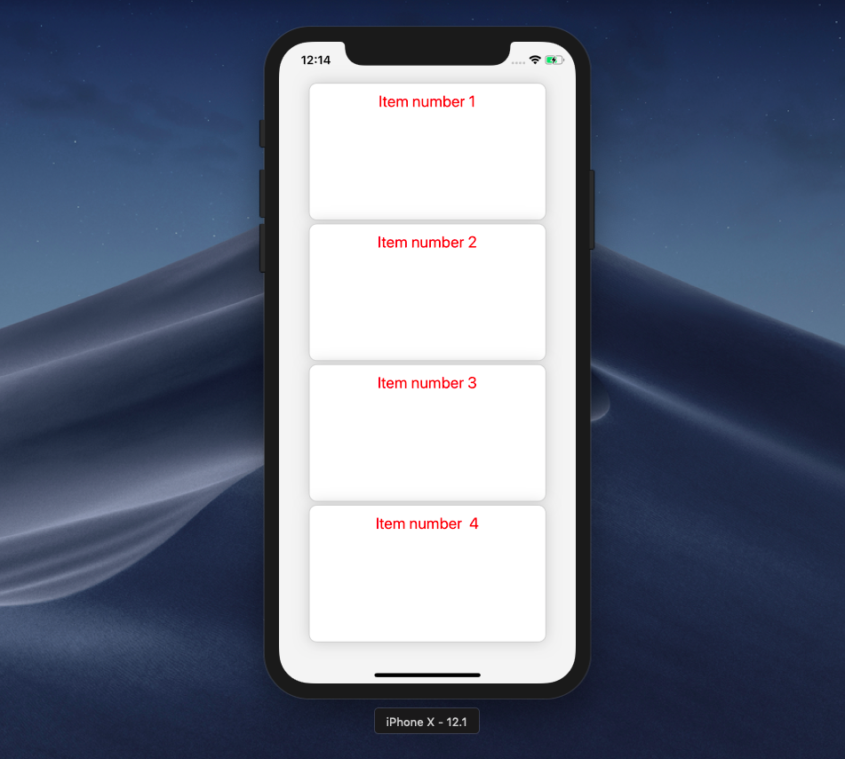

## Explore the best ways to style a React Native application


If you are just started with React Native or even you are experienced with it, you may find the styling a little bit challenging for the first time. that happens when you come especially from the web background and when you try to write React Native style as you usually do when you write CSS on the web and you find out what you expected. the method that React Native use for styling use CSS properties and it’s actually not the same as normal CSS. anyway, we are going to see how we do styling in React Native, in addition, to React Native style method styling method, we will explore the different ways to style a React Native application.

If you are new to React Native I wrote [a guide that will take to what you need to get started with React Native](https://medium.freecodecamp.org/what-you-need-to-know-to-start-building-mobile-apps-in-react-native-dded951277b7) check it out [here!](https://medium.freecodecamp.org/what-you-need-to-know-to-start-building-mobile-apps-in-react-native-dded951277b7)

**Tip**: Use [**Bit**](https://github.com/teambit/bit) to easily share and reuse React components to build apps. It’s free and open source, so feel free to jump in and make your components reusable.

[](https://bit.dev/)

### React Native style method

React Native give us two powerful ways by default to style our application :

#### Style props

You can add styling to your component using `style props` you simply add `style` props to your element it accepts an object of properties.

Embed placeholder 0.9135404487904006


If you look at our code, we use the CSS properties with the capital letter, notice that some properties are not supported in react-native, an error will throw when you try to use any unsupported property, CSS3 animations are not supported instead React Native leave that to the [animation API](https://facebook.github.io/react-native/docs/animations)

React Native use [Flexbox](https://developer.mozilla.org/en-US/docs/Web/CSS/CSS_Flexible_Box_Layout/Basic_Concepts_of_Flexbox) for layout, it’s a great tool to define the layout of your React Native app, elsewhere it’s not working as the same as in CSS but genuinely it’s easy to use and flexible.

Embed placeholder 0.0693675156841751


React native flexbox is a great way to deal with the layout manipulation it so easy to design your layout but you need some basic understanding of flexbox to get your head it, you can check this [great article for a better understanding](https://medium.com/the-react-native-log/understanding-react-native-flexbox-layout-7a528200afd4).

#### Using StyleSheet

if you have a large code base or you want to set many properties to your elements, writing our styling rules directly inside `style` props will make our code more complex that’s why React Native give us another way that let us write a concise code using `StyleSheet` method:

First, make sure to import `StyleSheet` from `react-native`

```
import { StyleSheet} from 'react-native';
```

And try to assign some style properties using `create` method that takes an object of properties.

Embed placeholder 0.011569961031794751

And then we pass the styles object to our component via the style props:

Embed placeholder 0.687274207323973

Our code looks more concise with `StyleSheet` method and the result still the same:


The styling method that _React Native_ use has really great features that allow as to do some dynamic styling but it’s limited especially when it comes to applying some CSS properties that aren’t supported by React Native, for example, applying box-shadow to your components you may have to do the following :

```
const Card=()=>(

 <View style={styles.card}>

  <Text>Hello!</Text>
</View>
)

//our style

 const styles=StyleSheer.create({

card:{
width:100,
height:120,
shadowColor: '#000000',
    shadowOffset: {
      width: 0,
      height: 3
    },
    shadowRadius: 5,
    shadowOpacity: 1.0} 
})
```

Whereas if we have to do the same and adding shadow in CSS:

```
.card{
width:100px,
height:120px,
box-shadow:0 0 5 #000000;
}
```

It’s easier to do it with CSS, we all would love to the same in React native, unfortunately, we can’t write CSS directly in React Native. but no worries the good news is styled-component support React Native 💣

### styled-component in React Native

Yes, you can use [styled-component](https://www.styled-components.com/docs/basics#react-native) with _React native_ so you can write your styles in React Native as you write normal CSS. and it’s easy to include it in your project and it doesn’t need any linking just run this following command inside the root directory of your app to install it:

```
yarn add styled-components
```

And then simply start using it in your components:

Embed placeholder 0.7298850918021489



So cool 😃. now you can totally write CSS with _React Native_ and we give that to `[styled-components](https://www.styled-components.com/docs/basics#react-native)` , I prefer to use styled-components to style my React Native elements the day since I found out that they support React Native it gives me more freedom to make the style I want so easily and you better use `[styled-components](https://www.styled-components.com/docs/basics#react-native)` from now and the get the benefits of CSS to make nice UI it makes your code cleaner, you can separate your styles to a single file far from your components that will make your code more organized. in another hand you can use the great features that styled-components provide us such as theming and passing props so you can make a dynamic style like the following:

Embed placeholder 0.31614586105980624

And here the result:


So awesome 💪!!

Sometimes you may want to draw some complex shapes that include circles and some specific style or gradient backgrounds for example (_CSS gradient background not supported in React Native_). you might think of using some methods that CSS provide like `clip-path` or any other method that allows you to make complex shapes in CSS, unfortunately, those methods are not supported in React Native at this time even if you use `styled-components` that lets you use the CSS properties into `React Native` at this situation, we have to use some alternative solutions like using SVG

### Using react-native-svg to draw specific shapes

[React Native community](https://github.com/react-native-community/) brings [react-native-svg](https://github.com/react-native-community/react-native-svg) that allows you to use the SVG in _React Native._ you can add it to your project  using **yarn** or **npm:**

```
// using yarn

yarn add react-native

// npm 
npm i react-native 
```

And then make sure to link it by running the following command line:

```
react-native link react-native-svg
```

And now let’s start something with it:

[Examples from react-native-svg docs](https://github.com/react-native-community/react-native-svg#clippath)](./asset-8.png)

As you see you can go so far with [react-native-svg](https://github.com/react-native-community/react-native-svg) in making specific shapes and gradient backgrounds and the things you usually do with SVG. you can check the [official docs](https://github.com/react-native-community/react-native-svg) to see the available options.

### Wrapping up

You can still use the React Native style method to make what you need but it remains complex when we want to make some complex styles so you need to use some alternative tools like react-native-svg to do that, for normal styling I like to use styled components it makes doing things easier for me and I hope the React Native community bring more supports of other style methods that will give us the freedom of making things easily

> If you have any addition or questions please leave a comment!

> You can always find me on [twitter](https://twitter.com/SaidHYN) 🐦

---

### Learn more

[**11 React Native Component Libraries You Should Know in 2019**  
_Useful React Native UI toolkits to use in your next app!_blog.bitsrc.io](https://blog.bitsrc.io/11-react-native-component-libraries-you-should-know-in-2018-71d2a8e33312 "https://blog.bitsrc.io/11-react-native-component-libraries-you-should-know-in-2018-71d2a8e33312")[](https://blog.bitsrc.io/11-react-native-component-libraries-you-should-know-in-2018-71d2a8e33312)

[**5 Tools for Faster Development in React**  
_5 tools to speed the development of your React application, focusing on components._blog.bitsrc.io](https://blog.bitsrc.io/5-tools-for-faster-development-in-react-676f134050f2 "https://blog.bitsrc.io/5-tools-for-faster-development-in-react-676f134050f2")[](https://blog.bitsrc.io/5-tools-for-faster-development-in-react-676f134050f2)

[**11 JavaScript Animation Libraries For 2019**  
_Some of the finest JS and CSS animation libraries around._blog.bitsrc.io](https://blog.bitsrc.io/11-javascript-animation-libraries-for-2018-9d7ac93a2c59 "https://blog.bitsrc.io/11-javascript-animation-libraries-for-2018-9d7ac93a2c59")[](https://blog.bitsrc.io/11-javascript-animation-libraries-for-2018-9d7ac93a2c59)