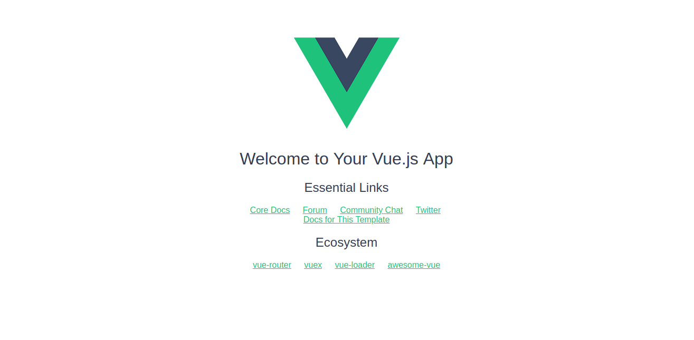
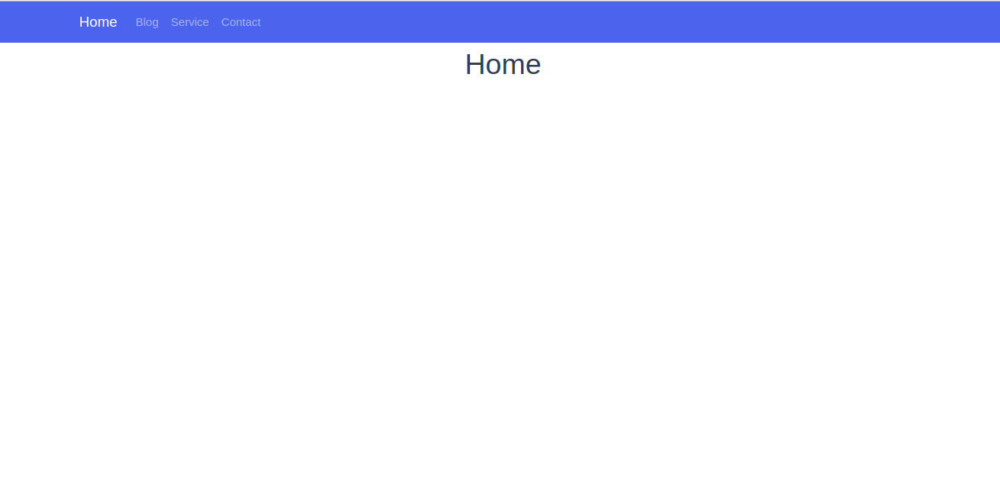
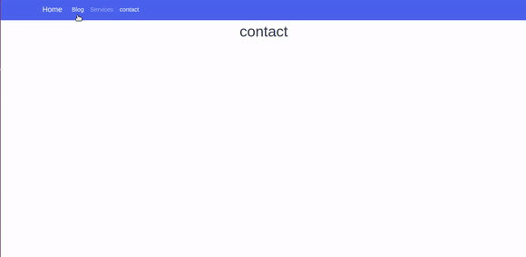
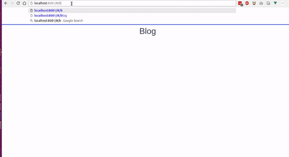
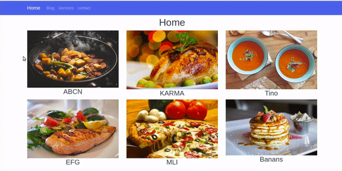
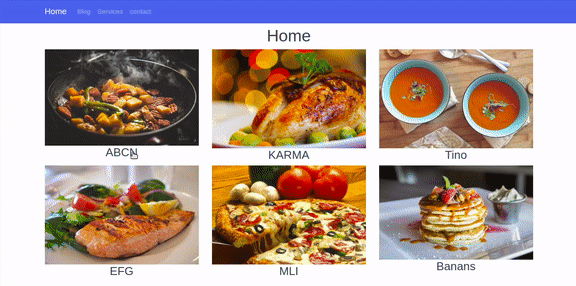
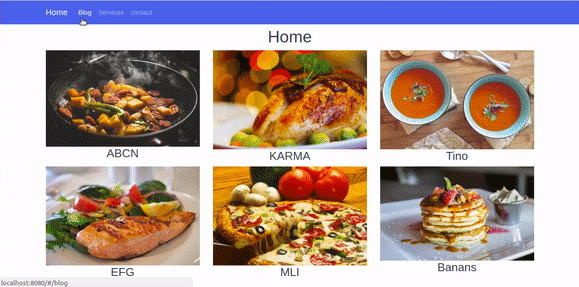

[!Zeolearn copyright[](./asset-1.jpeg)](https://www.zeolearn.com/magazine/understand-routing-in-vuejs-with-examples)

> Vue.js is a great JavaScript Framework created by [Evan You](https://twitter.com/youyuxi) ,it’s used to build Single web page and modern web applications with really height performances and production ,and it’s the most skill required in Front End Web development ,you can learn more about Vue.js [here](https://vuejs.org/) .

---

[Vue.js](https://vuejs.org/) provide bunch of features to build a powerful web components,Routing is one of those methods,it allow user switch between pages without page refreshing the thing that make the navigation easy and really nice in your web application ,so in this Article we are going to explain how Vue.js Routers work by building a Vue- template as example .

So let’s start our project by installing and create new Vue.js project,

We will need node.js and Vue-cli installed ,and we are using [vue-cli](https://github.com/vuejs/vue-cli) to generate new Vue.js project .

In your terminal run:

```
vue init webpack vue-router

//
cd vue-router
//
npm run dev
```

Browse to [http://localhost:8080](http://localhost:8080)



Open the app in your text editor, inside components folder open `HellowWorld.vue` file and rename it with `home.vue` ,remove all the code and replace it with this one .

```
<template>
  <div class="home">
    <h1>Home</h1>
  </div>
</template>

<script>
export default {
  name: 'home',
  data () {
    return {
      msg: 'Welcome to Your Vue.js App'
    }
  }
}
</script>

<!-- Add "scoped" attribute to limit CSS to this component only -->
<style scoped>

</style>
```

And go to `index.js` inside **router** folder and replace `HelloWorld` with `home`

```
import Vue from 'vue'
import Router from 'vue-router'
import home from '@/components/home'

Vue.use(Router)

export default new Router({
  routes: [
    {
      path: '/',
      name: 'home',
      component: home
    }
  ]
})
```

`App.vue` file should look like this !

```
<template>
  <div id="app">
    
    <router-view/>
  </div>
</template>

<script>
export default {
  name: 'App'
}
</script>

<style>
#app {
  
}
</style>
```

And Now let’s write our code !!

Now what we gonna do is adding a [Bootswatch](https://bootswatch.com/) template ,you can choose any template you like for me I will choose a [Cosmo](https://bootswatch.com/cosmo/) ,click Ctrl + U to view code source and just copy the Navbar ,we just need navbar, and past this code into `App.vue`  component.

Here we are 😃



The next is we gonna create 3 other component Blog,Services and Contact

Inside component folder create new file and name it blog.vue and push this code into it

```
<template>
 <div class="blog">
  <h1>{{blog}}</h1>
 </div>
</template>
<script>
 export default{
  name:'blog',
  data (){
   return{
    title:'Blog'
   }
  }
 }
</script>

<style scoped>
 
</style>
```

The same thing do it for service and contact component , then you must have those files inside your component folder:

-   home.vue
-   blog.vue
-   services.vue
-   contact.vue

### Routers config

Now after having four component we have to configure The routers to have the ability to navigate between those components.

So How we can navigate to each components using the routers?

here come the rule of the Routing ,now what we have to do is do some modifications inside router folder,open `index.js`



-   First import your components into index.js

Import all the components using `import` method

```
import home from '@/components/home'
import blog from '@/components/blog'
import services from '@/components/services'
import contact from '@/components/contact'
```

-   Second import vue and Router module from [vue-router](https://router.vuejs.org) module

```
import Vue from 'vue'
import Router from 'vue-router'

// use router
Vue.use(Router)
```

if you installed vue with vue-cli you have vue-router imported by default

-   And finally we have to define and init our component inside Router Method,it take an Array of objects which take properties :

```
export default new Router({
  routes: [
    {
      path: '/',
      name: 'home',
      component: home
    },
    {
      path: '/blog',
      name: 'blog',
      component: blog
    },
    {
      path: '/services',
      name: 'services',
      component: services
    },
    {
      path: '/contact',
      name: 'contact',
      component: contact
    }
  ]
})
```

-   `path` : mean the path of the component
-   `name`: name of the component
-   `component` : the view component

To make any component as the default component set slash to the path property,

```
path:'/'
```

In our example we set the home page as default page.now when you open the the project in the browser the first page will appear is the home page.

```
{
path:'/',
name:'home',
component:home
}
```

The vue-router has more advanced parameters and methods ,but we are not jumping in them,this is the list of properties and method that vue-router provide:

-   [Nested routers](https://router.vuejs.org/en/essentials/nested-routes.html)
-   [Named view](https://router.vuejs.org/en/essentials/named-views.html)
-   [Redirect and Alias](https://router.vuejs.org/en/essentials/redirect-and-alias.html)
-   [Navigation Guard](https://router.vuejs.org/en/advanced/navigation-guards.html)
-   [Router instance](https://router.vuejs.org/en/api/router-instance.html)

Now you can browse to any components by typing the name of the component!!



### router-link

Now we are gonna to make the navigation through the `Navbar` that we create using  `router-link` element.

To do that we should replace ‘<a></a>’ element by ‘<router-link></router/link>’ like this:

```
<li class="nav-item">
  <router-link class="nav-link" to="/blog">Blog</router-link>
</li>
<li class="nav-item">
  <router-link class="nav-link" to="/services">Services</router-link>
 </li>
<li class="nav-item">
   <router-link class="nav-link" to="/contact">contact</router-link>
 </li>
```

The router-link take ‘to=’’’ attribute which take the path of the component as value.

### Router-view

You will find `<router-view>` tag in `App.vue` file ,it is the view where the components are rendered ,it’s like the main div that contain all the components and it return the component that match the current route,we will work with route-view in transition in the next part.

### Router with Parameters

At this part we will use parameters to navigate to specific components,the parameters are really important ,they make Router work dynamically.

To work with parameters we are gonna create a list of product,and array of data ,so when you click on link of any product it will gonna take us to the page page details trough a parameter.

At this situation we are not going to use database or API to retrieve products data,so what have to do is create an Array of products that we suppose to be a database.

Inside  `home.vue` component put the Array within data() method just like this:

```
export default {
  name: 'home',
  data () {
    return {
      title: 'Home',
      products:[
      {
        productTitle:"ABCN",
        image       : require('../assets/images/product1.png'),
        productId:1
      },
      {
        productTitle:"KARMA",
        image       : require('../assets/images/product2.png'),
        productId:2
      },
      {
        productTitle:"Tino",
        image       : require('../assets/images/product3.png'),
        productId:3
      },
      {
        productTitle:"EFG",
        image       : require('../assets/images/product4.png'),
        productId:4
      },
      {
        productTitle:"MLI",
        image       : require('../assets/images/product5.png'),
        productId:5
      },
      {
        productTitle:"Banans",
        image       : require('../assets/images/product6.png'),
        productId:6
      }
      ]
    }
  }
}
```

Then fetch and loop into Products Array using `v-for` directive .

```
<div class="row">
      <div class="col-md-4 col-lg4" v-for="(data,index) in products" :key="index">
        
         <h3>{{data.productTitle}}</h3>
      </div>
    </div>
```

The Result:


To navigate to details component we have first to add a click event

```
<h3 @click="goTodetail()" >{{data.productTitle}}</h3>
```

Then add methods

```
methods:{
  goTodetail() {
    this.$router.push({name:'details'})
  }
```

if you click the title it will return undefined because we didn’t create the details component yet so let’s create one:

**details.vue**

```
<template>
 <div class="details">
  <div class="container">
   <h1 class="text-primary text-center">{{title}}</h1>
  </div>
 </div>
</template>
<script>
 export default{
  name:'details',
  data(){
   return{
    title:"details"
   }
  }
 }
</script>
```

Now we can navigate without getting an error 😃



Now how we can browse to the details page and get the matched data while we don’t have database ?

We gonna use the same products Array in details component ,so we can mach the id that come from the url

```
products:[
      {
        productTitle:"ABCN",
        image       : require('../assets/images/product1.png'),
        productId:1
      },
      {
        productTitle:"KARMA",
        image       : require('../assets/images/product2.png'),
        productId:2
      },
      {
        productTitle:"Tino",
        image       : require('../assets/images/product3.png'),
        productId:3
      },
      {
        productTitle:"EFG",
        image       : require('../assets/images/product4.png'),
        productId:4
      },
      {
        productTitle:"MLI",
        image       : require('../assets/images/product5.png'),
        productId:5
      },
      {
        productTitle:"Banans",
        image       : require('../assets/images/product6.png'),
        productId:6
      }
      ]
```

First we have to set the id to goTodetail() method as parameter ,

```
<h3 @click="goTodetail(data.productId)" >{{data.productTitle}}</h3>
```

Then add a second parameter to the router method,

The $router method take tow parameters ,first the `name` of the component we want to navigate and second parameter is the the `id` or any other parameter.

```
this.$router.push({name:'details',params:{Pid:proId}})
```

Add Pid as parameter in **index.js** inside `router` folder

```
{
      path: '/details/:Pid',
      name: 'details',
      component: details
    }
```

**home.vue**

```
methods:{
  goTodetail(prodId) {
    this.$router.push({name:'details',params:{Pid:proId}})
  }
  }
```

To get the the matched parameter use this line of code:

```
this.$route.params.Pid
```

**details.vue**

```
<h2>the product id is :{{this.$route.params.Pid}}</h2>
```

Then loop through products Array in  `detalils.vue` and check the object that match the parameter Pid and return it data

```
<div class="col-md-12" v-for="(product,index) in products" :key="index">
     <div v-if="proId == product.productId">
      <h1>{{product.productTitle}}</h1>
      
     </div>
    </div>

///
export default{
  name:'details',
  data(){
   return{
    proId:this.$route.params.Pid,
    title:"details"
     }
}
```

You see now when we click any product’s link it get us to same product i!



**detail.vue** component !

```
<template>
 <div class="details">
  <div class="container">
   <div class="row">
    <div class="col-md-12" v-for="(product,index) in products" :key="index">
     <div v-if="proId == product.productId">
      <h1>{{product.productTitle}}</h1>
      
     </div>
    </div>
   </div>
  </div>
 </div>
</template>
<script>
 export default{
  name:'details',
  data(){
   return{
    proId:this.$route.params.Pid,
    title:"details",
    products:[
    {
    productTitle:"ABCN",
    image       : require('../assets/images/product1.png'),
    productId:1
    },
    {
    productTitle:"KARMA",
    image       : require('../assets/images/product2.png'),
    productId:2
    },
    {
    productTitle:"Tino",
    image       : require('../assets/images/product3.png'),
    productId:3
    },
    {
    productTitle:"EFG",
    image       : require('../assets/images/product4.png'),
    productId:4
    },
    {
    productTitle:"MLI",
    image       : require('../assets/images/product5.png'),
    productId:5
    },
    {
    productTitle:"Banans",
    image       : require('../assets/images/product6.png'),
    productId:6
    }
    ]
     
   }
  }
 }
</script>
```

### The transition


In this part we are gonna make the transition of the component animated ,will animate the transition of the components ,it make the navigation awesome and it create some kind of UX and UI, so make an animation while the transition ,put the “<router-view>” inside “<transition/>” tag and give it a name of class .

**App.vue**

```
<transition name="moveInUp">
         <router-view/>
  </transition>
```

To animate the transition of the component when it enter to the view add `enter-active`  to the name given to the transition tag ,and in the leave add  `leave-active`  and then give it The CSS transition properties just like this below!

```
.moveInUp-enter-active{
  opacity: 0;
  transition: opacity 1s ease-in;
}
```

**Using CSS3 animation :**

Now we are gonna animate using @keyframes in CSS3

**A**\- when the component enter to the view

Add fade effect to the view when the component enter

```
.moveInUp-enter-active{
  animation: fadeIn 1s ease-in;
}
@keyframes fadeIn{
  0%{
    opacity: 0;
  }
  50%{
    opacity: 0.5;
  }
  100%{
    opacity: 1;
  }
}
```

**B**\- when the component leave the view

Now we gonna make the component move in up when it leave the view!

```
.moveInUp-leave-active{
  animation: moveInUp .3s ease-in;
}
@keyframes moveInUp{
 0%{
  transform: translateY(0);
 }
  100%{
  transform: translateY(-400px);
 }
}
```

As you see now you can create you own animation and transition for your components .

That’s it we are done ! 😆

You can Download the Source code [**here**](https://github.com/hayanisaid/Vue-router)** .**

### Wrapping and Conclusion

Routing in Vue.js make your app so much awesome when it come to navigation and it give it that energies of the single page web application and it create a better user experience.

You want to learn Bootstrap 4 check out my class on Skillshare with this [**referral link**](https://skl.sh/2ssg1nj) and get 2 free month access to 20000 class.

[_Originally published on zeolearn.com_](https://www.zeolearn.com/magazine/understand-routing-in-vuejs-with-examples)

> Subscribe to this [mailList](http://eepurl.com/dk9OJL) to learn more about Front End topics ,and Follow me on [Twitter](https://twitter.com/hayanisaid1995).