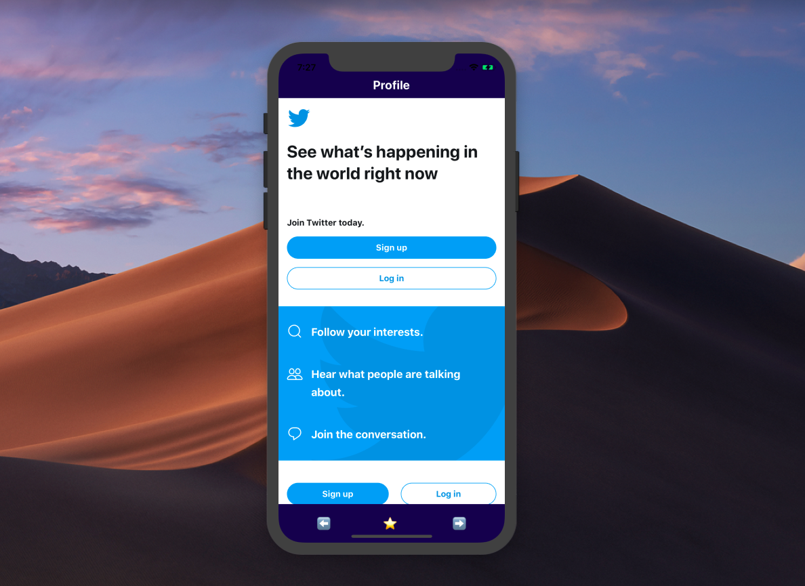
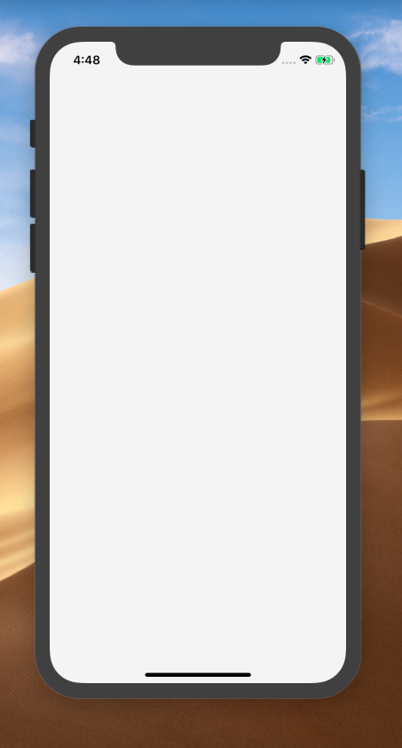
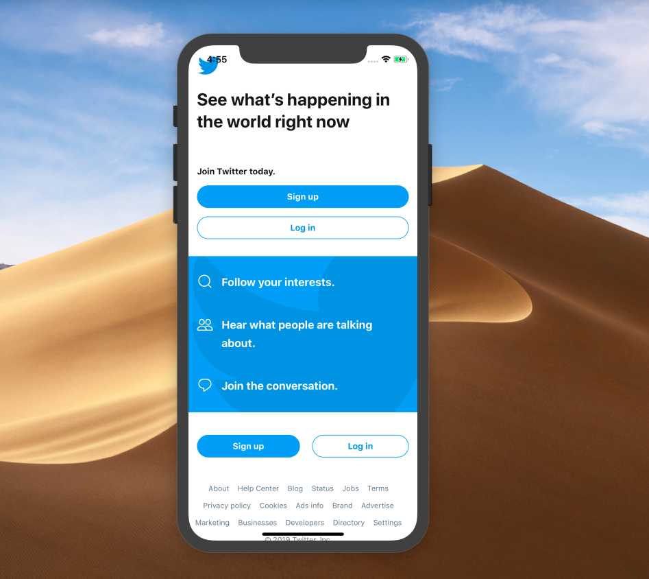
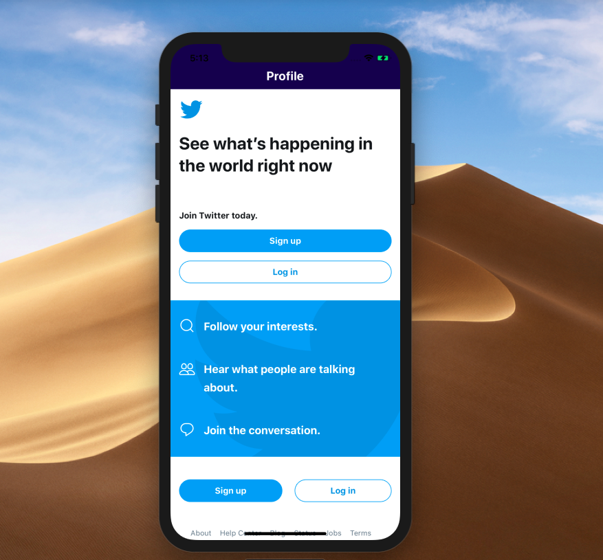
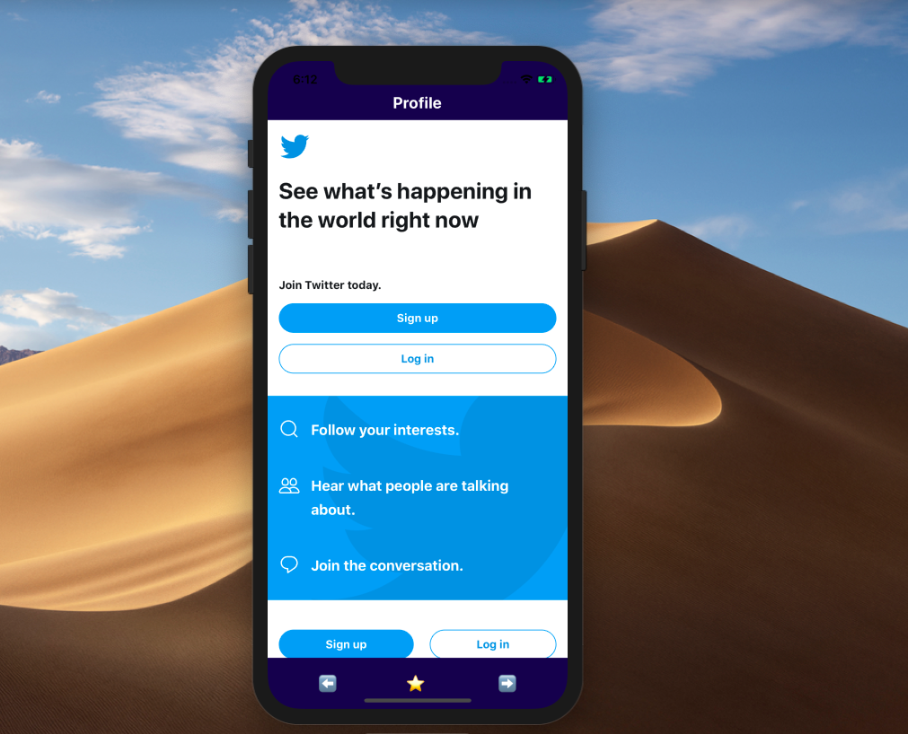
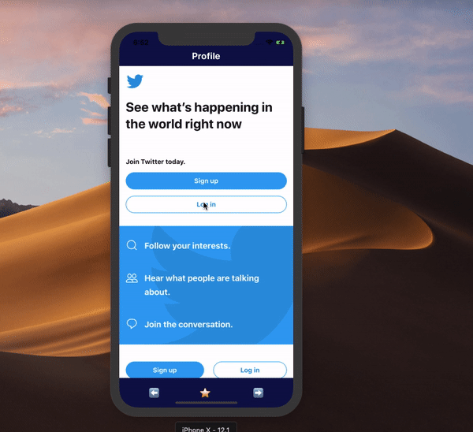
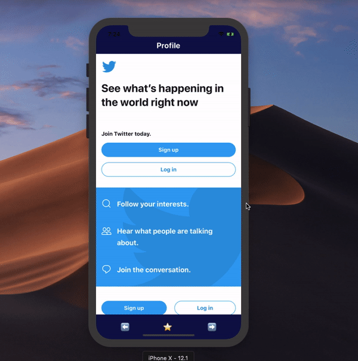

## WebView is the channel that connects React Native with Web platforms, giving us many great options to create a sort of connections to our app that is running on the Web!



Using `[**WebView**](https://facebook.github.io/react-native/docs/webview)` element has a many of advantages it can be used for embedding or running a web application inside our React Native app that’s good especially if you have a web app and you want to connect that app the with your React Native app or even get access to the other platforms (google maps ex).

for a better understanding of the use cases of `[**WebView**](https://facebook.github.io/react-native/docs/webview)`, we are going to build a WebView that can load a web page and control the navigation!

Tip: **Leverage components to build more modular software**. Use tools like [**Bit**](https://bit.dev) ([GitHub](https://github.com/teambit/bit)) to develop, share and reuse components between projects. It will help you build better applications faster alone or as a team, give it a try:

[**Share reusable code components as a team · Bit**  
_Easily share reusable components between projects and applications to build faster as a team. Collaborate to develop…_bitsrc.io](https://bitsrc.io "https://bitsrc.io")[](https://bitsrc.io)

### Getting started

Let start first by creating a new React Native project, make sure that you have the environment to run a React Native app. I’m using [react-native-cli](https://github.com/react-native-community/cli) so all I need to do is to run the following command:

> **Note**: you don’t need to create a new react-native app, you can just see the code and see how the WebView works I will leave to source good on GitHub

```
react-native init webview-app
```

This will bootstrap the project and all the necessary files to start working with React native.

Now run `react-native run-ios` to install the app on ios simulator and `react-native run-android` for Android.

For me, I have everything set up so I don’t have to run everything.

#### Implementing the WebView:

Note that `WebView` is an element of react-native that comes out of the box so no need for any extra configuration or installing any library so simply import it from **react-native** :

```
import { WebView } from "react-native";
```

And use it as any other elements:

Embed placeholder 0.4388313084012525

If you look at the screen it just now a blank screen!



And that’s because the WebView requires a source URL in order to work! so let’s add the URL, we use `**source**`  props to set the URL.

Embed placeholder 0.7649066944464387

I used here twitter as URL, and this will load the Twitter home page in our app 😉



Actually, that’s super awesome just to be able to display a webpage inside your react-native app, and actually, you can use any other website as well, that’s mean also we have many options to control the WebView for example, handle the navigation.

### Control the WebView

WebView, as we mentioned before, is just an element of react-native but there are options that let us do some tricks like even build a customized mini web browser Yeah!

#### Control the Layout

WebView is just a View that we can style and add an element to it, so we are going to add a header Component that can contain some other components, for example, a `navbar` to control the navigation! so let’s do it!

Embed placeholder 0.5237414222010861

And voila!!



Super cool, now let’s add a footer! the footer can contain, for example, a TabNavigator and some buttons to take some actions like _goingBack_ and _goForward_!

Embed placeholder 0.31302685681329234

The result !!



Until now 👍!

Let’s add actions to the buttons so when a button is clicked, for example, allow to the page to navigate back that gives us some control on the navigation history.

-   If I click left-arrow it should take me back to the previous page if there is any
-   If I click the right-arrow it should navigate me to the next page if there is any.

In order to have control and use WebView navigation history, we have to assign it a `ref` to trigger those two actions:

Embed placeholder 0.953653673511345

And yay!!



### Control the page loading

Loading a page inside the WebView can be slow, and we want to display an indicator like a spinner to indicate to the user that the page is loading that gives the user a better experience. there are `onLoadStart` props that take a function that it’s called when the page starts loading and `onLoadEnd` that it’s called when the load end. so basically we are using those two methods to change states and display an indicator based on that state so we need to use a state.

We will use `[ActivityIndicator](https://facebook.github.io/react-native/docs/activityindicator)` element from react-native to display the spinner!

```
 state={

 loading:false
}
```

Embed placeholder 0.4680062004938119

Voila 💫



We still have many options and ability to do with WebView, for example, you can be integrated with the navigator of your app and make everything dynamic, I used webView in one of the applications I worked on, so when you click the thumbnail of a restaurant it redirects you to the restaurant gallery inside the WebView and here the WebView take a dynamic URL and that’s really useful because there was a web app do this job so I connected my React Native application with this web app through the WebView so I didn’t have to do the same twice .

Here is a list of props you can use:

-   `[source](https://facebook.github.io/react-native/docs/webview#source)`
-   `[automaticallyAdjustContentInsets](https://facebook.github.io/react-native/docs/webview#automaticallyadjustcontentinsets)`
-   `[injectJavaScript](https://facebook.github.io/react-native/docs/webview#injectjavascript)`
-   `[injectedJavaScript](https://facebook.github.io/react-native/docs/webview#injectedjavascript)`
-   `[mediaPlaybackRequiresUserAction](https://facebook.github.io/react-native/docs/webview#mediaplaybackrequiresuseraction)`
-   `[nativeConfig](https://facebook.github.io/react-native/docs/webview#nativeconfig)`
-   `[onError](https://facebook.github.io/react-native/docs/webview#onerror)`
-   `[onLoad](https://facebook.github.io/react-native/docs/webview#onload)`
-   `[onLoadEnd](https://facebook.github.io/react-native/docs/webview#onloadend)`
-   `[onLoadStart](https://facebook.github.io/react-native/docs/webview#onloadstart)`
-   `[onMessage](https://facebook.github.io/react-native/docs/webview#onmessage)`
-   `[onNavigationStateChange](https://facebook.github.io/react-native/docs/webview#onnavigationstatechange)`
-   `[originWhitelist](https://facebook.github.io/react-native/docs/webview#originwhitelist)`
-   `[renderError](https://facebook.github.io/react-native/docs/webview#rendererror)`
-   `[renderLoading](https://facebook.github.io/react-native/docs/webview#renderloading)`
-   `[scalesPageToFit](https://facebook.github.io/react-native/docs/webview#scalespagetofit)`
-   `[onShouldStartLoadWithRequest](https://facebook.github.io/react-native/docs/webview#onshouldstartloadwithrequest)`
-   `[startInLoadingState](https://facebook.github.io/react-native/docs/webview#startinloadingstate)`
-   `[style](https://facebook.github.io/react-native/docs/webview#style)`
-   `[decelerationRate](https://facebook.github.io/react-native/docs/webview#decelerationrate)`
-   `[domStorageEnabled](https://facebook.github.io/react-native/docs/webview#domstorageenabled)`
-   `[javaScriptEnabled](https://facebook.github.io/react-native/docs/webview#javascriptenabled)`
-   `[mixedContentMode](https://facebook.github.io/react-native/docs/webview#mixedcontentmode)`
-   `[thirdPartyCookiesEnabled](https://facebook.github.io/react-native/docs/webview#thirdpartycookiesenabled)`
-   `[userAgent](https://facebook.github.io/react-native/docs/webview#useragent)`
-   `[allowsInlineMediaPlayback](https://facebook.github.io/react-native/docs/webview#allowsinlinemediaplayback)`
-   `[allowFileAccess](https://facebook.github.io/react-native/docs/webview#allowFileAccess)`
-   `[bounces](https://facebook.github.io/react-native/docs/webview#bounces)`
-   `[contentInset](https://facebook.github.io/react-native/docs/webview#contentinset)`
-   `[dataDetectorTypes](https://facebook.github.io/react-native/docs/webview#datadetectortypes)`
-   `[scrollEnabled](https://facebook.github.io/react-native/docs/webview#scrollenabled)`
-   `[geolocationEnabled](https://facebook.github.io/react-native/docs/webview#geolocationenabled)`
-   `[allowUniversalAccessFromFileURLs](https://facebook.github.io/react-native/docs/webview#allowUniversalAccessFromFileURLs)`
-   `[useWebKit](https://facebook.github.io/react-native/docs/webview#usewebkit)`
-   `[url](https://facebook.github.io/react-native/docs/webview#url)`
-   `[html](https://facebook.github.io/react-native/docs/webview#html)`

### Methods

-   `[extraNativeComponentConfig](https://facebook.github.io/react-native/docs/webview#extranativecomponentconfig)`
-   `[goForward](https://facebook.github.io/react-native/docs/webview#goforward)`
-   `[goBack](https://facebook.github.io/react-native/docs/webview#goback)`
-   `[reload](https://facebook.github.io/react-native/docs/webview#reload)`
-   `[stopLoading](https://facebook.github.io/react-native/docs/webview#stoploading)`

### Wrapping up

The WebView element is a powerful API through you can do magic things even like a mini Web Browser embedded inside your React Native app it’s a channel that will connect your apps in different platforms (mobile, Web)

---

#### _More from me about React Native:_

-   [Making Animations In React Native — The Simplified Guide](https://blog.bitsrc.io/making-animations-in-react-native-the-simplified-guide-6580f961f6e8)
-   [Styling in React Native](https://blog.bitsrc.io/styling-in-react-native-c48caddfbe47)
-   [What you need to know to start building mobile apps in React Native](https://medium.freecodecamp.org/what-you-need-to-know-to-start-building-mobile-apps-in-react-native-dded951277b7)

> Discuss on [Twitter](https://twitter.com/SaidHYN) 🐦

> Here where [I started!](https://medium.com/@saidhayani)

---

### Learn more

[**11 React Native Component Libraries You Should Know in 2019**  
_Useful React Native UI toolkits to use in your next app!_blog.bitsrc.io](https://blog.bitsrc.io/11-react-native-component-libraries-you-should-know-in-2018-71d2a8e33312 "https://blog.bitsrc.io/11-react-native-component-libraries-you-should-know-in-2018-71d2a8e33312")[](https://blog.bitsrc.io/11-react-native-component-libraries-you-should-know-in-2018-71d2a8e33312)

[**5 Tools for Faster Development in React**  
_5 tools to speed the development of your React application, focusing on components._blog.bitsrc.io](https://blog.bitsrc.io/5-tools-for-faster-development-in-react-676f134050f2 "https://blog.bitsrc.io/5-tools-for-faster-development-in-react-676f134050f2")[](https://blog.bitsrc.io/5-tools-for-faster-development-in-react-676f134050f2)

[**How to Share React UI Components between Projects and Apps**  
_A simple guide to help you organize, share and sync React components between your team’s apps._blog.bitsrc.io](https://blog.bitsrc.io/how-to-easily-share-react-components-between-projects-3dd42149c09 "https://blog.bitsrc.io/how-to-easily-share-react-components-between-projects-3dd42149c09")[](https://blog.bitsrc.io/how-to-easily-share-react-components-between-projects-3dd42149c09)

[**teambit/bit**  
_Easily share code between projects with your team. - teambit/bit_github.com](https://github.com/teambit/bit "https://github.com/teambit/bit")[](https://github.com/teambit/bit)