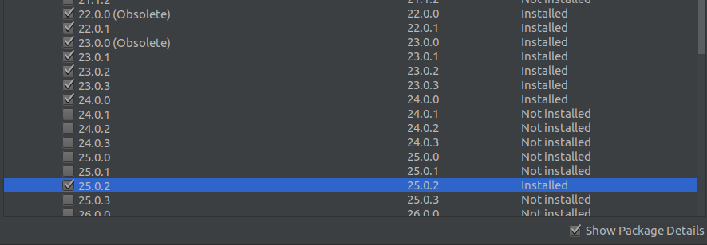

Nothing is better than building apps with JavaScript. Unless you are building mobile apps. JavaScript is for building web apps, and using it to build native mobile app used to not be possible. It was hard for any web developer to dive into building native mobile apps. They have to learn Java, or Objective-C …or any programming language that was used for this purpose.

That is, until Facebook’s [React Native](https://facebook.github.io/react-native/) broke this barrier. React Native comes with great advantages like building cross-platform apps for both Android and IOS. Before React Native, you had to write your code twice — one for Android and one for IOS. That’s no longer the case.

This article is an intro to the world of React Native, so get ready 💪.

### Why React Native?

Right, so why React native and not any other technology?

It gives us many solutions that other technologies can not afford. Here is what you can do with React Native:

#### Building native mobile apps

React Native allows us to write native apps in JavaScript for both iOS and Android. It gives us the ability to use all the native components like gestures, push notifications, camera, and location. There are some other JavaScript libraries for building mobile apps like ionic or PhoneGap. But those libraries use Webview, and the apps built with those technologies are not native.

#### Building cross platform mobile apps (iOS and Android)

Yeah, with React Native you can build mobile apps that can run on iOS and Android. This is one of the great benefits of React Native. Before Facebook created it, you had to build your app twice and with different code: one for iOS using Swift or Objective-C and one for Android using Java or Kotlin. React Native solved this problem so you can build your React Native app and it will work in iOS and Android. Awesome! 💪

#### Write your code all in JavaScript and React

While you are building React Native apps, you will actually write JavaScript. [Reactjs](https://reactjs.org/) code allows us to build great UI and user experience components.

### Getting started with react-native

Starting with react-native can be exciting, but at the same can be a bit confusing. The first step is to install it, and there are several ways to do it:

#### Using expo-cli:

expo-cli is a command line tool. It downloads and installs the React Native boilerplate for you, integrated with [expo](http://expo.io/) API ([check here for installation guide](https://github.com/react-community/create-react-native-app)). It’s an easy way to build a React Native app, and it’s the recommended way if you’ve just started with React Native.

expo-cli gives you many options. You can run and test your application on a mobile device without any configuration. Scan a QR code and your app will open up with expo mobile app. You can explore other mobile applications built with React Native on the browser over a web interface called [appertize](https://appetize.io/)!

#### Using react-native-cli

The r[eact-native-cli](https://facebook.github.io/react-native/docs/understanding-cli) does the same job as expo-cli, but with a different approach and extra advantages. The apps that are installed with react-native-cli provide us the option and the ability to create our own native modules in our app. You don’t need to eject your application to be able to make native modules. Ejecting makes you able to use native modules and write you own (_we will explore how to write native modules in another part_).

Developing React Native apps on different platforms is a different process. Some times we need some specific configuration for a specific platform. For example to build for Android, you need to use the Android SDK, so let’s explore how this works!

### Building mobile apps for Android

There are some requirements you need to install to start developing for Android. First, you have to download and configure both Android SDK and Android Studio. You can download them with this link [here](https://developer.android.com/studio/).

After downloading Android Studio you need to install some APIs as well. To do that open Android Studio, then click settings tab this window will open up:

First, check ✔️the platform you want your react-native to support in the SDK Platforms tab (for example Android 6.0 Marshmallow). Then switch to SDK tools.

And check `Android SDK Build-Tools`, `Android SDK tools`, and `google play service`. Under Android SDK Build-Tools select all the platforms:

-   Starting from 19.0.0 to 20.0.0
-   From 22.0.0 to 24.0.0
-   And 25.0.2 , 26.0.1 to 26.0.3
-   27.0.3 and 28.0.1 to 28.02

Now we are done with SDK and Android Studio. The next step is the emulator. The emulator (or the simulator) is where we have to run and test our app. There are many different choices.

You can use Android Studio emulators. You check here how to create an [emulator to use on Android Studio](https://developer.android.com/studio/run/managing-avds). Honestly I never used them. I prefer [Genymotion](https://www.genymotion.com/) or a real device instead.

#### **Genymotion**

[Genymotion](https://www.genymotion.com/) is a desktop application that provides a virtual emulator to test your application. I like to use it a lot because it’s fast. 🚀 It gives you options to create a customized phone with the features that you can find in any real device. For example enable Wifi, Location, and Camera. I highly recommend you use [Genymotion](https://www.genymotion.com/) over Android Studio emulators or any other emulator.

#### **Using real devices**

Nothing is better that using real devices to run and test your app. This is because it lets you knows how you application looks like on a real device. It makes you feel the reality of your work in a way the virtual device doesn’t give. So if you have the ability to use a device, don’t hesitate.

**Up to this point, we’re ok with Android — but what about iOS?**

### Building react-native apps for IOS

Running React Native for iOS doesn’t look much different from Android. The same React Native app that runs in Android can run on iOS as well, with some exceptions.

For example if you want to run on an iOS device, you need to have a MacOS. Talking about MacOS and iOS, you don’t need to download any extra dependencies such as the SDK for Android to run React Native on iOS.

Regarding Emulators, Xcode has nice emulators that you can use to test your React Native app. You can check this post that shows [some tricks to use](https://www.appcoda.com/ios-simulator-tips-tricks/) with Emulators.

](./asset-5.jpg)

In MacOS you can run both iOS and Android. You can definitely install Android Studio and Genymotion on MacOS. This possibility doesn’t exist on a PC where you can only run the Android emulator but not an iOS emulator. So you are lucky 👌if you have a MacOS — enjoy 😜.

So now we have the environment to build a React Native app and we’ve installed everything, but how is the React Native code written? It’s so simple: you will actually write [Reactjs](https://reactjs.org/) code.

You can check [the official guide](https://facebook.github.io/react-native/docs/) to get some practice with React Native. I recommend this great article to start “[React Native YouTube Replica.](https://medium.com/react-native-training/react-native-youtube-replica-f378200d91f0)” It will guide you step by step to create your first React Native app.

Wow! Up until now you are fine and you are coding with react-native. 🎧 But you need to check and debug your errors and see the logs of your code. _Yeah the logs!! So we need a_ _debugger_! How do you debug with React Native?

### Debugging react-native

Debugging your code is very important, not just with React Native but with any other programming language. So in your React Native code, you need to know what’s going on. There are many different ways to debug a React Native app like:

#### Debug with Chrome devtools

React Native gives you the option to use Chrome devtools to see the logs of your app. To debug with Chrome and enable debugging mode in your emulator, on the keyboard just click `Ctrl+ m`.

This screen will pop-up:

And then choose `Debug Js Remotely`. This will open a tab in Google Chrome with this address `http://localhost:8081/debugger-ui/`. That’s for using Chrome devtools, what about other options?

#### Using React-native-debugger

](./asset-7.png)

[React-native-debugger](https://github.com/jhen0409/react-native-debugger) is a great tool to debug React Native code. It’s a desktop application that gives you many advantages. It comes with Redux devtools and React-devtools integration. You can debug the style as well. It’s actually the best debugger for React Native and it’s the one that I use. Usually it’s available on MacOS, Windows, and Linux. Check out [the installation and integration guide](https://github.com/jhen0409/react-native-debugger).

I think it’s enough at this point. This is the first part of the absolute guide for building mobile apps with React Native. In the next part we are going to dive into more technical tips and issues like how we can use native components, the React native API, integration with other libraries, Redux , GraphQL and stuff like that. So subscribe to this [mail-list](http://eepurl.com/dk9OJL) to stay tuned when the next part comes out. Thank you for your time. 😃

You can always find me on [Twitter](https://twitter.com/@saidHYN) 🐦

<Embed src="https://upscri.be/7d6b36?as_embed=true" height={350} width={700} />